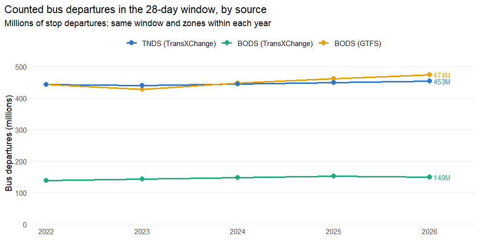
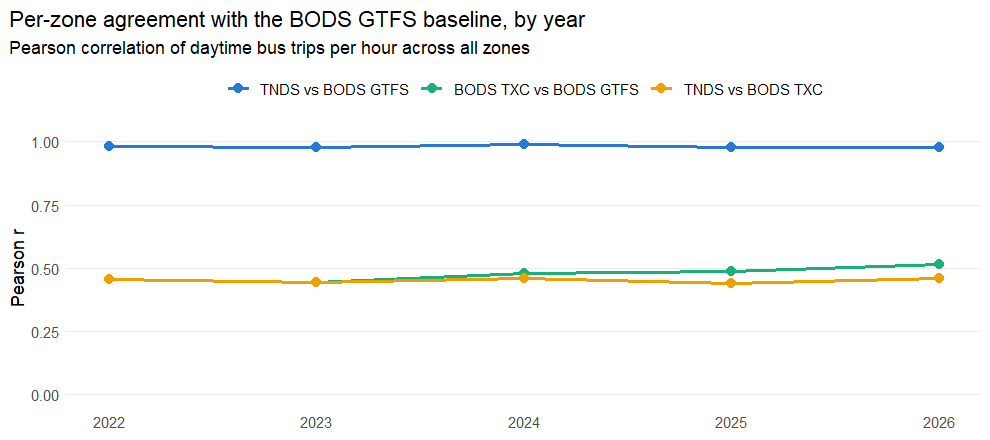
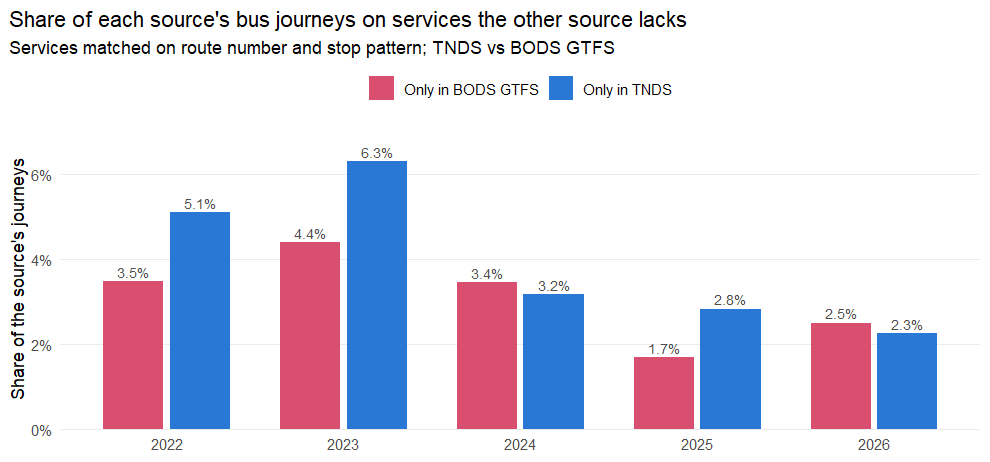
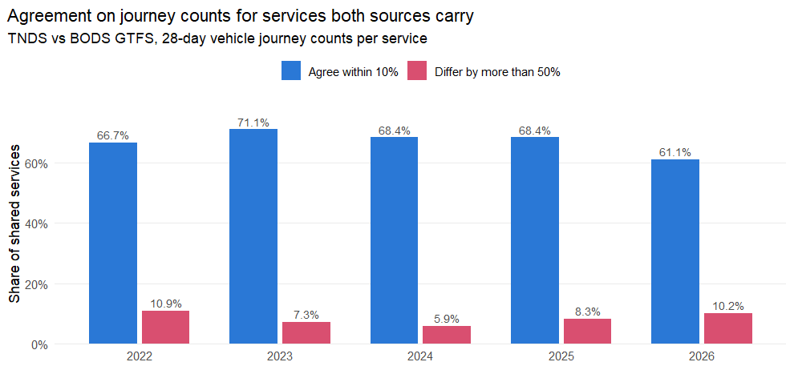

# Comparing the three bus timetable sources, 2022–2026

Since the Bus Open Data Service (BODS) became the statutory home of English
bus timetables, three parallel versions of "the bus timetable" exist:

1. **TNDS (TransXChange)** — the Traveline National Dataset, compiled by the
   traveline consortium from local authority and operator data. This was the
   source used for the 2018–2023 analysis years. Converted to GTFS with
   `UK2GTFS::transxchange2gtfs()`.
2. **BODS (TransXChange)** — the raw TransXChange files that operators
   publish directly to the DfT's Bus Open Data Service (its "change archive"
   containing every dataset revision, filtered to the revisions valid on the
   analysis date). Converted to GTFS with `UK2GTFS::transxchange2gtfs()`.
3. **BODS (GTFS)** — the DfT's own GTFS rendering of the BODS data, used
   directly without any UK2GTFS conversion. This is the source used for the
   2024 and 2025 analysis years.

This report compares all three over **five years, one matched snapshot per
year**, to establish whether the differences seen in October 2025 are a
persistent property of the sources or an artefact of one snapshot.

|Year |28-day counting window   |TNDS snapshot            |BODS TransXChange snapshot |BODS GTFS snapshot |
|:----|:------------------------|:------------------------|:--------------------------|:------------------|
|2022 |2022-10-31 to 2022-11-27 |tnds_20221102_merged.zip |bods_txc_20221102.zip      |20221102           |
|2023 |2023-10-30 to 2023-11-26 |tnds_20231101_merged.zip |bods_txc_20231101.zip      |20231101           |
|2024 |2024-10-07 to 2024-11-03 |tnds_20241004_merged.zip |bods_txc_20241007.zip      |20241007           |
|2025 |2025-10-06 to 2025-11-02 |tnds_20251003_merged.zip |bods_txc_20251006.zip      |20251006           |
|2026 |2026-07-27 to 2026-08-23 |tnds_20260726_merged.zip |bods_txc_20260725.zip      |20260726           |

Within a year all three sources are deduplicated with
`UK2GTFS::gtfs_deduplicate()`, then counted with
`UK2GTFS::gtfs_trips_per_zone()` over the **same 28-day window** and the
**same plain LSOA21 / DZ22 boundaries**, so every difference below is a
difference in the sources or their conversion, not in the counting method.
(The published trips-per-zone outputs use zones widened for stop access.
This comparison uses the unmodified boundaries: widened zones overlap, so one
stop falls in several of them and a difference between two sources at that
stop would be counted several times over.) Route types were
harmonised to the set used throughout this analysis (0 tram, 1 metro, 2 rail,
3 bus, 4 ferry, **200 coach**); coach is kept distinct from local bus in every
source, and the headline bus comparisons are for `route_type == 3` only.

### Why the series starts in 2022, and not 2021

The comparison needs all three sources at one date. That is not available for
2021:

- The **BODS TransXChange change archive begins in May 2022** — there is no
  earlier archive on the data drive, so a 2021 three-way comparison is
  impossible.
- The only **2021 BODS GTFS** snapshot is from **January 2021**, while the
  nearest TNDS snapshots are December 2020 and September 2021. Any pairing
  spans at least eight weeks of the third national lockdown, during which
  operators were cutting timetables week by week — the date gap, not the
  sources, would dominate the result.

2026 is included in its place, giving five years of genuinely matched
snapshots. Two structural changes fall inside the series and are visible in
the numbers below: **TNDS discontinued its separate NCSD national coach
archive after February 2025**, and the TNDS regional files grew substantially
from the 2025 snapshots onward.

### Which 2026 snapshot, and why not February

Two 2026 triples exist on the data drive, February and July. The series uses
**July**. February was dropped because its TNDS side is distorted by
registrations that expire *inside* the counting window: about a quarter of the
feed's bus trips stop part-way through it, and the effect is large enough to
exceed the whole measured gap to BODS GTFS, so every February figure was
incomparable with the other four years. The mechanism is general and is
measured for every year below — February was simply the window in which it
dominated. Using July has a second benefit: it is the same snapshot the
published-timetable validation (`pdf_validation.md`) checks against, so the
comparison's most recent year and the PDF validation now describe the same
feeds.

All five years of both TransXChange sources were converted with one UK2GTFS
build. An earlier version of this report mixed builds across the series, which
made part of the apparent year-on-year improvement in BODS TransXChange coverage
an artefact of the converter rather than of the data.

## Feed-level summary

`Agencies` and `Routes` count the whole converted feed; `Routes in window` and
`Trips in window` count only what operates inside the 28-day window. **Compare
sources on the windowed columns.** The whole-feed columns are not like-for-like:
a TNDS conversion is kept for the snapshot date ±45 days and a
BODS TransXChange one for ±31, so TNDS carries a longer stretch of calendar and
its whole-feed counts are correspondingly higher. That difference disappears
once anything is counted over a window, which is every other figure in this
report.

|Year |Source              | Agencies| Routes| Routes in window| Trips in window| Missing departure times|
|:----|:-------------------|--------:|------:|----------------:|---------------:|-----------------------:|
|2022 |TNDS (TransXChange) |      950| 16,573|           16,573|       1,206,537|                       0|
|2022 |BODS (TransXChange) |      457| 10,233|           10,233|         459,608|                       0|
|2022 |BODS (GTFS)         |      920| 13,526|           13,526|         895,094|                       0|
|2023 |TNDS (TransXChange) |      910| 15,085|           15,085|       1,205,876|                       0|
|2023 |BODS (TransXChange) |      500| 11,250|           11,250|         505,540|                       0|
|2023 |BODS (GTFS)         |      879| 12,930|           12,930|         873,701|                       0|
|2024 |TNDS (TransXChange) |      856| 15,555|           15,555|       1,247,169|                       0|
|2024 |BODS (TransXChange) |      459| 11,046|           11,046|         505,954|                       0|
|2024 |BODS (GTFS)         |      858| 13,556|           13,556|         914,578|                       0|
|2025 |TNDS (TransXChange) |      818| 15,923|           15,923|       1,334,013|                       0|
|2025 |BODS (TransXChange) |      477| 12,061|           12,061|         505,710|                       0|
|2025 |BODS (GTFS)         |      661| 13,743|           13,743|       1,343,761|                       0|
|2026 |TNDS (TransXChange) |      805| 16,221|           16,221|       1,192,974|                       0|
|2026 |BODS (TransXChange) |      439| 11,999|           11,999|         471,527|                       0|
|2026 |BODS (GTFS)         |      633| 12,822|           12,822|       1,210,307|                       0|

## National bus service totals

Total counted bus (`route_type == 3`) departures from stops, summed over all
zones. The plain boundaries tile the country, so each stop falls in one zone
and a journey is counted once per zone it passes through — levels are
comparable between sources but are still not a national vehicle-trip count,
because a journey crossing several zones contributes to each.

> **These levels are not comparable with versions of this report published
> before August 2026.** Earlier editions counted over the *widened* zones the
> published trips-per-zone outputs use, and those overlap: a stop falls in 2.6
> of them on average, so one bus was counted in every overlapping zone it
> passed through and the national totals were about 2.3 times the figures
> below. Nothing was lost in the change — only 186 of 318,931 stops fall
> outside all plain zones — and the *relative* differences between sources,
> which is what this report is for, barely moved. Compare ratios and per-zone
> agreement across editions, never levels.

|Year |        TNDS|   BODS TXC|   BODS GTFS|TNDS vs BODS GTFS |BODS TXC vs BODS GTFS |
|:----|-----------:|----------:|-----------:|:-----------------|:---------------------|
|2022 | 191,497,979| 72,135,534| 191,861,067|-0.2%             |-62.4%                |
|2023 | 188,132,805| 72,660,975| 184,385,522|+2.0%             |-60.6%                |
|2024 | 189,364,689| 77,483,832| 195,271,287|-3.0%             |-60.3%                |
|2025 | 192,093,827| 80,758,995| 199,212,058|-3.6%             |-59.5%                |
|2026 | 191,138,742| 80,540,734| 203,021,824|-5.9%             |-60.3%                |

## Zone-level agreement

Per-zone average daytime bus trips per hour (`tph_daytime_avg`, the headline
measure used by Carbon & Place), each TransXChange-derived source against the
BODS GTFS baseline.

|Year |Comparison            | Pearson r| Spearman rho| Median abs diff (tph)|Zones within 10% |
|:----|:---------------------|---------:|------------:|---------------------:|:----------------|
|2022 |TNDS vs BODS GTFS     |     0.981|        0.932|                  0.18|61.4%            |
|2022 |BODS TXC vs BODS GTFS |     0.455|        0.311|                  1.45|29.1%            |
|2022 |TNDS vs BODS TXC      |     0.456|        0.297|                  1.85|21.0%            |
|2023 |TNDS vs BODS GTFS     |     0.980|        0.920|                  0.06|67.2%            |
|2023 |BODS TXC vs BODS GTFS |     0.443|        0.288|                  1.34|31.3%            |
|2023 |TNDS vs BODS TXC      |     0.445|        0.289|                  1.77|24.1%            |
|2024 |TNDS vs BODS GTFS     |     0.990|        0.970|                  0.04|73.8%            |
|2024 |BODS TXC vs BODS GTFS |     0.479|        0.343|                  1.36|32.3%            |
|2024 |TNDS vs BODS TXC      |     0.460|        0.318|                  1.56|26.0%            |
|2025 |TNDS vs BODS GTFS     |     0.980|        0.967|                  0.04|70.3%            |
|2025 |BODS TXC vs BODS GTFS |     0.487|        0.353|                  1.38|30.6%            |
|2025 |TNDS vs BODS TXC      |     0.441|        0.314|                  1.61|24.1%            |
|2026 |TNDS vs BODS GTFS     |     0.977|        0.959|                  0.00|74.0%            |
|2026 |BODS TXC vs BODS GTFS |     0.515|        0.372|                  1.35|33.3%            |
|2026 |TNDS vs BODS TXC      |     0.462|        0.339|                  1.35|31.0%            |

## Coverage by country

BODS is an **England-only statutory requirement**; Scottish and Welsh
services reach it only where operators cross the border or publish
voluntarily. TNDS ingests the Scottish and Welsh traveline data directly, so
country-level coverage is where the sources should differ most.

|Year |Country  |  Zones| TNDS mean tph| BODS TXC mean tph| BODS GTFS mean tph| TNDS zero-service zones| BODS TXC zero-service zones| BODS GTFS zero-service zones|
|:----|:--------|------:|-------------:|-----------------:|------------------:|-----------------------:|---------------------------:|----------------------------:|
|2022 |England  | 32,427|         10.12|              4.44|              10.13|                       0|                           0|                            0|
|2022 |Scotland |  6,548|          6.22|              0.00|               6.71|                       0|                           1|                            0|
|2022 |Wales    |  1,878|          6.98|              1.98|               5.03|                       0|                           0|                            0|
|2023 |England  | 32,375|          9.90|              4.46|               9.68|                       0|                           0|                            0|
|2023 |Scotland |  6,546|          6.60|              0.01|               6.60|                       0|                           0|                            0|
|2023 |Wales    |  1,881|          5.42|              2.26|               5.03|                       0|                           0|                            0|
|2024 |England  | 32,391|         10.09|              4.74|              10.43|                       0|                           0|                            0|
|2024 |Scotland |  6,542|          5.95|              0.01|               5.93|                       0|                           0|                            0|
|2024 |Wales    |  1,881|          5.19|              2.34|               5.84|                       0|                           0|                            0|
|2025 |England  | 32,441|         10.12|              4.93|              10.57|                       0|                           0|                            0|
|2025 |Scotland |  6,522|          6.50|              0.00|               6.49|                       0|                           1|                            0|
|2025 |Wales    |  1,882|          5.28|              2.33|               4.95|                       0|                           0|                            0|
|2026 |England  | 32,409|         10.14|              4.92|              10.87|                       0|                           0|                            0|
|2026 |Scotland |  6,539|          6.12|              0.00|               6.11|                       0|                           1|                            0|
|2026 |Wales    |  1,884|          4.90|              2.27|               4.94|                       0|                           0|                            0|

## What the sources actually disagree about

The zone-level statistics say *how much* the sources differ. To say *what*
they differ about, individual bus routes were matched between the three
feeds.

Routes cannot be matched on identifiers — `route_id` is source-specific and
the BODS GTFS `agency_id` is a synthetic code (`OP77`), not a NOC. Instead
each route is identified by its **public route number plus the set of stops
it serves**. Two routes are linked when they share a normalised route number
and their stop sets overlap by at least half; connected components of that
graph are treated as one **service**. Linking runs *within* a source as well
as between them, so a service that one source splits across several
`route_id`s is still compared as a single service. A second pass then links
whatever the numbers failed to pair, on stop overlap alone (80%), because the
sources do not always agree on what a service's public number is.

The unit counted here is **vehicle journeys in the 28-day window** — a
journey counts once however many stops or zones it passes through. This is a
stricter measure than the zone-level departure counts above.

|Year | Matched services| In all three sources| TNDS only| BODS TXC only| BODS GTFS only|
|:----|----------------:|--------------------:|---------:|-------------:|--------------:|
|2022 |           17,071|                6,866|       993|           256|            173|
|2023 |           16,055|                6,745|     1,099|           139|            123|
|2024 |           16,204|                7,793|       924|            30|            174|
|2025 |           16,225|                8,398|     1,307|            42|            125|
|2026 |           20,365|                6,327|       748|           739|            138|

### Missing services, or different frequencies?

For the TNDS / BODS GTFS pair — the two sources that agree most closely at
zone level — the total gap splits into journeys on services the other source
does not carry at all, and journeys on services both carry but time
differently.

|Year | Services in both| TNDS-only services| BODS GTFS-only services| Journeys on TNDS-only services| Journeys on BODS GTFS-only services| Net difference on shared services| Total gap (TNDS - BODS GTFS)|
|:----|----------------:|------------------:|-----------------------:|------------------------------:|-----------------------------------:|---------------------------------:|----------------------------:|
|2022 |           11,646|              1,410|                     909|                        485,489|                             329,537|                          -121,658|                       34,294|
|2023 |           10,969|              1,644|                   1,040|                        585,456|                             398,508|                            39,982|                      226,930|
|2024 |           11,795|              1,023|                   1,030|                        297,654|                             337,069|                          -357,594|                     -397,009|
|2025 |           11,710|              1,350|                     829|                        269,713|                             168,400|                          -498,003|                     -396,690|
|2026 |            9,310|                810|                     568|                        212,321|                             250,479|                          -561,839|                     -599,997|

#### How much of that is really the same service under another name?

The "exclusive" counts above are an upper bound on the coverage gap, because
the matching can only link two routes that agree on a public route number.
Where the two sources disagree about what the number *is* — TNDS carrying the
operator's marketing name, the DfT's GTFS carrying the short code — no link is
ever made and the one service is counted as exclusive to each source, twice
over.

The test below looks for exactly that: a TNDS-only service and a BODS
GTFS-only service that share **both terminals**, run under a recognisably
**identical operator name**, and carry a journey count **within 20%** of each
other. Requiring the operator to match as well keeps generic terminal names
("Bus Station") from pairing unrelated routes.

|Year | Paired services| ...with identical counts| ...with no TNDS route number| TNDS journeys involved| BODS GTFS journeys involved|Share of TNDS-only journeys |Share of BODS GTFS-only journeys |
|:----|---------------:|------------------------:|----------------------------:|----------------------:|---------------------------:|:---------------------------|:--------------------------------|
|2022 |              85|                       69|                           45|                 65,702|                      64,791|13.5%                       |19.7%                            |
|2023 |              84|                       71|                           50|                 68,882|                      67,765|11.8%                       |17.0%                            |
|2024 |             110|                       93|                           47|                 92,353|                      92,792|31.0%                       |27.5%                            |
|2025 |              60|                       50|                           18|                 51,595|                      50,527|19.1%                       |30.0%                            |
|2026 |              30|                       25|                            5|                 33,940|                      33,431|16.0%                       |13.3%                            |

This is a persistent, material share of the apparent gap, present in every year of the series: 11.8%-31.0% of the journeys attributed to TNDS-only services and 13.3%-30.0% of those attributed to BODS GTFS-only services belong to a service the *other* source also carries, under a different name. In 2026, 25 of the 30 pairs match to the journey, which puts them beyond reasonable doubt, and 5 of them have no route number in TNDS at all.

Table: Largest services counted as exclusive to both sources at once, 2026

|From                 |To                           |TNDS number | TNDS journeys|BODS GTFS number | BODS GTFS journeys|Operator             |
|:--------------------|:----------------------------|:-----------|-------------:|:----------------|------------------:|:--------------------|
|Victoria Bus Station |Victoria Bus Station         |one         |         5,040|1                |              5,040|trentbarton          |
|Friar Lane           |Swallow Drive                |mln         |         4,516|RM               |              4,516|trentbarton          |
|Stonehurst Court     |Stonehurst Court             |18          |         3,400|20               |              3,287|Brighton & Hove      |
|Bus Station          |Bus Station                  |SWI         |         3,072|TM               |              2,712|Trent Barton         |
|Friar Lane           |Friar Lane                   |sky         |         2,948|SN               |              2,948|trentbarton          |
|Corporation Street   |Corporation Street           |all         |         2,092|TA               |              2,092|trentbarton          |
|Whittingham Avenue   |Travel Centre                |24          |         1,904|24SO             |              1,904|Stephensons of Essex |
|Coach Park           |Coach Park                   |skye        |         1,752|SNX              |              1,752|trentbarton          |
|Parliament Street    |Parliament Street            |cal         |         1,548|CC               |              1,548|trentbarton          |
|Tram Park & Ride     |Tram Park & Ride             |con         |         1,408|C                |              1,408|trentbarton          |
|East Beach           |Leigh-on-Sea Railway Station |99          |         1,008|99OT             |              1,008|Ensign Bus           |
|Woodthorpe Shops     |Woodthorpe Shops             |12          |           824|Y12              |                824|East Yorkshire       |

Two naming habits produce these pairs, and they carry very different weight. In 2026, TNDS holds the longer name in 10 pairs and the shorter one in 12, with 5 carrying no number at all. One habit is a marketing name or local variant against a bare code - `one`/`1`, `mln`/`RM`, `sky`/`SN`, each agreeing on journeys to within 5%. The other is school-service prefixes and suffixes (`S458`/`458`, `807D`/`808`), a long tail of tiny services: it is why **trentbarton** contributes both the most pairs (8) and the most journeys (20,008 of 33,940).

One caveat on reading the table: where an operator runs many routes between
the same pair of generic terminals, the *aggregate* is sound but an individual
pairing can be wrong, because the counterpart is chosen as the closest journey
count among same-terminal, same-operator candidates. The rows to trust
unreservedly are the ones whose counts match exactly.

`match_route_services()` has a second pass for exactly this case: where the
numbers fail, it links routes on stop overlap alone (80%). It used to consider
only routes left **completely unpaired** by the first pass, which excluded the
operators that cause most of the trouble — a service one source splits across
several `route_id`s sharing a number is linked to *itself* in the first pass, so
it was no longer unpaired and the pass never saw it. It now runs over whole
connected components, confined to components whose routes all come from one
source (precisely the ones that would otherwise be reported as exclusive), so
those multi-registration branded services are candidates.

**The pairs counted above are therefore the residual**, not the whole naming
problem: services the improved matching still fails to link, because their stop
sets overlap by less than the 80% it asks for.

Among the services **both** sources carry, how closely do they agree on the
number of journeys?

|Year | Shared services|Within 2% |Within 10% |Differ by more than 50% |Median absolute difference |
|:----|---------------:|:---------|:----------|:-----------------------|:--------------------------|
|2022 |          11,646|63.4%     |74.4%      |7.7%                    |0.0%                       |
|2023 |          10,969|81.7%     |85.9%      |3.5%                    |0.0%                       |
|2024 |          11,795|77.9%     |81.9%      |2.6%                    |0.0%                       |
|2025 |          11,710|75.8%     |80.1%      |4.0%                    |0.0%                       |
|2026 |           9,310|83.6%     |87.9%      |3.3%                    |0.0%                       |

#### The age of a snapshot relative to its window

Where the agreement on shared services is weaker, the usual reason is not a
converter disagreement about school terms but the age of the snapshot relative
to the counting window.

A TransXChange snapshot carries the registration that is operative *at the
snapshot date* and nothing beyond it. The BODS change archive also holds
future-dated files, so it carries the successor timetable where a TNDS snapshot
does not. Any window extending weeks past a snapshot therefore understates the
source, and it does so lumpily, because operators re-register together — around
school terms above all. This is measured directly for every year and source:
the share of each feed's bus trips whose calendar ends before the **horizon**
— the earlier of the window end and the feed's own last date — and how often
those trips run compared with the ones that last to it. Measuring against the
horizon rather than the window end keeps the two effects apart: a feed trimmed
to a span that stops short of the window would otherwise report every one of
its trips as expiring, which says nothing about the timetable.

|Year |Source              |Window ends |Feed ends  |Horizon    | Bus trips| Ending early| Runs, early| Runs, lasting| Journeys counted| If none expired|
|:----|:-------------------|:-----------|:----------|:----------|---------:|------------:|-----------:|-------------:|----------------:|---------------:|
|2022 |TNDS (TransXChange) |2022-11-27  |2022-12-17 |2022-11-27 | 1,320,836|        21.5%|        0.90|          8.93|        9,512,754|       9,970,026|
|2022 |BODS (TransXChange) |2022-11-27  |2022-12-03 |2022-11-27 |   473,287|        11.4%|        2.81|          9.43|        4,106,165|       4,264,764|
|2022 |BODS (GTFS)         |2022-11-27  |2023-07-21 |2022-11-27 |   890,243|         6.4%|        1.42|         11.30|        9,478,460|       9,682,551|
|2023 |TNDS (TransXChange) |2023-11-26  |2023-12-16 |2023-11-26 | 1,172,113|        16.8%|        2.90|          8.95|        9,291,084|      10,081,203|
|2023 |BODS (TransXChange) |2023-11-26  |2023-12-02 |2023-11-26 |   516,167|        16.3%|        2.32|          9.14|        4,143,716|       4,681,190|
|2023 |BODS (GTFS)         |2023-11-26  |2024-07-19 |2023-11-26 |   856,905|        10.7%|        4.19|         11.35|        9,064,154|       9,546,966|
|2024 |TNDS (TransXChange) |2024-11-03  |2024-11-18 |2024-11-03 | 1,256,777|        24.4%|        3.44|          8.76|        9,378,425|       9,929,410|
|2024 |BODS (TransXChange) |2024-11-03  |2024-11-07 |2024-11-03 |   508,784|         8.2%|        6.28|          9.02|        4,472,360|       4,605,391|
|2024 |BODS (GTFS)         |2024-11-03  |2025-06-27 |2024-11-03 |   878,614|         6.2%|        9.50|         11.24|        9,775,434|       9,996,734|
|2025 |TNDS (TransXChange) |2025-11-02  |2025-11-17 |2025-11-02 | 1,274,441|        23.8%|        3.97|          8.56|        9,523,797|      10,327,819|
|2025 |BODS (TransXChange) |2025-11-02  |2025-11-06 |2025-11-02 |   512,273|         8.6%|        6.51|          9.31|        4,642,986|       4,832,058|
|2025 |BODS (GTFS)         |2025-11-02  |2125-09-28 |2025-11-02 | 1,263,811|         8.7%|        3.81|          8.28|        9,920,487|      10,386,761|
|2026 |TNDS (TransXChange) |2026-08-23  |2026-09-09 |2026-08-23 | 1,323,639|        18.1%|        1.06|          8.44|        9,401,680|       9,695,835|
|2026 |BODS (TransXChange) |2026-08-23  |2026-08-25 |2026-08-23 |   478,192|         5.1%|        1.37|         10.08|        4,610,815|       4,702,710|
|2026 |BODS (GTFS)         |2026-08-23  |2027-08-02 |2026-08-23 | 1,288,523|         6.2%|        3.58|          8.24|       10,001,677|      10,316,166|

In TNDS the share of bus trips ending before the horizon ranges from **16.8% in 2023** up to **24.4% in 2024**. In that worst year they average 3.44 runs against 8.76 for the trips that last to the horizon, and scaling them up would lift the TNDS total from 9,378,425 to about 9,929,410 journeys — a shortfall of **550,985**, against a measured gap to BODS GTFS of 397,009. The expiry is concentrated on a few dates rather than spread through the window — in 2024, 2024-10-26 (105,555 trips); 2024-11-02 (36,797 trips) — which is the signature of collective re-registration rather than of services being withdrawn one by one.

The DfT's BODS GTFS is not immune to the same measure (6.2%-10.7%), which is worth knowing before reading it as the stable baseline, though it is a continuously updated feed rather than a dated registration snapshot, so the two are not measuring quite the same thing.

Every feed reaches at least as far as its own window, so none of the difference above is a conversion trim running out (TNDS is kept to the snapshot date ±45 days).

(`If none expired` scales each early-ending trip's run count by the ratio of
the horizon to the part of it the trip is available for. It assumes the expiring
service would have continued at its own rate, so it is an upper bound quoted
only to size the effect; the trip and date counts either side of it are exact
counts from the feed's `calendar` and `trips` tables.)

None of this is a converter bug, and none of it should be read as a source
carrying less service. The consequence for interpretation is that a snapshot
figure measures **service as registered at the snapshot date**, not service
operated across the window — so a snapshot should either be counted over a
window inside its operative period, or reported with that caveat attached. It is
also a reminder that the counting window, not only the source, affects how
closely the sources agree.

### Worked examples

The largest services each source carries and the other does not, and the
largest disagreements on services both carry, for **2026**.

Table: Busiest services in TNDS but absent from BODS GTFS, 2026

|Route |Operator                      |From                                   |To                                     | TNDS journeys| BODS TXC journeys|
|:-----|:-----------------------------|:--------------------------------------|:--------------------------------------|-------------:|-----------------:|
|SHTL  |Gatwick Interterminal Shuttle |Gatwick North Terminal Shuttle Station |Gatwick North Terminal Shuttle Station |        13,776|                 0|
|PREM  |Bus4Us                        |Coach Station                          |Coach Station                          |         5,180|                 0|
|one   |trentbarton                   |Victoria Bus Station                   |Victoria Bus Station                   |         5,040|                 0|
|mln   |trentbarton                   |Friar Lane                             |Swallow Drive                          |         4,516|                 0|
|18    |Brighton & Hove               |Stonehurst Court                       |Stonehurst Court                       |         3,400|                 0|
|50    |Brighton & Hove               |Bottom of Davey Drive                  |Bottom of Davey Drive                  |         3,256|                 0|
|SWI   |Trent Barton                  |Bus Station                            |Bus Station                            |         3,072|                 0|
|12A   |Brighton & Hove               |Brighton Station                       |Brighton Station                       |         2,956|                 0|
|sky   |trentbarton                   |Friar Lane                             |Friar Lane                             |         2,948|                 0|
|SC1   |South Pennine                 |Sheffield Interchange/B1               |Sheffield Interchange                  |         2,536|                 0|
|NOVO  |Bus4Us                        |Coach Station                          |Coach Station                          |         2,520|                 0|
|4     |First Cymru Buses Ltd         |Morriston Hospital Main Entrance       |Morriston Hospital Main Entrance       |         2,256|             2,256|

Table: Busiest services in BODS GTFS but absent from TNDS, 2026

|Route |Operator                              |From                       |To                         | BODS GTFS journeys| BODS TXC journeys|
|:-----|:-------------------------------------|:--------------------------|:--------------------------|------------------:|-----------------:|
|10    |Metrobus                              |North Terminal Bus Station |North Terminal Bus Station |              7,172|               784|
|757   |Arriva Beds and Bucks                 |Airport Bus Station        |Airport Bus Station        |              6,720|               160|
|1     |trentbarton                           |Victoria Bus Station       |Victoria Bus Station       |              5,040|             5,040|
|RM    |trentbarton                           |Friar Lane                 |Swallow Drive              |              4,516|             4,516|
|12    |Arriva Wales                          |Rhyl Bus Station Stand A   |Rhyl Bus Station Stand D   |              4,156|               300|
|100   |Metrobus                              |Oriel School               |Oriel School               |              3,728|               332|
|2     |Metrobus                              |Yewlands Walk              |Yewlands Walk              |              3,676|               288|
|HE    |Go Ahead Luton Parkway                |HereEast / The Yard        |HereEast / The Yard        |              3,620|                60|
|C     |Fastrack (Arriva Kent Thameside)      |Manor Way Roundabout       |Manor Way Roundabout       |              3,363|             2,295|
|X30   |First Essex                           |Bus Station                |Coach Station              |              3,290|             1,832|
|20    |Brighton & Hove Bus and Coach Company |Stonehurst Court           |Stonehurst Court           |              3,287|               341|
|20    |Metrobus                              |Orchard Drive              |Orchard Drive              |              3,272|               376|

Table: Largest journey-count disagreements on services both sources carry, 2026

|Route |Operator                            |From                      |To                            | TNDS journeys| BODS GTFS journeys| Difference|Ratio |
|:-----|:-----------------------------------|:-------------------------|:-----------------------------|-------------:|------------------:|----------:|:-----|
|466   |ARRIVA LONDON SOUTH LIMITED         |Westway Common            |Addington Village Interchange |         5,204|             13,408|     -8,204|0.39  |
|C1    |First Essex                         |Hospital                  |Hospital                      |           824|              8,656|     -7,832|0.10  |
|216   |London United                       |Elmsleigh Bus Station     |Elmsleigh Bus Station         |         2,616|             10,432|     -7,816|0.25  |
|74    |National Express West Midlands      |Colmore Circus            |Colmore Circus                |        10,900|             18,540|     -7,640|0.59  |
|50    |National Express West Midlands      |Moor St Selfridges        |Druids Heath Terminus         |        11,488|             18,460|     -6,972|0.62  |
|235   |LONDON UNITED BUSWAYS LIMITED       |The Three Fishes          |Great West Quarter            |         6,640|             13,280|     -6,640|0.50  |
|96    |ARRIVA LONDON NORTH LIMITED         |Thomas Street             |Bus Station                   |         6,908|             13,540|     -6,632|0.51  |
|290   |London United                       |Arragon Road (TW1)        |Arragon Road (TW1)            |         2,788|              9,316|     -6,528|0.30  |
|3     |First Portsmouth, Fareham & Gosport |Bus Station               |South Parade Pier             |         4,152|             10,677|     -6,525|0.39  |
|1     |First Portsmouth, Fareham & Gosport |South Parade Pier         |The Hard Interchange          |         4,120|             10,538|     -6,418|0.39  |
|C2    |First Essex                         |Hospital                  |Hospital                      |           617|              6,679|     -6,062|0.09  |
|279   |Arriva London North                 |Bus Station               |Manor House                   |         8,284|             14,312|     -6,028|0.58  |
|406   |London United                       |Cromwell Road Bus Station |High Street                   |         2,756|              8,752|     -5,996|0.31  |
|207   |Transport UK                        |Hayes By-Pass             |White City Bus Station        |         7,156|             13,112|     -5,956|0.55  |
|79    |National Express West Midlands      |Wolverhampton Bus Station |Wolverhampton Bus Station     |         4,330|             10,274|     -5,944|0.42  |

## Interpretation

- Across 2022-2026 the TNDS bus total runs between -5.9% and +2.0% of the BODS GTFS total, and the BODS TransXChange total between -62.4% and -59.5%.
- Per-zone agreement with BODS GTFS is stable across the series: Pearson r ranges 0.977-0.990 for TNDS and 0.443-0.515 for BODS TransXChange.
- Of TNDS bus journeys, 2.3%-6.3% sit on services BODS GTFS does not carry at all; of BODS GTFS journeys, 1.7%-4.4% sit on services TNDS does not carry.
- Where both sources carry a service, 74.4%-87.9% of services agree on the 28-day journey count to within 10%.
- Agreement on shared services is weakest in **2022** (median difference 0.0%, 63.4% of services within 2%) against 75.8%-83.6% within 2% in the other years. In that window 21.5% of TNDS bus trips sit on calendars ending before it does, which is the largest single identified contributor.
- The measured differences above are upper bounds on two counts: route matching cannot link a service the two sources number differently (see the paired-services table), and a TNDS figure is service *as registered at the snapshot date*, not service operated across the window.

### Why the sources differ

- **Coverage obligations differ.** BODS is a statutory requirement for
  English local bus services only. TNDS carries the Scottish and Welsh
  traveline datasets. The BODS GTFS and BODS TransXChange feeds do include
  some Scottish and Welsh services (cross-border operators, voluntary
  publication, and TfW/Traveline Cymru bulk uploads), but coverage outside
  England should be treated as incomplete in both BODS-derived sources.
- **Different compilation routes.** TNDS is compiled and quality-assured by
  traveline from local authority systems; BODS TransXChange is published
  directly by operators (with varying quality and duplication across dataset
  revisions); BODS GTFS is the DfT's automated conversion of the latter.
  Services can legitimately appear in one and not another (e.g. new
  operators publishing only to BODS; local services still only in local
  authority systems).
- **Duplication, in every source — now removed before counting.** The BODS
  change archive contains every revision of every dataset; superseded revisions
  are dropped with `UK2GTFS::txc_filter_files()`, keeping the revision valid on
  the analysis date. Beyond that, every feed of every source passes through
  `UK2GTFS::gtfs_deduplicate()` before it is counted, which removes a journey
  the feed describes twice on the same day. On the July 2026 snapshots that is
  5.2% of the DfT GTFS's trips and 1.6% of TNDS's.

<!-- Those two rates are measured, not derived from any target, so they go
     stale when a feed is reconverted. To re-measure: read each July 2026 feed
     exactly as read_feed() does (gtfs_read, drop shapes, drop stops with no
     stop_lon, gtfs_clean) and compare nrow(trips) before and after
     gtfs_deduplicate(). Last measured 2026-08-08 on the reconverted feeds:
     TNDS 23,711 of 1,483,772 (1.6%); DfT GTFS 77,151 of 1,469,864 (5.2%),
     against 47,242 (3.2%) with match_block = TRUE and
     match_operator = "agency_id". -->

  Two of that function's settings had to be loosened before it worked on these
  feeds, and both are worth knowing when reading any figure here. It originally
  required `block_id` to agree, but the DfT's GTFS fills `block_id` with a hash
  generated per dataset revision, so two copies of one journey never agreed and
  none were removed; and it grouped routes by `agency_id`, but one operator is
  regularly filed under several agency records — Arriva London North is both
  `OP401`/`ARVA` and `OP16197`/`ALNO` — which split duplicate journeys into
  different groups. With both loosened, First Bristol's 21 and A1 land exactly
  on their published timetables and exactly on TNDS.

  What is left is small but not zero: 0.8% of the DfT GTFS's counted runs and
  0.0% of TNDS's are still the same journey twice on a day, because removal is
  deliberately stricter than detection. `lsoa_disagreement.md` measures the
  residual for both sources. Treat every source as capable of counting a bus
  twice, and note that this is one of the few disagreements where an
  independent check can say which source is wrong.
- **Conversion differences.** The TransXChange sources are converted with
  UK2GTFS (this pipeline), while BODS GTFS is converted by the DfT's ITO
  World pipeline. Differences in how each handles operating profiles, bank
  holidays, school-term services and duplicate journeys show up as small
  per-zone differences even where the underlying timetable is identical.
- **The snapshot dates mean different things.** A TNDS snapshot is the
  registration operative on the day it was taken, and it carries nothing
  forward; the BODS change archive contains future-dated files, so it already
  holds the successor timetable. A counting window that reaches weeks past the
  TNDS snapshot therefore understates TNDS — sharply, where operators
  re-register around school terms. The size of this is measured per year above.
  It is not a defect in either source, but it does mean the two columns answer
  slightly different questions.
- **Coach coverage differs by design.** All sources distinguish coach (200)
  from local bus (3), but TNDS's coach data came from the separate NCSD
  archive, discontinued after February 2025 — so TNDS snapshots from 2025
  onward have no coach services at all. Services classified as coach in one
  source and bus in another also remain a real (small) difference.

### Caveats on the route matching

- Matching keys on the **public route number and stop pattern**. Where an
  operator renumbers a route between snapshots, or two genuinely different
  services share a number and a large part of their stop pattern, the match
  can be wrong. The stop-overlap threshold (half the smaller stop set) is a
  deliberate compromise: raising it splits legitimate matches where one
  source omits a branch, lowering it merges distinct services.
- Services counted as "absent" from a source may be present under a
  **different route number** rather than genuinely missing. This is not
  hypothetical: the paired-services table above shows it accounts for a fifth
  to a third of the journeys on "exclusive" services in every year of the
  series. The worked example tables should be read as leads to investigate, not
  as a certified list of gaps.
- The stop-overlap fallback for that case now operates on connected components
  rather than lone routes, so it does reach a service one source splits across
  several `route_id`s under a single number. It remains bounded by the 80%
  overlap it requires: where one source omits a branch or a length of a route,
  the overlap falls short and the pair is left unlinked.
- Journey counts are the number of vehicle journeys operating in the
  28-day window under GTFS calendar semantics, including `calendar_dates`
  exceptions. They are not passenger-facing frequencies.
