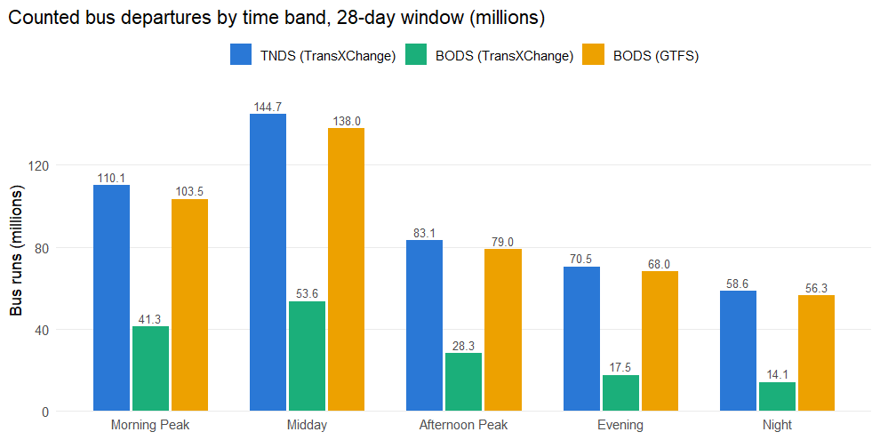
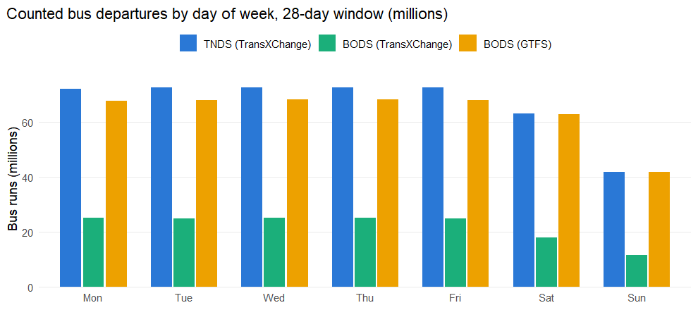
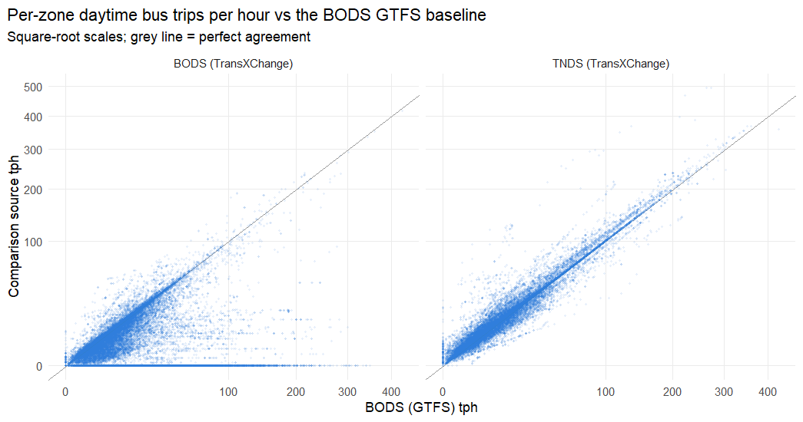
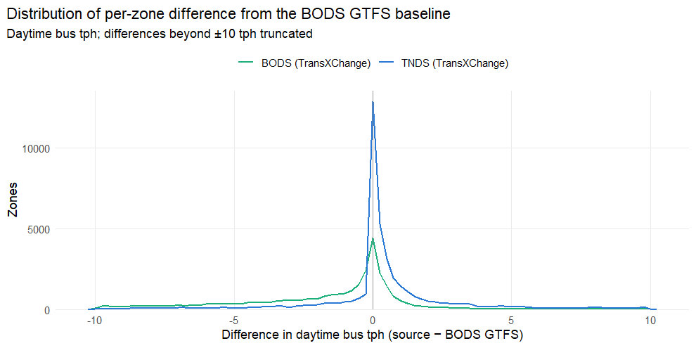

# Comparing the three October 2025 bus timetable sources

Since the Bus Open Data Service (BODS) became the statutory home of English
bus timetables, three parallel versions of "the bus timetable" exist for
recent years:

1. **TNDS (TransXChange)** — the Traveline National Dataset, compiled by the
   traveline consortium from local authority and operator data. This was the
   source used for the 2018–2023 analysis years. Converted to GTFS with
   `UK2GTFS::transxchange2gtfs()`.
2. **BODS (TransXChange)** — the raw TransXChange files that operators
   publish directly to the DfT's Bus Open Data Service (its "change archive"
   containing every dataset revision, filtered to the revisions valid on the
   analysis date). Converted to GTFS with `UK2GTFS::transxchange2gtfs()`.
3. **BODS (GTFS)** — the DfT's own GTFS rendering of the BODS data, used
   directly without any UK2GTFS conversion. This is the source used for the
   2024 and 2025 analysis years.

All three were counted with `UK2GTFS::gtfs_trips_per_zone()` over the **same
28-day window (2025-10-06 to
2025-11-02)** and the **same widened LSOA zones**,
so every difference below is a difference in the sources or their conversion,
not in the counting method. Route types were harmonised to the set used
throughout this analysis (0 tram, 1 metro, 2 rail, 3 bus, 4 ferry,
**200 coach**); coach is kept distinct from local bus in every source, and
the headline bus comparisons below are for `route_type == 3` only.

One structural difference to note up front: TNDS distributed national coach
services as a separate NCSD archive, which **was discontinued after the
February 2025 snapshot** — the October 2025 TNDS snapshot therefore contains
no coach data, while both BODS sources still carry coach services published
to BODS.

## Feed-level summary

|Source              | Agencies| Routes|     Trips| Stops used| Routes in window| Trips in window| Missing departure times|
|:-------------------|--------:|------:|---------:|----------:|----------------:|---------------:|-----------------------:|
|TNDS (TransXChange) |      818| 16,345| 1,464,516|    319,253|           16,345|       1,385,008|                       0|
|BODS (TransXChange) |      469| 10,994|   563,395|    230,908|           10,994|         556,002|                       0|
|BODS (GTFS)         |      661| 13,743| 1,457,842|    309,871|           13,743|       1,329,251|                       0|

## Mode composition (trips by route type)

|source              |   Tram|  Metro|   Rail|       Bus|  Ferry|     6|  Coach|
|:-------------------|------:|------:|------:|---------:|------:|-----:|------:|
|BODS (GTFS)         | 41,387| 57,176| 14,683| 1,298,108| 30,443| 1,016| 15,029|
|BODS (TransXChange) |    830|      0|      0|   562,525|      0|     0|     40|
|TNDS (TransXChange) | 43,985| 65,135| 17,725| 1,312,439| 21,173|     0|  4,059|

## National bus service totals

Total counted bus (`route_type == 3`) departures from stops, summed over all
zones (a departure serving stops in more than one zone is counted in each, so
levels are comparable between sources but are not a national vehicle-trip
count).

|Source              | Bus runs in 28-day window|vs BODS (GTFS) |
|:-------------------|-------------------------:|:--------------|
|BODS (GTFS)         |               444,719,870|+0.0%          |
|BODS (TransXChange) |               154,684,230|-65.2%         |
|TNDS (TransXChange) |               467,000,097|+5.0%          |

## Coverage by country

BODS is an **England-only statutory requirement**; Scottish and Welsh
services reach it only where operators cross the border or publish
voluntarily. TNDS ingests the Scottish and Welsh traveline data directly, so
country-level coverage is where the sources should differ most.

|country  |  zones| TNDS mean tph| BODS TXC mean tph| BODS GTFS mean tph| TNDS zero-service zones| BODS TXC zero-service zones| BODS GTFS zero-service zones|
|:--------|------:|-------------:|-----------------:|------------------:|-----------------------:|---------------------------:|----------------------------:|
|England  | 33,669|         22.95|              9.11|              21.77|                       6|                       4,219|                          201|
|Scotland |  7,320|         16.82|              0.00|              16.34|                       1|                       7,296|                           21|
|Wales    |  1,907|          8.40|              3.69|               7.56|                       0|                         435|                            3|

## Zone-level agreement

Per-zone average daytime bus trips per hour (`tph_daytime_avg`, the headline
measure used by Carbon & Place), each TransXChange-derived source against the
BODS GTFS baseline.

|Source                | Pearson r| Spearman rho| Median abs diff (tph)|Zones within 10% |
|:---------------------|---------:|------------:|---------------------:|:----------------|
|TNDS vs BODS GTFS     |     0.972|        0.965|                  0.52|56.6%            |
|BODS TXC vs BODS GTFS |     0.308|        0.218|                  2.67|26.1%            |
|TNDS vs BODS TXC      |     0.299|        0.206|                  3.53|21.1%            |

Table: England only

|Source                | Pearson r| Spearman rho| Median abs diff (tph)|Zones within 10% |
|:---------------------|---------:|------------:|---------------------:|:----------------|
|TNDS vs BODS GTFS     |     0.969|        0.960|                  0.71|51.7%            |
|BODS TXC vs BODS GTFS |     0.313|        0.309|                  1.73|32.2%            |
|TNDS vs BODS TXC      |     0.300|        0.288|                  2.71|26.2%            |

## Largest disagreements

|Zone (LSOA21/DZ22) | TNDS tph| BODS TXC tph| BODS GTFS tph|
|:------------------|--------:|------------:|-------------:|
|E01032739          |    368.2|            0|         349.7|
|E01003933          |    354.8|            0|         340.8|
|E01003932          |    354.8|            0|         340.7|
|E01003930          |    346.9|            0|         333.0|
|E01033868          |    336.2|            0|         322.2|
|E01032582          |    335.9|            0|         308.9|
|E01004735          |    334.0|            0|         321.3|
|E01003110          |    333.0|            0|         319.1|
|E01033873          |    331.0|            0|         317.0|
|E01003943          |    330.9|            0|         316.9|
|E01003937          |    330.9|            0|         316.9|
|E01033876          |    318.2|            0|         304.3|
|E01032719          |    318.1|            0|         304.1|
|E01033874          |    318.1|            0|         304.1|
|E01032584          |    316.4|            0|         296.0|

## Interpretation

<!-- INTERPRETATION: completed after the pipeline run; see render notes -->

- Over the identical 28-day October 2025 window the pipeline counted **467,000,097** bus runs from TNDS, **154,684,230** from BODS TransXChange and **444,719,870** from BODS GTFS.
- In Scotland the mean zone daytime tph is 16.82 (TNDS), 0.00 (BODS TXC) and 16.34 (BODS GTFS); 7,296 zones have no counted service in BODS TXC against 1 in TNDS.
- In Wales the mean zone daytime tph is 8.40 (TNDS), 3.69 (BODS TXC) and 7.56 (BODS GTFS); 435 zones have no counted service in BODS TXC against 0 in TNDS.

### Why the sources differ

- **Coverage obligations differ.** BODS is a statutory requirement for
  English local bus services only. TNDS carries the Scottish and Welsh
  traveline datasets. The BODS GTFS and BODS TransXChange feeds do include
  some Scottish and Welsh services (cross-border operators, voluntary
  publication, and TfW/Traveline Cymru bulk uploads), but coverage outside
  England should be treated as incomplete in both BODS-derived sources.
- **Different compilation routes.** TNDS is compiled and quality-assured by
  traveline from local authority systems; BODS TransXChange is published
  directly by operators (with varying quality and duplication across dataset
  revisions); BODS GTFS is the DfT's automated conversion of the latter.
  Services can legitimately appear in one and not another (e.g. new
  operators publishing only to BODS; local services still only in local
  authority systems).
- **Duplication handling.** The BODS change archive contains every revision
  of every dataset; superseded revisions were dropped with
  `UK2GTFS::txc_filter_files()` keeping the revision valid on the analysis
  date. Residual duplication (the same service published by both an operator
  and a local authority scheme) inflates counts in the TransXChange-derived
  sources; the DfT GTFS pipeline applies its own de-duplication.
- **Conversion differences.** The TransXChange sources are converted with
  UK2GTFS (this pipeline), while BODS GTFS is converted by the DfT's ITO
  World pipeline. Differences in how each handles operating profiles, bank
  holidays, school-term services and duplicate journeys show up as small
  per-zone differences even where the underlying timetable is identical.
- **Coach coverage differs by design.** All sources now distinguish coach
  (200) from local bus (3), but TNDS's coach data came from the separate
  NCSD archive, discontinued after February 2025 — so the October 2025 TNDS
  snapshot has no coach services at all. Services classified as coach in one
  source and bus in another also remain a real (small) difference.
