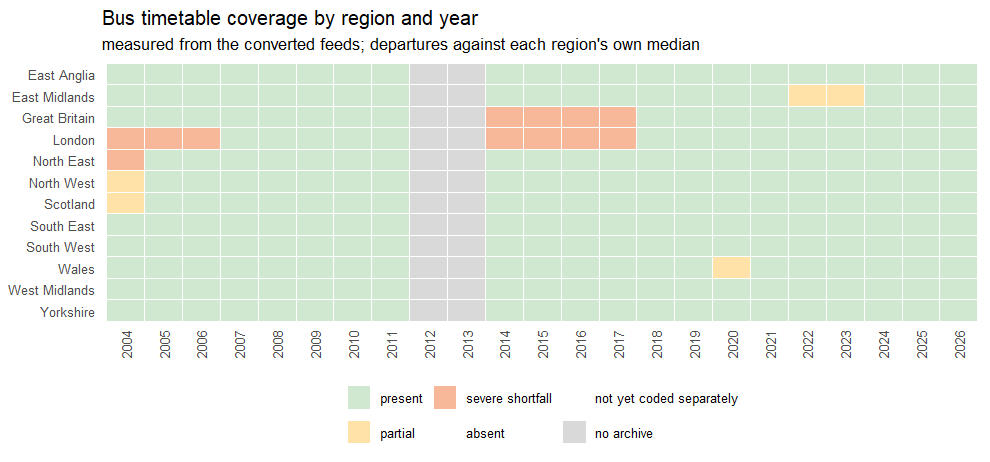
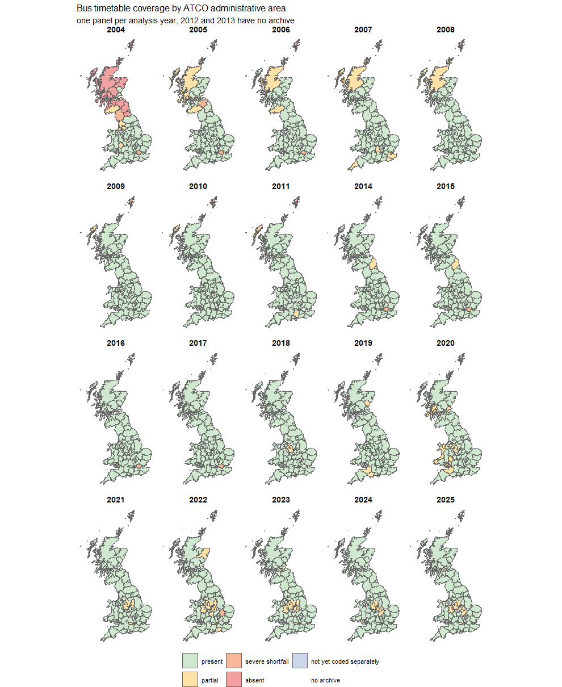
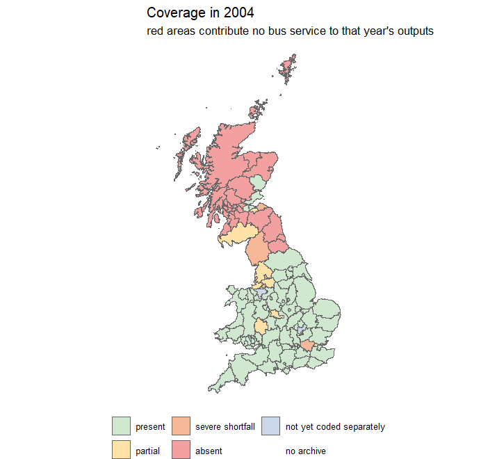
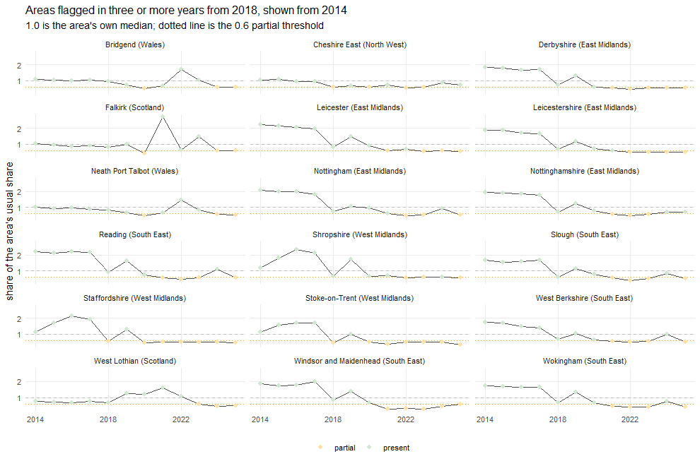
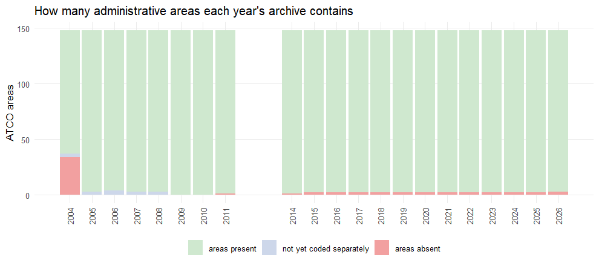
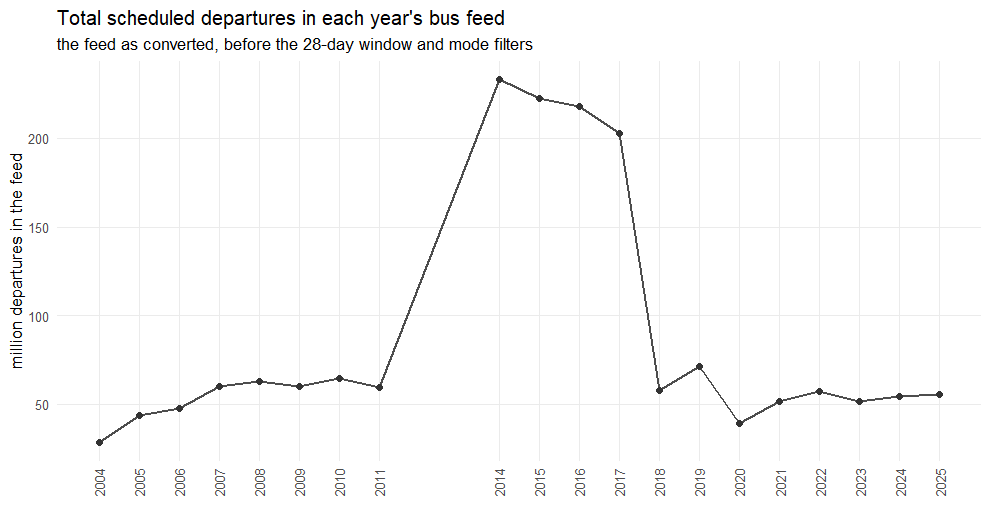
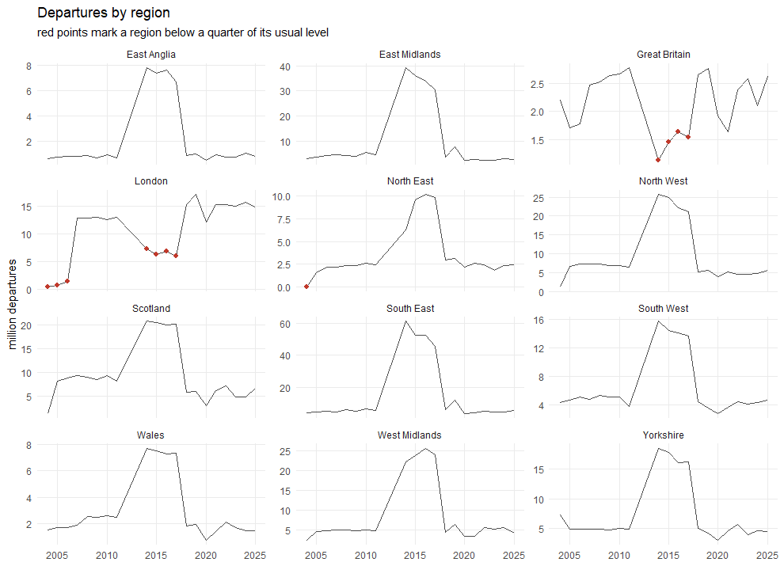
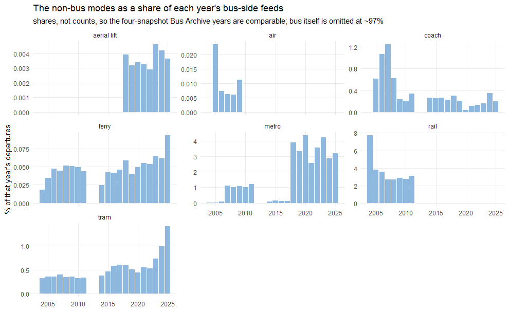
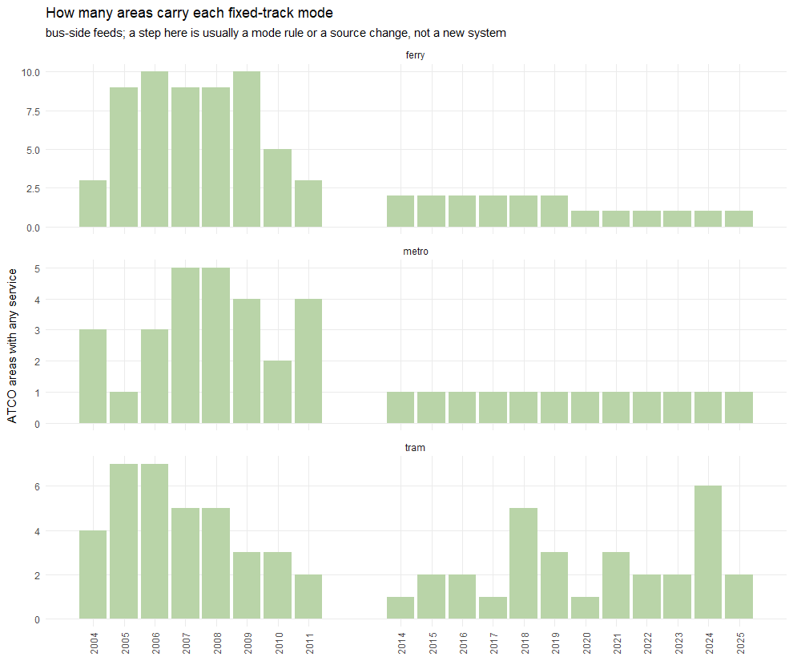

# Where and when the timetable data actually exists

The manual's coverage figure — `images/manual/transport_bus_data.webp` — is a
hand-assessed grid of region against year, green for usable and red for not.
It was right about the big things and it is the reason nobody reads 2004
Scotland as a collapse in bus service. But it was compiled by eye several
years ago, it stops at 2023, and it records eleven regions, which is coarse
enough to hide an entire county.

This report rebuilds it by measurement, extends it to 2025, and
puts it in the pipeline so it stays current. It is generated from the
converted feeds themselves, so a reconversion re-measures it rather than
leaving the assessment to drift away from the data.

It also goes wider than the manual's grid in three ways. It covers **every
mode**, not just bus, because bus is 97% of departures and a whole tram
network could disappear without moving a figure. It gives the **2018–2025
years their own section**, because that is one continuous TNDS series where
coverage ought to be complete and anything flagged is worth chasing. And it
is explicit about what the **"Great Britain" region** is, which is not a
place.

## How coverage is measured

The unit is the **ATCO administrative area**, not the region. A coverage gap
is physically a set of files that is not in the archive, and the archives are
assembled per administrative area, so that is the unit at which data goes
missing. Every stop id in every era carries its area in the first three
characters of the NaPTAN AtcoCode, and between 99.6% and 100% of stops in
every feed join to UK2GTFS's `atco_areas` lookup, so one rule works across
NPTDR, the Bus Archive and TNDS alike. Boundaries come from that same lookup.

Three numbers are taken per area per year, because they fail differently:
how many stops the feed **describes**, how many of those a vehicle actually
**calls at**, and how many **departures** that amounts to. A feed can list an
area's stops and run nothing from them, which a stop count alone scores as
present. Departures is the measure used throughout, and it is split by
`route_type` as well as by area, which is what the mode section uses.

An area is judged against **its own usual level**, and on its **share of that
year's departures** rather than the raw count. The eras are not on a common
scale: a Bus Archive year merges four weekly snapshots, so 2014–2017 hold
around 220 million departures against 28–71 million in an NPTDR or TNDS year.
Any benchmark in raw departures inherits that multiplier. A share cancels it,
and it also cancels genuine national change — which is what is wanted here,
because this measures coverage, not service. `absent` is no departures at
all, `severe shortfall` is below a quarter of the area's usual share, and
`partial` is below six tenths.

**An area missing because its stops are filed under a predecessor authority
is not a coverage gap**, and is shown separately in blue. Local government
reorganisation creates ATCO areas mid-series, and the service was in the
archive all along under the old code. The test is whether the *region* grew
when the area first appeared: a gap filling in adds the area's stops to its
region, a re-coding only moves them within it.

### "Great Britain" is not a region

Eleven of the twelve regions in the grid are places: Scotland, Wales, London,
the nine English regions. **"Great Britain" is not.** It is where the ATCO
scheme puts the five *national* networks, whose stops are numbered once for
the country instead of by the authority they stand in:

|ATCO |network                   | years with service| most stops|
|:----|:-------------------------|------------------:|----------:|
|900  |National - National Coach |                  7|         33|
|910  |National - National Rail  |                 20|       2578|
|920  |National - National Air   |                  7|         59|
|930  |National - National Ferry |                 20|        298|
|940  |National - National Tram  |                 19|       1543|

A tram stop is `9400…`, a rail station `9100…`, a coach stop `900…`, whatever
town it is in. So these five rows describe **modes, not geography**, and they
behave differently from the other eleven for a reason that has nothing to do
with coverage of the country: a national code appears when a source chooses
to use it and vanishes when a source codes the same services locally instead.

That is why the "Great Britain" row is the one that flickers. It is also why
it is excluded from the maps — its polygons span the whole country, so
drawing it would lay five national layers over every local area — and why
the national networks are discussed under modes below rather than here.

**Where a national network is missing, the service is usually not.** The
clearest case is coach: `900` holds coach only in the NPTDR years, and from
2014 the same coaches are in the archive under ordinary local area codes, or
in the separate BODS Coach feed. The mode section is the place to read that;
the geographic grid would call it a gap, and it is not one.

Only the **bus-side feeds** are measured in this section. The rail CIF feeds
are keyed on TIPLOC rather than ATCO, so the same join cannot be made — they
are measured by position instead and reported under modes.

One caution remains. The method cannot tell a missing file from a real
collapse in service, so a `partial` year may be a genuine reduction — 2020 is
the obvious case. Only `absent` is unambiguous.

## What each year is made of

| year|source                    |28-day counting window   |
|----:|:-------------------------|:------------------------|
| 2004|NPTDR                     |2004-09-27 to 2004-10-24 |
| 2005|NPTDR                     |2005-09-26 to 2005-10-23 |
| 2006|NPTDR                     |2006-09-25 to 2006-10-22 |
| 2007|NPTDR                     |2007-10-01 to 2007-10-28 |
| 2008|NPTDR                     |2008-09-29 to 2008-10-26 |
| 2009|NPTDR                     |2009-09-28 to 2009-10-25 |
| 2010|NPTDR                     |2010-09-27 to 2010-10-24 |
| 2011|NPTDR                     |2011-09-26 to 2011-10-23 |
| 2014|Bus Archive (TNDS weekly) |2014-10-06 to 2014-11-02 |
| 2015|Bus Archive (TNDS weekly) |2015-10-05 to 2015-11-01 |
| 2016|Bus Archive (TNDS weekly) |2016-10-03 to 2016-10-30 |
| 2017|Bus Archive (TNDS weekly) |2017-10-02 to 2017-10-29 |
| 2018|TNDS                      |2018-05-14 to 2018-06-10 |
| 2019|TNDS                      |2019-10-07 to 2019-11-03 |
| 2020|TNDS                      |2020-06-29 to 2020-07-26 |
| 2021|TNDS                      |2021-10-11 to 2021-11-07 |
| 2022|TNDS                      |2022-10-31 to 2022-11-27 |
| 2023|TNDS                      |2023-10-30 to 2023-11-26 |
| 2024|TNDS + BODS Coach         |2024-09-30 to 2024-11-03 |
| 2025|TNDS + BODS Coach         |2025-09-29 to 2025-11-02 |

There is no archive at all for 2012 and 2013: NPTDR stopped after 2011 and the Bus Archive starts in 2014. Those years are shown as a grey column throughout and are not interpolated anywhere in this pipeline.

## The coverage grid

This is the direct successor to the manual's figure: region by year, coloured
by measured status rather than by assessment.

The region roll-up is generous by construction: a region keeps most of its
departures when one of its areas vanishes, so a region only turns amber when
a large area or several small ones go. The area-level maps below are what the
regional view hides.

### How this compares with the manual's figure

The strongest agreement is London. The manual marks it red in 2004-2006 and 2014-2017, and those are exactly the seven years this finds: London runs at 7-15% of its usual share of national departures in them, against 91-102% in 2007-2011 and 112-143% from 2018. Whatever else is true of those years, the London bus network is not in the archive in any useful quantity.

The two do not agree everywhere, and they are not measuring the same thing.
The manual records a judgement about whether a region's data is *usable*,
which takes in problems this cannot see — a snapshot taken at the wrong time
of year, a known conversion failure, an operator's data arriving in the wrong
format. This measures one narrow, checkable thing: whether departures are
present in the quantity the area normally has.

So a region-year the manual flags and this one does not has probably not been
disproved; it has been found to contain data, which was never the whole of
the manual's claim. The reverse case — flagged here and not there — is the
one worth acting on, because it means something measurable changed since the
manual was written, or was missed by eye.

## Coverage in space

## The years with real gaps

| year| areas affected| of which absent|regions                                                 |
|----:|--------------:|---------------:|:-------------------------------------------------------|
| 2004|             40|              34|Great Britain, London, North East, North West, Scotland |
| 2005|              8|               0|Great Britain, London, North West, Scotland             |
| 2006|              4|               0|Great Britain, London, Scotland                         |
| 2007|              2|               0|Scotland                                                |
| 2008|              2|               0|Great Britain, Scotland                                 |
| 2009|              1|               0|Scotland                                                |
| 2010|              2|               0|Great Britain, Scotland                                 |
| 2011|              4|               1|Great Britain, Scotland, South West                     |
| 2014|              3|               1|Great Britain, London                                   |
| 2015|              3|               2|Great Britain, London                                   |
| 2016|              3|               2|Great Britain, London                                   |
| 2017|              4|               2|Great Britain, London                                   |
| 2018|              2|               2|Great Britain                                           |
| 2019|              2|               2|Great Britain                                           |
| 2020|              2|               2|Great Britain                                           |
| 2021|              2|               2|Great Britain                                           |
| 2022|              4|               2|East Anglia, East Midlands, Great Britain               |
| 2023|              4|               2|Great Britain, South West                               |
| 2024|              3|               2|Great Britain                                           |
| 2025|              3|               2|Great Britain                                           |

**2004is the worst year**: 34 areas have no service at all, against 111 present.

### 2004 in detail

|region        |area                      |ATCO |departures in a normal year |
|:-------------|:-------------------------|:----|:---------------------------|
|Great Britain |National - National Air   |920  |0                           |
|Great Britain |National - National Coach |900  |0                           |
|Great Britain |National - National Tram  |940  |0                           |
|North East    |Durham                    |130  |0                           |
|North East    |Hartlepool                |075  |0                           |
|North East    |Middlesbrough             |079  |0                           |
|North East    |Northumberland            |310  |0                           |
|North East    |Redcar and Cleveland      |078  |0                           |
|North East    |Stockton-on-Tees          |077  |0                           |
|North East    |Tyne and Wear             |410  |0                           |
|Scotland      |Aberdeen                  |639  |0                           |
|Scotland      |Aberdeenshire             |630  |0                           |
|Scotland      |Argyll and Bute           |607  |0                           |
|Scotland      |Clackmannanshire          |668  |0                           |
|Scotland      |East Ayrshire             |618  |0                           |
|Scotland      |East Dunbartonshire       |611  |0                           |
|Scotland      |East Renfrewshire         |612  |0                           |
|Scotland      |Falkirk                   |669  |0                           |
|Scotland      |Glasgow                   |609  |0                           |
|Scotland      |Highland                  |670  |0                           |
|Scotland      |Inverclyde                |613  |0                           |
|Scotland      |Moray                     |638  |0                           |
|Scotland      |North Ayrshire            |617  |0                           |
|Scotland      |North Lanarkshire         |616  |0                           |
|Scotland      |Orkney Islands            |602  |0                           |
|Scotland      |Perth and Kinross         |648  |0                           |
|Scotland      |Renfrewshire              |614  |0                           |
|Scotland      |Scottish Borders          |690  |0                           |
|Scotland      |Shetland Islands          |603  |0                           |
|Scotland      |South Ayrshire            |619  |0                           |
|Scotland      |South Lanarkshire         |615  |0                           |
|Scotland      |Stirling                  |660  |0                           |
|Scotland      |West Dunbartonshire       |608  |0                           |
|Scotland      |Western Isles             |601  |0                           |

### Absences that are not gaps

These areas are missing from the early years because they did not exist yet as ATCO areas. Their stops are in the archive under the predecessor authority, and the region does not grow when they appear — so they are **not** counted as gaps anywhere above.

|region        |area                      |ATCO |absent from              | first appears|
|:-------------|:-------------------------|:----|:------------------------|-------------:|
|East Midlands |Leicester                 |269  |2004 2005 2006           |          2007|
|North West    |Blackburn with Darwen     |258  |2006 2007 2008           |          2009|
|South East    |Central Bedfordshire      |021  |2004 2005 2006 2007 2008 |          2009|
|North West    |Cheshire West and Chester |061  |2004 2005 2006 2007 2008 |          2009|

## The modern era, 2018 to 2025

Everything above is dominated by 2004. From 2018 the source is one
continuous TNDS series and coverage should be complete, so anything flagged
here is either a real reduction in service or a defect worth chasing. This
section is the detail for those eight years.

Across the eight years there are 119 area-years below six tenths of normal, involving 59 distinct areas.

The national codes (National - National Air, National - National Coach, National - National Rail) are left out of this section. They are modes rather than places and their comings and goings are a question about sources, dealt with under "Great Britain is not a region" above.

Two patterns are worth separating before reading the table. **2020 is the
pandemic**, and it accounts for a large share of the single-year entries —
most of Wales appears once, in 2020, and nowhere else. **Neighbouring areas
failing in the same years is the signature of a data problem**, because an
upload, an operator or an authority's feed covers a contiguous patch, while
a service reduction does not respect administrative borders so precisely.

**Areas flagged in more than one year** are the ones to look at: a single year can be a timetable change, a pattern is more likely to be the data.

|region        |area                   |ATCO |years                              | count|lowest |status  |
|:-------------|:----------------------|:----|:----------------------------------|-----:|:------|:-------|
|West Midlands |Staffordshire          |380  |2018 2020 2021 2022 2023 2024 2025 |     7|46%    |partial |
|West Midlands |Stoke-on-Trent         |389  |2018 2020 2021 2022 2023 2024 2025 |     7|33%    |partial |
|East Midlands |Derbyshire             |100  |2021 2022 2023 2024 2025           |     5|45%    |partial |
|South East    |Windsor and Maidenhead |036  |2021 2022 2023 2024 2025           |     5|27%    |partial |
|East Midlands |Leicester              |269  |2021 2023 2024 2025                |     4|53%    |partial |
|East Midlands |Leicestershire         |260  |2022 2023 2024 2025                |     4|49%    |partial |
|North West    |Cheshire East          |060  |2018 2020 2022 2023                |     4|54%    |partial |
|South East    |Reading                |039  |2021 2022 2023 2025                |     4|49%    |partial |
|South East    |Slough                 |037  |2021 2022 2023 2025                |     4|40%    |partial |
|South East    |West Berkshire         |030  |2021 2022 2023 2025                |     4|49%    |partial |
|South East    |Wokingham              |035  |2021 2022 2023 2025                |     4|38%    |partial |
|East Midlands |Nottingham             |339  |2022 2023 2025                     |     3|48%    |partial |
|East Midlands |Nottinghamshire        |330  |2021 2022 2023                     |     3|49%    |partial |
|Scotland      |Falkirk                |669  |2020 2024 2025                     |     3|40%    |partial |
|Scotland      |West Lothian           |629  |2023 2024 2025                     |     3|44%    |partial |
|Wales         |Bridgend               |551  |2020 2024 2025                     |     3|51%    |partial |
|Wales         |Neath Port Talbot      |582  |2020 2024 2025                     |     3|48%    |partial |
|West Midlands |Shropshire             |350  |2022 2023 2025                     |     3|55%    |partial |
|East Midlands |Northamptonshire       |300  |2024 2025                          |     2|58%    |partial |
|East Midlands |Rutland                |268  |2024 2025                          |     2|48%    |partial |
|South East    |Southend-on-Sea        |158  |2023 2024                          |     2|56%    |partial |
|South West    |Somerset               |360  |2019 2020                          |     2|46%    |partial |
|Wales         |Newport                |531  |2020 2021                          |     2|32%    |partial |

Flagged in a single year only:

|region        |area                  |ATCO |year |share |
|:-------------|:---------------------|:----|:----|:-----|
|East Anglia   |Cambridgeshire        |050  |2022 |20%   |
|East Midlands |Derby                 |109  |2020 |55%   |
|East Midlands |Peterborough          |059  |2022 |7%    |
|North West    |Warrington            |069  |2022 |56%   |
|Scotland      |Aberdeenshire         |630  |2022 |58%   |
|Scotland      |Angus                 |649  |2019 |59%   |
|Scotland      |Argyll and Bute       |607  |2020 |60%   |
|Scotland      |Clackmannanshire      |668  |2024 |54%   |
|Scotland      |East Dunbartonshire   |611  |2025 |51%   |
|Scotland      |Edinburgh             |620  |2020 |47%   |
|Scotland      |Fife                  |650  |2020 |45%   |
|South East    |Bedford               |020  |2025 |55%   |
|South East    |West Sussex           |440  |2022 |58%   |
|South West    |Bristol               |010  |2019 |56%   |
|South West    |Dorset                |120  |2019 |45%   |
|South West    |North Somerset        |019  |2020 |55%   |
|South West    |Poole                 |128  |2019 |56%   |
|South West    |South Gloucestershire |017  |2019 |59%   |
|South West    |Torbay                |119  |2023 |13%   |
|Wales         |Blaenau Gwent         |532  |2020 |49%   |
|Wales         |Caerphilly            |554  |2020 |47%   |
|Wales         |Cardiff               |571  |2020 |51%   |
|Wales         |Ceredigion            |523  |2020 |48%   |
|Wales         |Conwy                 |513  |2020 |49%   |
|Wales         |Flintshire            |512  |2020 |55%   |
|Wales         |Gwynedd               |540  |2020 |53%   |
|Wales         |Isle of Anglesey      |541  |2025 |52%   |
|Wales         |Merthyr Tydfil        |553  |2023 |37%   |
|Wales         |Monmouthshire         |533  |2020 |54%   |
|Wales         |Pembrokeshire         |521  |2020 |48%   |
|Wales         |Rhondda Cynon Taff    |552  |2020 |57%   |
|Wales         |Torfaen               |534  |2020 |46%   |
|Wales         |Vale of Glamorgan     |572  |2020 |56%   |
|West Midlands |Herefordshire         |209  |2020 |59%   |
|West Midlands |Warwickshire          |420  |2022 |60%   |
|Yorkshire     |Kingston upon Hull    |229  |2022 |35%   |

**The strongest candidates for a defect**, flagged in four or more of the eight years:

- *West Midlands* — Staffordshire (7 years, low 46%); Stoke-on-Trent (7 years, low 33%)
- *East Midlands* — Derbyshire (5 years, low 45%); Leicester (4 years, low 53%); Leicestershire (4 years, low 49%)
- *South East* — Windsor and Maidenhead (5 years, low 27%); Reading (4 years, low 49%); Slough (4 years, low 40%); West Berkshire (4 years, low 49%); Wokingham (4 years, low 38%)
- *North West* — Cheshire East (4 years, low 54%)

Several of those are adjacent pairs or blocks rather than isolated areas — Staffordshire with Stoke-on-Trent, Leicester with Leicestershire, and the four Berkshire authorities together — which is what makes them worth opening: a contiguous group of authorities short in the same set of years points at one upstream source, not at the bus networks themselves.

Read these as questions, not findings. The measure compares an area against its own median over twenty years, so a network that has genuinely shrunk since 2004 sits below 1.0 for real reasons, and the 2020 entries are the pandemic rather than a defect. What would indicate a data problem is a **step** - a year or two far below neighbours on either side - rather than a slope.

## Coverage in time

A change in this line is not by itself a change in bus service: it moves with
the source, with the archive's completeness, and with how much of the network
a snapshot happened to catch. It is here to be read against the grid above,
not on its own.

## Every mode, not just bus

Everything above counts departures regardless of mode, which is reasonable
because bus is about 97% of them — but it means a tram network could vanish
without moving a single figure. This section separates them.

Two sources, measured differently and kept apart. The **bus-side feeds**
(NPTDR, Bus Archive, TNDS, BODS Coach) are not bus-only: NPTDR in particular
carries rail, tram, metro, ferry, coach and air. The **rail CIF feeds**
supply heavy rail from 2018 and are keyed on TIPLOC, so their stops are
placed by coordinate rather than by code.

|mode        |2004   |2005   |2006   |2007   |2008   |2009   |2010   |2011   |2014    |2015    |2016    |2017    |2018   |2019   |2020   |2021   |2022   |2023   |2024   |2025   |
|:-----------|:------|:------|:------|:------|:------|:------|:------|:------|:-------|:-------|:-------|:-------|:------|:------|:------|:------|:------|:------|:------|:------|
|tram        |94     |156    |171    |239    |218    |217    |214    |200    |883     |1,043   |1,281   |1,217   |344    |364    |175    |287    |308    |375    |540    |788    |
|metro       |2      |8      |43     |667    |645    |651    |650    |722    |191     |316     |262     |232     |2,271  |2,368  |1,718  |1,322  |2,048  |2,168  |1,562  |1,781  |
|rail        |2,191  |1,647  |1,692  |1,604  |1,679  |1,741  |1,773  |1,832  |2       |3       |4       |4       |3      |1      |1      |0      |0      |1      |1      |1      |
|bus         |26,003 |41,379 |45,257 |56,996 |59,733 |57,473 |61,744 |56,529 |231,572 |220,423 |215,754 |200,590 |55,400 |68,296 |37,486 |49,903 |55,022 |48,723 |52,054 |53,095 |
|ferry       |5      |15     |23     |27     |32     |31     |32     |26     |58      |94      |90      |93      |34     |29     |19     |28     |31     |33     |33     |52     |
|aerial lift |–      |–      |–      |–      |–      |–      |–      |–      |–       |–       |–       |–       |2      |2      |1      |2      |2      |2      |2      |2      |
|coach       |0      |268    |508    |751    |393    |144    |133    |202    |621     |569     |574     |466     |176    |144    |16     |60     |78     |80     |191    |109    |
|air         |–      |10     |4      |4      |4      |7      |–      |–      |0       |–       |–       |–       |–      |–      |–      |–      |–      |–      |–      |–      |

*Thousands of departures in each year's bus-side feeds, by mode. An en dash
is a mode the year's feeds do not contain at all.*

**Compare down a column, not across a row.** These are raw counts, and
2014–2017 hold four weekly snapshots each, so their figures are about four
times those of a comparable year — bus reads 231,572 in 2014 against 56,529
in 2011 and 55,400 in 2018, and almost all of that is the merge, not the
network. The chart below is on shares for that reason.

### The rail CIF feeds

Thousands of departures, 2018 onwards.

|mode  |2018  |2019  |2020  |2021  |2022  |2023  |2024  |2025  |
|:-----|:-----|:-----|:-----|:-----|:-----|:-----|:-----|:-----|
|bus   |256   |329   |126   |204   |265   |335   |426   |369   |
|ferry |4     |2     |3     |2     |2     |2     |4     |2     |
|metro |62    |43    |76    |33    |57    |54    |49    |53    |
|rail  |3,720 |3,918 |3,158 |2,872 |3,270 |4,174 |5,232 |5,279 |

These feeds are not purely rail. They carry **metro**, which the pipeline drops (`drop_route_types = 1` in `year_sources()`) because TNDS holds the Underground and the Tyne and Wear Metro in full and summing both would count those stations twice; **bus**, which is rail-replacement services; and a little **ferry**. What the pipeline takes from them is the rail row.

### What the mode table says about the series

- **Rail all but disappears from these feeds after 2011**: the NPTDR archives average 1,770 thousand rail departures a year, and from 2014 the bus-side feeds average 2 thousand. That is not a change in the railway. NPTDR was a multi-modal archive; TransXChange is not, and from 2018 the pipeline takes heavy rail from the CIF feeds instead. **The 2014-2017 years have neither** - no NPTDR and no CIF - so those four years carry essentially no rail at all.
- **Air** is an NPTDR mode and only an NPTDR mode: it runs in 2005-2009 (5 years), and the only trace of it anywhere else is 48 departures in 2014. `load_pt_frequency()` in the build repo drops route type 1100 outright, so none of it reaches the published figures.
- **Coach is in every year, but 2004 has essentially none** — 79 departures against 268,483 in 2005, which is why the published 2004 coach figure is zero. Its ups and downs after that are source changes rather than service: TNDS carried coach in its NCSD archive until that disappeared after February 2025, and from 2024 coach comes from the BODS Coach feed instead. The build repo folds coach back into bus for exactly this reason.
- **Metro steps twice, and neither step is a new railway**: 43k departures in 2006 against 667k in 2007, and 232k in 2017 against 2,271k in 2018. The first is NPTDR beginning to carry the Underground, the second is the move to TNDS. The Bus Archive years in between hold almost no metro, and what they do hold is Tyne and Wear.
- Where a mode's row is thin rather than empty, treat it as a coverage question and not a trend. The non-bus modes are small enough that one operator's data arriving in a different format moves the whole row; `reports/non_bus_modes.md` is the standing check on their identity.

## Every gap, by area and year

| year|region        |area                      |ATCO |departures |normal |share of normal |status           |
|----:|:-------------|:-------------------------|:----|:----------|:------|:---------------|:----------------|
| 2004|Great Britain |National - National Air   |920  |0          |0      |0%              |absent           |
| 2004|Great Britain |National - National Coach |900  |0          |0      |0%              |absent           |
| 2004|Great Britain |National - National Tram  |940  |0          |0      |0%              |absent           |
| 2004|London        |Greater London            |490  |438,383    |0      |7%              |severe shortfall |
| 2004|North East    |Darlington                |076  |626        |0      |1%              |severe shortfall |
| 2004|North East    |Durham                    |130  |0          |0      |0%              |absent           |
| 2004|North East    |Hartlepool                |075  |0          |0      |0%              |absent           |
| 2004|North East    |Middlesbrough             |079  |0          |0      |0%              |absent           |
| 2004|North East    |Northumberland            |310  |0          |0      |0%              |absent           |
| 2004|North East    |Redcar and Cleveland      |078  |0          |0      |0%              |absent           |
| 2004|North East    |Stockton-on-Tees          |077  |0          |0      |0%              |absent           |
| 2004|North East    |Tyne and Wear             |410  |0          |0      |0%              |absent           |
| 2004|North West    |Blackburn with Darwen     |258  |6          |0      |0%              |severe shortfall |
| 2004|North West    |Cumbria                   |090  |1,708      |0      |2%              |severe shortfall |
| 2004|North West    |Warrington                |069  |1,043      |0      |2%              |severe shortfall |
| 2004|Scotland      |Aberdeen                  |639  |0          |0      |0%              |absent           |
| 2004|Scotland      |Aberdeenshire             |630  |0          |0      |0%              |absent           |
| 2004|Scotland      |Argyll and Bute           |607  |0          |0      |0%              |absent           |
| 2004|Scotland      |Clackmannanshire          |668  |0          |0      |0%              |absent           |
| 2004|Scotland      |East Ayrshire             |618  |0          |0      |0%              |absent           |
| 2004|Scotland      |East Dunbartonshire       |611  |0          |0      |0%              |absent           |
| 2004|Scotland      |East Lothian              |627  |1,990      |0      |3%              |severe shortfall |
| 2004|Scotland      |East Renfrewshire         |612  |0          |0      |0%              |absent           |
| 2004|Scotland      |Falkirk                   |669  |0          |0      |0%              |absent           |
| 2004|Scotland      |Glasgow                   |609  |0          |0      |0%              |absent           |
| 2004|Scotland      |Highland                  |670  |0          |0      |0%              |absent           |
| 2004|Scotland      |Inverclyde                |613  |0          |0      |0%              |absent           |
| 2004|Scotland      |Moray                     |638  |0          |0      |0%              |absent           |
| 2004|Scotland      |North Ayrshire            |617  |0          |0      |0%              |absent           |
| 2004|Scotland      |North Lanarkshire         |616  |0          |0      |0%              |absent           |
| 2004|Scotland      |Orkney Islands            |602  |0          |0      |0%              |absent           |
| 2004|Scotland      |Perth and Kinross         |648  |0          |0      |0%              |absent           |
| 2004|Scotland      |Renfrewshire              |614  |0          |0      |0%              |absent           |
| 2004|Scotland      |Scottish Borders          |690  |0          |0      |0%              |absent           |
| 2004|Scotland      |Shetland Islands          |603  |0          |0      |0%              |absent           |
| 2004|Scotland      |South Ayrshire            |619  |0          |0      |0%              |absent           |
| 2004|Scotland      |South Lanarkshire         |615  |0          |0      |0%              |absent           |
| 2004|Scotland      |Stirling                  |660  |0          |0      |0%              |absent           |
| 2004|Scotland      |West Dunbartonshire       |608  |0          |0      |0%              |absent           |
| 2004|Scotland      |Western Isles             |601  |0          |0      |0%              |absent           |
| 2005|Great Britain |National - National Coach |900  |14         |0      |10%             |severe shortfall |
| 2005|Great Britain |National - National Tram  |940  |23,502     |0      |4%              |severe shortfall |
| 2005|London        |Greater London            |490  |703,774    |0      |8%              |severe shortfall |
| 2005|North West    |Blackburn with Darwen     |258  |105        |0      |0%              |severe shortfall |
| 2005|Scotland      |Falkirk                   |669  |18,002     |0      |18%             |severe shortfall |
| 2005|Scotland      |Orkney Islands            |602  |30         |0      |0%              |severe shortfall |
| 2005|Scotland      |Scottish Borders          |690  |7,391      |0      |18%             |severe shortfall |
| 2005|Scotland      |Shetland Islands          |603  |1,611      |0      |19%             |severe shortfall |
| 2006|Great Britain |National - National Tram  |940  |69,177     |0      |10%             |severe shortfall |
| 2006|London        |Greater London            |490  |1,451,096  |0      |14%             |severe shortfall |
| 2006|Scotland      |Orkney Islands            |602  |1,264      |0      |14%             |severe shortfall |
| 2006|Scotland      |Shetland Islands          |603  |1,390      |0      |15%             |severe shortfall |
| 2007|Scotland      |Orkney Islands            |602  |924        |0      |8%              |severe shortfall |
| 2007|Scotland      |Shetland Islands          |603  |2,153      |0      |19%             |severe shortfall |
| 2008|Great Britain |National - National Coach |900  |33         |0      |16%             |severe shortfall |
| 2008|Scotland      |Shetland Islands          |603  |2,232      |0      |19%             |severe shortfall |
| 2009|Scotland      |Shetland Islands          |603  |2,242      |0      |19%             |severe shortfall |
| 2010|Great Britain |National - National Air   |920  |212        |0      |5%              |severe shortfall |
| 2010|Scotland      |Shetland Islands          |603  |2,488      |0      |20%             |severe shortfall |
| 2011|Great Britain |National - National Air   |920  |0          |0      |0%              |absent           |
| 2011|Great Britain |National - National Coach |900  |39         |0      |20%             |severe shortfall |
| 2011|Scotland      |Shetland Islands          |603  |2,480      |0      |22%             |severe shortfall |
| 2011|South West    |Portsmouth                |199  |12,252     |0      |7%              |severe shortfall |
| 2014|Great Britain |National - National Air   |920  |48         |0      |0%              |severe shortfall |
| 2014|Great Britain |National - National Coach |900  |0          |0      |0%              |absent           |
| 2014|London        |Greater London            |490  |7,370,109  |0      |15%             |severe shortfall |
| 2015|Great Britain |National - National Air   |920  |0          |0      |0%              |absent           |
| 2015|Great Britain |National - National Coach |900  |0          |0      |0%              |absent           |
| 2015|London        |Greater London            |490  |6,317,678  |0      |13%             |severe shortfall |
| 2016|Great Britain |National - National Air   |920  |0          |0      |0%              |absent           |
| 2016|Great Britain |National - National Coach |900  |0          |0      |0%              |absent           |
| 2016|London        |Greater London            |490  |6,854,341  |0      |15%             |severe shortfall |
| 2017|Great Britain |National - National Air   |920  |0          |0      |0%              |absent           |
| 2017|Great Britain |National - National Coach |900  |0          |0      |0%              |absent           |
| 2017|Great Britain |National - National Rail  |910  |152        |0      |15%             |severe shortfall |
| 2017|London        |Greater London            |490  |5,997,190  |0      |14%             |severe shortfall |
| 2018|Great Britain |National - National Air   |920  |0          |0      |0%              |absent           |
| 2018|Great Britain |National - National Coach |900  |0          |0      |0%              |absent           |
| 2019|Great Britain |National - National Air   |920  |0          |0      |0%              |absent           |
| 2019|Great Britain |National - National Coach |900  |0          |0      |0%              |absent           |
| 2020|Great Britain |National - National Air   |920  |0          |0      |0%              |absent           |
| 2020|Great Britain |National - National Coach |900  |0          |0      |0%              |absent           |
| 2021|Great Britain |National - National Air   |920  |0          |0      |0%              |absent           |
| 2021|Great Britain |National - National Coach |900  |0          |0      |0%              |absent           |
| 2022|East Anglia   |Cambridgeshire            |050  |43,056     |0      |20%             |severe shortfall |
| 2022|East Midlands |Peterborough              |059  |7,998      |0      |7%              |severe shortfall |
| 2022|Great Britain |National - National Air   |920  |0          |0      |0%              |absent           |
| 2022|Great Britain |National - National Coach |900  |0          |0      |0%              |absent           |
| 2023|Great Britain |National - National Air   |920  |0          |0      |0%              |absent           |
| 2023|Great Britain |National - National Coach |900  |0          |0      |0%              |absent           |
| 2023|Great Britain |National - National Rail  |910  |9          |0      |4%              |severe shortfall |
| 2023|South West    |Torbay                    |119  |11,997     |0      |13%             |severe shortfall |
| 2024|Great Britain |National - National Air   |920  |0          |0      |0%              |absent           |
| 2024|Great Britain |National - National Coach |900  |0          |0      |0%              |absent           |
| 2024|Great Britain |National - National Rail  |910  |31         |0      |12%             |severe shortfall |
| 2025|Great Britain |National - National Air   |920  |0          |0      |0%              |absent           |
| 2025|Great Britain |National - National Coach |900  |0          |0      |0%              |absent           |
| 2025|Great Britain |National - National Rail  |910  |29         |0      |11%             |severe shortfall |

## How to read the series because of this

The gaps are not noise spread evenly over the country. They are whole
administrative areas, so they land as a contiguous block on a map, and any
statistic that sums or averages over zones will move when one appears or
disappears. Three consequences:

**A year with a gap is not comparable with a year without one**, for any
national total, in any mode. This is most acute in the earliest year of the
series, which is also the one most often wanted as a baseline.

**Per-zone figures are safe where the zone has data.** A gap removes zones
from the series rather than depressing the ones that remain, so a like-for-
like comparison restricted to zones present in both years is unaffected. The
published change columns already avoid the worst of it by taking
`maxbus_2006_2008` rather than a single early year.

**A gap and a service cut look identical in a zone-count.** The only reliable
separator is the one used here: an entire administrative area going to zero
and returning is an archive artefact, because real networks do not do that.

## Prefixes that are not an administrative area

A stop id whose first three characters are not a known ATCO area code. These are excluded from every count above: there are 17 of them, they appear in one or two years each, and left in they would contribute a permanent baseline of absent "areas" that means nothing. Largest first.

|prefix | years present| most stops in a year| most departures|
|:------|-------------:|--------------------:|---------------:|
|305    |             2|                 1253|           54800|
|SPT    |             4|                  184|           10781|
|000    |            11|                  109|            7828|
|780    |             1|                   14|            1010|
|FD0    |             3|                    7|             441|
|888    |             2|                    3|              42|
|998    |             4|                    3|              21|
|700    |             3|                    2|              28|
|AIM    |             4|                    2|             216|
|FD2    |             3|                    2|               8|
|FD3    |             3|                    2|              94|
|FD5    |             3|                    2|              43|
|PTI    |             1|                    2|              36|
|070    |             1|                    1|             205|
|308    |             1|                    1|              88|
|BRQ    |             1|                    1|               4|
|BRS    |             1|                    1|               2|

---

Generated 2026-10-01 08:20 from 22 bus feeds covering 20 years.
