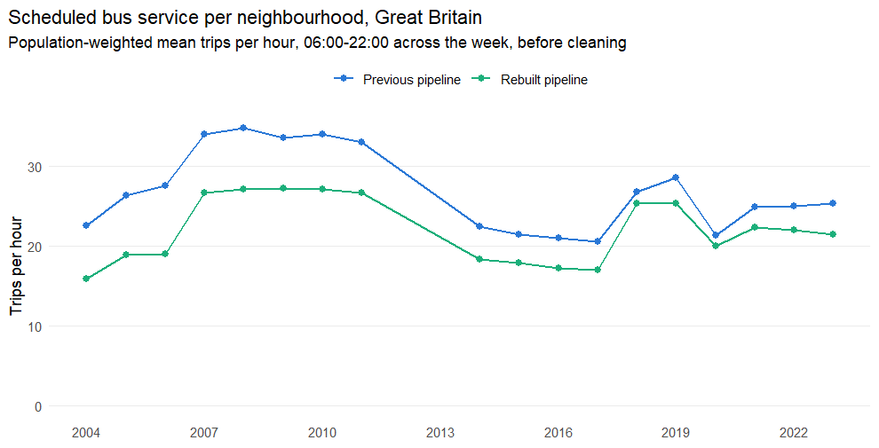
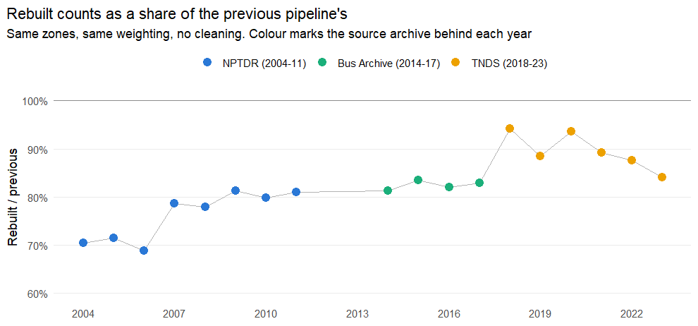
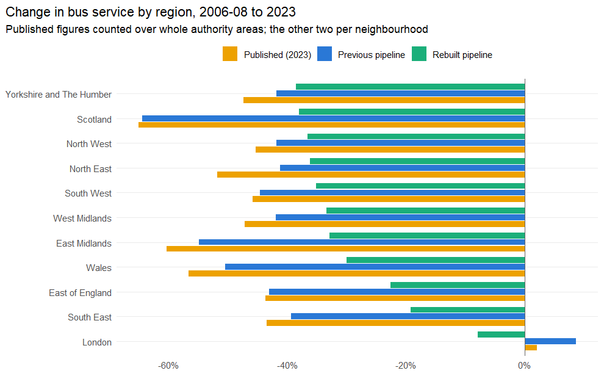
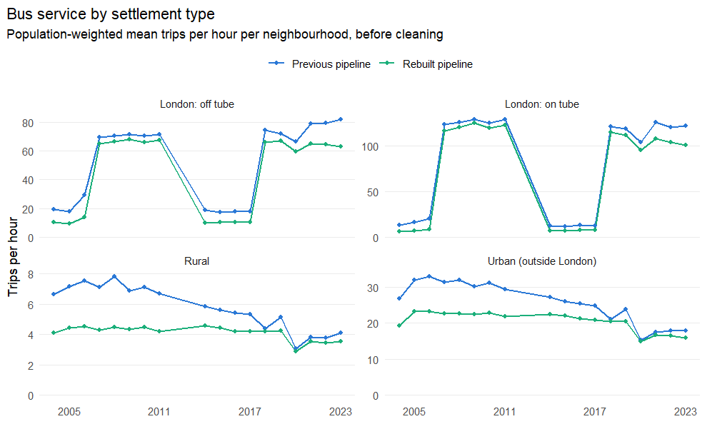
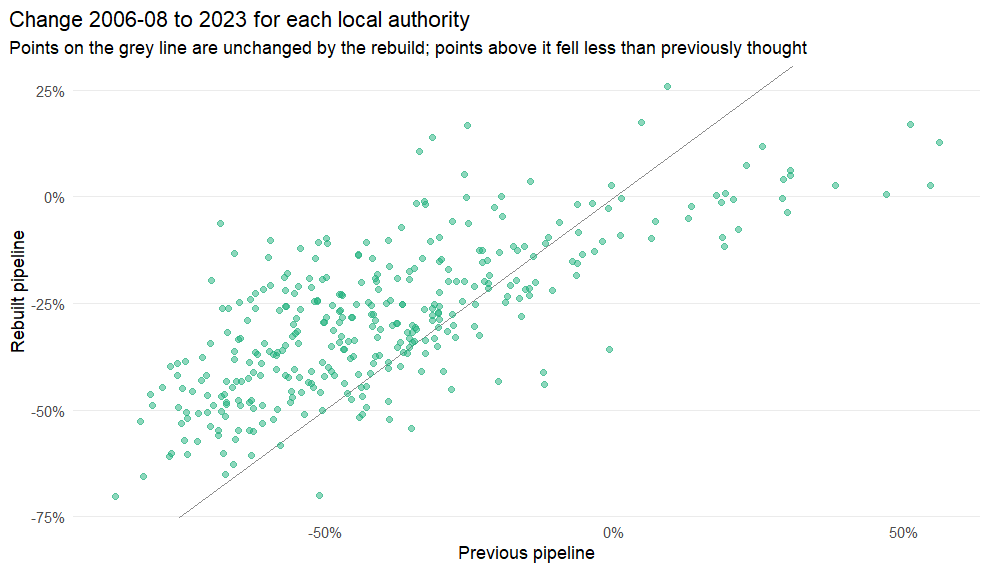

# Have the Friends of the Earth bus-decline findings changed?


## The question

The 2023 Friends of the Earth report [*How Britain's bus services have
drastically declined*](https://policy.friendsoftheearth.uk/insight/how-britains-bus-services-have-drastically-declined)
was built on the timetable analysis in the
[TransportBlackspots](https://github.com/ITSLeeds/TransportBlackspots) repo.
This repo is a rewrite of that analysis, run after a long series of fixes to
[UK2GTFS](https://github.com/ITSLeeds/UK2GTFS), the package that converts two
decades of historic timetable formats into GTFS before anything is counted.

Those fixes changed the numbers. The question is whether they changed the
*findings*.

**Short answer: the direction survives and the size does not.** Bus service
outside London still fell heavily, rural areas still fell further than urban
ones, and London is still an enormous outlier. But the rebuilt conversion cuts
roughly 10 to 15 percentage points off the measured decline almost everywhere,
because it counts far less service in the 2004-2011 archives the baseline is
drawn from. Two individual claims in the report do not survive: London's
"almost constant level of bus provision" becomes a modest fall, and the naming
of the worst-hit local authorities changes substantially.

Along the way this turned up two defects in the pipeline's recent years, both
since fixed, described in section 7.

## What is being compared

Two runs of the same measure, over the same zones, with the same method:

| | Timetable outputs | Built |
|---|---|---|
| **Previous pipeline** | `../inputdata/pt_frequency/` (byte-identical to the TransportBlackspots `data/` folder) | November 2025 |
| **Rebuilt pipeline** | `data/` in this repo | August 2026 |

Both are `trips_per_lsoa21_22_by_mode_<year>.Rds`: scheduled vehicle
departures counted at the stops in each 2021 LSOA (2022 Data Zone in
Scotland), by mode, day of week and time band.

The analysis on top of them is a port of the published one, not a new one: the
weekday means and the `tph_daytime_avg` weighting from
`scripts/make-stats/combine_trips_per_lsoa.R`, the outlier-and-interpolation
clean from `scripts/toby-analysis/final/clean-data.R`, and the
population-weighted aggregation from
`scripts/toby-analysis/final/weighted-regional-means.R`. Both series go through
it identically, so a difference between the two columns is the timetable
conversion and not the analysis.

Four things to state before the numbers.

**The port reproduces the published figures.** Running it over the previous
pipeline's outputs recovers the published Table 3 to within a few percentage
points (section 3). That is what licenses reading the rebuilt column as a
change in the data rather than a change in the method.

**Coach has been folded back into bus.** The rebuilt pipeline codes coach
separately as GTFS extended route type 200; the previous one left coach inside
route type 3. Both columns count 3 and 200 together. This turns out to matter
very little either way (section 6).

**The published regional tables were counted over whole local authority
areas.** Published Tables 1 and 2 come from a `trips_per_la_by_mode` series
this repo does not produce, and their trips-per-hour levels (London 509, the
North East 276) are authority-wide totals. Only percentage changes are
comparable for regions. Published Table 3 *is* per-neighbourhood, so it
compares directly, levels and all.

**The previous-pipeline column is not the published run.** It is the November
2025 TransportBlackspots rerun on 2021 zones — the closest thing to the
published analysis that exists on the same geography. The published figures
came from an earlier run on 2011 zones.

## 1. The national trend





| Year| Zones matched| Previous| Rebuilt| Rebuilt / previous| Zone correlation| Zone rank correlation|
|----:|-------------:|--------:|-------:|------------------:|----------------:|---------------------:|
| 2004|         31460|    22.52|   15.88|              0.705|            0.947|                 0.955|
| 2005|         39377|    26.29|   18.82|              0.716|            0.935|                 0.955|
| 2006|         39913|    27.50|   18.96|              0.689|            0.932|                 0.947|
| 2007|         42899|    33.91|   26.67|              0.786|            0.941|                 0.965|
| 2008|         42920|    34.70|   27.07|              0.780|            0.936|                 0.955|
| 2009|         42934|    33.50|   27.23|              0.813|            0.955|                 0.964|
| 2010|         42952|    33.95|   27.10|              0.798|            0.951|                 0.965|
| 2011|         42600|    32.92|   26.67|              0.810|            0.956|                 0.965|
| 2014|         39512|    22.43|   18.25|              0.814|            0.954|                 0.967|
| 2015|         39520|    21.41|   17.88|              0.835|            0.965|                 0.973|
| 2016|         39464|    21.00|   17.22|              0.820|            0.961|                 0.969|
| 2017|         39478|    20.50|   17.00|              0.829|            0.962|                 0.973|
| 2018|         42866|    26.80|   25.26|              0.942|            0.993|                 0.997|
| 2019|         42831|    28.62|   25.33|              0.885|            0.988|                 0.984|
| 2020|         42571|    21.39|   20.01|              0.936|            0.993|                 0.995|
| 2021|         42702|    24.96|   22.29|              0.893|            0.989|                 0.992|
| 2022|         42676|    25.04|   21.92|              0.875|            0.985|                 0.986|
| 2023|         42707|    25.45|   21.39|              0.841|            0.976|                 0.971|

The two curves have the same shape, and the correlation between the two runs
across the tens of thousands of individual neighbourhoods never falls below
0.93 — the rebuild is not
reshuffling *which* places have service. It is re-counting *how much*, and the
size of that re-count depends heavily on the year.



This is the finding that drives everything else. The rebuilt pipeline counts:

- about **24% less**
  service across the NPTDR years, 2004-2011;
- about **18% less**
  across the Bus Archive years, 2014-2017;
- about **10% less**
  across the TNDS years, 2018-2023.

The published baseline is the 2006-08 average and the published end point is
2023. The baseline sits in the era the rebuild changed most and the end point
in the era it changed least, so every decline measured between them gets
smaller.

## 2. By region


Table: Change in bus service, 2006-08 average to 2023

|Region                   | Published| Previous| Rebuilt| Rebuilt - previous (pp)|
|:------------------------|---------:|--------:|-------:|-----------------------:|
|Yorkshire and The Humber |      -47%|     -42%|    -39%|                    +3.3|
|Scotland                 |      -65%|     -64%|    -38%|                   +26.4|
|North West               |      -45%|     -42%|    -37%|                    +5.3|
|North East               |      -52%|     -41%|    -36%|                    +5.0|
|South West               |      -46%|     -45%|    -35%|                    +9.5|
|West Midlands            |      -47%|     -42%|    -33%|                    +8.6|
|East Midlands            |      -60%|     -55%|    -33%|                   +22.0|
|Wales                    |      -57%|     -50%|    -30%|                   +20.5|
|East of England          |      -44%|     -43%|    -23%|                   +20.4|
|South East               |      -43%|     -39%|    -19%|                   +20.1|
|London                   |        2%|       9%|     -8%|                   -16.6|




Every region outside London still shows a fall of at least
19%, so no region escapes the finding. But
two things move.

**Every regional decline is smaller**, by between +3.3 and
+26.4 percentage points.

**The ranking of regions changes materially.** The published worst three were
Scotland, East Midlands, Wales; in the rebuilt data they are
Yorkshire and The Humber, Scotland, North West. Scotland, the East Midlands and Wales
all move towards the middle of the table, because they are the regions whose
2004-2011 counts the rebuild cuts hardest. The rank correlation between the
published regional ordering and the rebuilt one is
0.42 across the ten regions outside London — the
"savage cuts everywhere except London" conclusion is unaffected, but which
region was worst hit is not a claim this data supports any more.


Table: Rebuilt counts as a share of the previous pipeline's, by region and year

|Region                   | 2004| 2005| 2006| 2007| 2008| 2009| 2010| 2011| 2014| 2015| 2016| 2017| 2018| 2019| 2020| 2021| 2022| 2023|
|:------------------------|----:|----:|----:|----:|----:|----:|----:|----:|----:|----:|----:|----:|----:|----:|----:|----:|----:|----:|
|East Midlands            | 0.64| 0.62| 0.58| 0.53| 0.56| 0.60| 0.59| 0.58| 0.58| 0.62| 0.60| 0.62| 0.97| 0.63| 1.01| 1.04| 0.93| 0.83|
|East of England          | 0.59| 0.69| 0.69| 0.68| 0.61| 0.72| 0.72| 0.72| 0.59| 0.64| 0.63| 0.65| 0.96| 0.80| 1.00| 1.00| 0.96| 0.91|
|London                   | 0.52| 0.49| 0.48| 0.94| 0.95| 0.96| 0.94| 0.95| 0.55| 0.60| 0.58| 0.59| 0.91| 0.93| 0.90| 0.84| 0.83| 0.79|
|North East               | 0.65| 0.72| 0.72| 0.85| 0.72| 0.74| 0.73| 0.73| 0.99| 0.99| 0.99| 0.99| 0.92| 0.89| 0.98| 0.82| 0.93| 0.62|
|North West               | 0.84| 0.88| 0.84| 0.86| 0.85| 0.86| 0.84| 0.85| 0.99| 0.99| 0.99| 0.99| 0.97| 0.82| 0.97| 0.89| 0.93| 0.94|
|Scotland                 | 0.90| 0.59| 0.53| 0.57| 0.55| 0.61| 0.58| 0.60| 0.99| 0.99| 0.98| 0.99| 1.00| 0.99| 0.99| 0.94| 0.93| 1.02|
|South East               | 0.66| 0.69| 0.68| 0.68| 0.69| 0.71| 0.70| 0.74| 0.62| 0.66| 0.65| 0.66| 0.98| 0.79| 0.95| 0.95| 0.92| 0.91|
|South West               | 0.66| 0.66| 0.66| 0.67| 0.65| 0.69| 0.68| 0.70| 0.98| 0.98| 0.98| 0.98| 0.94| 0.98| 0.81| 0.99| 0.96| 0.77|
|Wales                    | 0.52| 0.59| 0.63| 0.65| 0.62| 0.63| 0.66| 0.66| 0.97| 0.97| 0.96| 0.96| 0.98| 0.98| 0.97| 0.98| 0.97| 0.91|
|West Midlands            | 0.76| 0.84| 0.81| 0.85| 0.83| 0.85| 0.84| 0.85| 0.92| 0.90| 0.85| 0.87| 0.97| 0.89| 0.99| 0.99| 1.03| 0.96|
|Yorkshire and The Humber | 0.80| 0.85| 0.87| 0.87| 0.86| 0.88| 0.86| 0.87| 0.91| 0.95| 0.96| 0.96| 0.99| 0.96| 0.99| 1.01| 0.76| 0.92|

The regional detail shows the re-count is not uniform. Scotland and the East
Midlands lose around 40% of their 2005-2011 counts, while Yorkshire and the
North West lose 13-16%. In the TNDS years most regions sit at 0.9 or above.
Whatever the conversion fixes did, they did it unevenly across the historic
archives, which is why the ranking of regions moves as well as the level.


Table: Change in bus service, 2010 to 2023

|Region                   | Published| Previous| Rebuilt| Rebuilt - previous (pp)|
|:------------------------|---------:|--------:|-------:|-----------------------:|
|East Midlands            |      -55%|     -49%|    -30%|                   +19.5|
|East of England          |      -33%|     -34%|    -17%|                   +16.9|
|London                   |        3%|       9%|     -9%|                   -17.4|
|North East               |      -50%|     -41%|    -36%|                    +4.5|
|North West               |      -39%|     -36%|    -30%|                    +6.3|
|Scotland                 |      -55%|     -58%|    -30%|                   +27.9|
|South East               |      -42%|     -37%|    -20%|                   +17.7|
|South West               |      -47%|     -44%|    -36%|                    +8.1|
|Wales                    |      -56%|     -49%|    -30%|                   +19.1|
|West Midlands            |      -48%|     -40%|    -31%|                    +9.1|
|Yorkshire and The Humber |      -44%|     -39%|    -35%|                    +3.5|

## 3. London, urban and rural

This is the published Table 3, and it is measured on the same geography as the
rebuild, so levels compare directly and not just changes.


|Location                              | Pub. 2006-08| Pub. 2023| Pub. change| Prev. 2006-08| Prev. 2023| Prev. change| Reb. 2006-08| Reb. 2023| Reb. change|
|:-------------------------------------|------------:|---------:|-----------:|-------------:|----------:|------------:|------------:|---------:|-----------:|
|London: not near Underground stations |         68.8|      78.5|         14%|          70.5|       81.3|          15%|         66.0|      63.4|         -4%|
|London: near Underground stations     |        127.8|     120.4|         -6%|         125.9|      122.3|          -3%|        119.1|     101.7|        -15%|
|Outside London: rural                 |          7.7|       3.7|        -52%|           8.0|        4.1|         -49%|          4.9|       3.5|        -28%|
|Outside London: urban                 |         29.5|      15.5|        -48%|          33.4|       17.7|         -47%|         24.1|      16.1|        -33%|

The three published columns and the three previous-pipeline columns agree
closely — -49% against a published -52%
for rural, -47% against -48%
for urban outside London, 15% against +14% for London away
from the Underground. The port is faithful.

The rebuilt column is a different picture in two ways.

**The falls are smaller.** Rural -28% rather than
-49%; urban outside London -33% rather than
-47%. Rural service still falls further than urban service, so
the relative claim holds, but the gap between them narrows.

**London no longer holds level.** The published finding was that London bus
provision was "almost constant", up 14% away from the Underground and down 6%
near it. The rebuilt data puts those at -4% and
-15%. That reverses the sign of the headline London claim. It
does *not* reverse the comparison that the report actually rests on: London
neighbourhoods still have four times the service of other urban ones and
eighteen times that of rural ones, and they still fell far less than anywhere
else.




|Settlement             | Year| Previous pipeline| Rebuilt pipeline| Ratio|
|:----------------------|----:|-----------------:|----------------:|-----:|
|London: off tube       | 2004|             19.20|            10.32| 0.538|
|London: off tube       | 2005|             18.02|             9.28| 0.515|
|London: off tube       | 2006|             29.18|            14.17| 0.486|
|London: off tube       | 2007|             69.39|            64.80| 0.934|
|London: off tube       | 2008|             70.62|            66.56| 0.942|
|London: off tube       | 2009|             71.34|            67.85| 0.951|
|London: off tube       | 2010|             70.54|            66.16| 0.938|
|London: off tube       | 2011|             71.35|            67.36| 0.944|
|London: off tube       | 2014|             18.68|            10.13| 0.542|
|London: off tube       | 2015|             17.26|            10.30| 0.597|
|London: off tube       | 2016|             17.84|            10.29| 0.577|
|London: off tube       | 2017|             17.79|            10.35| 0.582|
|London: off tube       | 2018|             74.63|            66.09| 0.886|
|London: off tube       | 2019|             72.12|            66.87| 0.927|
|London: off tube       | 2020|             66.70|            59.71| 0.895|
|London: off tube       | 2021|             79.13|            65.25| 0.825|
|London: off tube       | 2022|             79.35|            64.29| 0.810|
|London: off tube       | 2023|             82.04|            63.15| 0.770|
|London: on tube        | 2004|             13.39|             5.99| 0.447|
|London: on tube        | 2005|             16.33|             7.19| 0.440|
|London: on tube        | 2006|             20.29|             9.07| 0.447|
|London: on tube        | 2007|            123.92|           117.03| 0.944|
|London: on tube        | 2008|            126.26|           120.88| 0.957|
|London: on tube        | 2009|            129.39|           125.03| 0.966|
|London: on tube        | 2010|            125.56|           120.14| 0.957|
|London: on tube        | 2011|            128.99|           122.54| 0.950|
|London: on tube        | 2014|             12.99|             7.29| 0.561|
|London: on tube        | 2015|             11.84|             7.20| 0.608|
|London: on tube        | 2016|             13.10|             7.94| 0.606|
|London: on tube        | 2017|             12.91|             7.80| 0.604|
|London: on tube        | 2018|            121.31|           114.88| 0.947|
|London: on tube        | 2019|            118.76|           112.27| 0.945|
|London: on tube        | 2020|            103.98|            95.87| 0.922|
|London: on tube        | 2021|            126.36|           108.21| 0.856|
|London: on tube        | 2022|            120.47|           104.50| 0.867|
|London: on tube        | 2023|            122.27|           101.13| 0.827|
|Rural                  | 2004|              6.64|             4.09| 0.616|
|Rural                  | 2005|              7.16|             4.45| 0.621|
|Rural                  | 2006|              7.55|             4.52| 0.598|
|Rural                  | 2007|              7.13|             4.27| 0.599|
|Rural                  | 2008|              7.81|             4.46| 0.571|
|Rural                  | 2009|              6.91|             4.33| 0.627|
|Rural                  | 2010|              7.11|             4.48| 0.630|
|Rural                  | 2011|              6.67|             4.20| 0.629|
|Rural                  | 2014|              5.83|             4.56| 0.782|
|Rural                  | 2015|              5.62|             4.43| 0.789|
|Rural                  | 2016|              5.42|             4.17| 0.770|
|Rural                  | 2017|              5.31|             4.20| 0.790|
|Rural                  | 2018|              4.39|             4.20| 0.956|
|Rural                  | 2019|              5.14|             4.26| 0.828|
|Rural                  | 2020|              3.06|             2.88| 0.941|
|Rural                  | 2021|              3.82|             3.54| 0.928|
|Rural                  | 2022|              3.79|             3.44| 0.909|
|Rural                  | 2023|              4.10|             3.54| 0.864|
|Urban (outside London) | 2004|             26.86|            19.30| 0.718|
|Urban (outside London) | 2005|             31.95|            23.32| 0.730|
|Urban (outside London) | 2006|             32.87|            23.31| 0.709|
|Urban (outside London) | 2007|             31.36|            22.53| 0.718|
|Urban (outside London) | 2008|             32.04|            22.63| 0.706|
|Urban (outside London) | 2009|             30.28|            22.52| 0.744|
|Urban (outside London) | 2010|             31.19|            22.77| 0.730|
|Urban (outside London) | 2011|             29.40|            21.81| 0.742|
|Urban (outside London) | 2014|             27.13|            22.47| 0.828|
|Urban (outside London) | 2015|             25.93|            22.01| 0.849|
|Urban (outside London) | 2016|             25.37|            21.17| 0.835|
|Urban (outside London) | 2017|             24.74|            20.86| 0.843|
|Urban (outside London) | 2018|             20.96|            20.38| 0.972|
|Urban (outside London) | 2019|             23.90|            20.47| 0.856|
|Urban (outside London) | 2020|             15.30|            14.82| 0.968|
|Urban (outside London) | 2021|             17.42|            16.60| 0.953|
|Urban (outside London) | 2022|             17.77|            16.40| 0.923|
|Urban (outside London) | 2023|             17.78|            15.95| 0.897|

Both series show the same two well-known holes: London is largely missing
before 2007 and again across the 2014-2017 Bus Archive years, which is exactly
what the published methodology warned about and imputed around. Those holes sit
between the baseline and the end point, so they shape the middle of the trend
lines without driving the headline changes.

## 4. The worst-hit local authorities

The published Table 4 named Hart, Fenland and Broxtowe as the three worst-hit
authorities. Those figures were counted over whole authority areas and these
are population-weighted neighbourhood means, so the levels differ; what matters
is whether the same places come out on top.


Table: The twenty largest proportional falls in the rebuilt data

|Local authority         |Region                   | 2006-08| 2023| Rebuilt change| Previous change| Rank, rebuilt| Rank, previous|
|:-----------------------|:------------------------|-------:|----:|--------------:|---------------:|-------------:|--------------:|
|Torbay                  |South West               |    16.9|  4.8|         -71.4%|          -50.9%|             1|            131|
|Hart                    |South East               |     6.8|  2.0|         -70.9%|          -86.2%|             2|              1|
|Fenland                 |East of England          |     6.2|  2.2|         -65.4%|          -81.4%|             3|              3|
|Cannock Chase           |West Midlands            |    11.6|  4.0|         -65.2%|          -67.2%|             4|             40|
|Somerset                |South West               |     6.6|  2.6|         -60.4%|          -71.3%|             5|             23|
|Melton                  |East Midlands            |     6.5|  2.6|         -60.3%|          -76.4%|             6|              9|
|Renfrewshire            |Scotland                 |    40.5| 16.2|         -59.9%|          -73.7%|             7|             18|
|Mid Suffolk             |East of England          |     3.3|  1.3|         -59.5%|          -65.8%|             8|             48|
|Malvern Hills           |West Midlands            |     4.6|  1.9|         -59.3%|          -67.5%|             9|             38|
|Staffordshire Moorlands |West Midlands            |     7.2|  3.0|         -58.5%|          -76.9%|            10|              7|
|Rotherham               |Yorkshire and The Humber |    19.8|  8.2|         -58.4%|          -57.6%|            11|             93|
|Stoke-on-Trent          |West Midlands            |    24.4| 10.3|         -57.6%|          -74.3%|            12|             15|
|Falkirk                 |Scotland                 |    16.1|  6.8|         -57.6%|          -72.0%|            13|             21|
|Reading                 |South East               |    30.0| 13.0|         -56.5%|          -65.6%|            14|             50|
|Clackmannanshire        |Scotland                 |    11.3|  5.0|         -56.1%|          -68.4%|            15|             32|
|Wokingham               |South East               |     6.2|  2.8|         -55.6%|          -68.1%|            16|             34|
|Dorset                  |South West               |     5.7|  2.5|         -55.6%|          -61.7%|            17|             75|
|Aberdeen City           |Scotland                 |    40.1| 18.0|         -55.1%|          -66.8%|            18|             45|
|Worcester               |West Midlands            |    16.1|  7.2|         -55.0%|          -65.0%|            19|             55|
|West Berkshire          |South East               |     6.1|  2.8|         -55.0%|          -69.6%|            20|             30|

This is where the rebuild bites hardest. Of the twenty authorities the report
named, 13 are in the previous pipeline's worst twenty but only
7 are in the rebuilt one's. The two pipelines agree with each
other on just 6 of twenty. Across all 349
authorities the rank correlation is 0.75 — strong enough that
the broad geography is stable, far too weak to support naming individual
places.




Table: The authorities the rebuild moves most

|Local authority      |Region          | Previous change| Rebuilt change| Difference (pp)|Direction                    |
|:--------------------|:---------------|---------------:|--------------:|---------------:|:----------------------------|
|Bromley              |London          |           54.5%|           3.6%|           -50.8|Bigger fall in rebuilt data  |
|Merton               |London          |           46.9%|           0.8%|           -46.0|Bigger fall in rebuilt data  |
|Barking and Dagenham |London          |           56.1%|          13.5%|           -42.6|Bigger fall in rebuilt data  |
|Greenwich            |London          |           38.0%|           3.9%|           -34.1|Bigger fall in rebuilt data  |
|Kingston upon Thames |London          |           21.3%|         -12.5%|           -33.8|Bigger fall in rebuilt data  |
|Lewisham             |London          |           29.8%|          -3.5%|           -33.3|Bigger fall in rebuilt data  |
|Harrow               |London          |           51.0%|          18.2%|           -32.8|Bigger fall in rebuilt data  |
|Richmond upon Thames |London          |           19.0%|         -12.5%|           -31.5|Bigger fall in rebuilt data  |
|Bexley               |London          |           29.0%|          -0.2%|           -29.2|Bigger fall in rebuilt data  |
|Brent                |London          |           18.5%|          -9.6%|           -28.2|Bigger fall in rebuilt data  |
|Torfaen              |Wales           |          -56.9%|         -17.4%|           +39.5|Smaller fall in rebuilt data |
|Nottingham           |East Midlands   |          -62.1%|         -22.3%|           +39.7|Smaller fall in rebuilt data |
|Rushcliffe           |East Midlands   |          -64.7%|         -24.0%|           +40.7|Smaller fall in rebuilt data |
|Slough               |South East      |          -59.4%|         -18.4%|           +41.0|Smaller fall in rebuilt data |
|Southend-on-Sea      |East of England |          -51.2%|          -9.9%|           +41.3|Smaller fall in rebuilt data |
|Rochford             |East of England |          -54.3%|         -11.0%|           +43.2|Smaller fall in rebuilt data |
|Luton                |East of England |          -32.8%|          10.8%|           +43.6|Smaller fall in rebuilt data |
|Lewes                |South East      |          -33.8%|          10.3%|           +44.0|Smaller fall in rebuilt data |
|Uttlesford           |East of England |          -25.3%|          22.7%|           +48.0|Smaller fall in rebuilt data |
|Central Bedfordshire |East of England |          -52.6%|          -4.4%|           +48.2|Smaller fall in rebuilt data |

The largest movers in one direction are almost all London boroughs, which the
rebuild takes from strong growth to roughly flat. In the other direction they
are authorities in the East of England, the South East and the East Midlands,
whose 2006-08 counts the rebuilt NPTDR conversion cuts hardest.

## 5. The London Sunday night comparison

The report's most quoted single statistic: of the 317 local authorities outside
London, only 59 had a weekday morning peak more frequent than the average
London Sunday night.


|Series            | London Sunday night, trips per hour| Authorities outside London| Of which beat it at weekday morning peak|
|:-----------------|-----------------------------------:|--------------------------:|----------------------------------------:|
|Published (2023)  |                                  NA|                        317|                                       59|
|Previous pipeline |                               28.42|                        316|                                       38|
|Rebuilt pipeline  |                               27.37|                        316|                                       30|

Neither pipeline reproduces the published count of 59, because the published
version counted over whole authority areas rather than per neighbourhood and
the authority list has changed since 2023. On this measure both pipelines are
*harsher* than the published figure. The finding is unaffected by the rebuild:
the overwhelming majority of authorities outside London have a weekday morning
peak worse than a London Sunday night.

## 6. Where the difference comes from

### Coach reclassification: almost none of it


| Year| Bus and coach| Bus only| Coach share|
|----:|-------------:|--------:|-----------:|
| 2004|         15.88|    15.88|       0.00%|
| 2005|         18.86|    18.76|       0.51%|
| 2006|         19.08|    18.89|       0.98%|
| 2007|         26.67|    26.41|       0.96%|
| 2008|         27.07|    26.88|       0.70%|
| 2009|         27.23|    27.15|       0.29%|
| 2010|         27.10|    27.02|       0.30%|
| 2011|         26.68|    26.55|       0.48%|
| 2014|         18.35|    18.29|       0.31%|
| 2015|         17.97|    17.90|       0.34%|
| 2016|         17.30|    17.23|       0.35%|
| 2017|         17.05|    16.99|       0.38%|
| 2018|         25.26|    25.09|       0.65%|
| 2019|         25.33|    25.17|       0.65%|
| 2020|         20.01|    19.99|       0.13%|
| 2021|         22.29|    22.21|       0.37%|
| 2022|         21.92|    21.83|       0.40%|
| 2023|         21.39|    21.28|       0.52%|

Coach is under 1% of scheduled service in every year, and because both columns
in this report include it, it cancels out entirely. It matters only for anyone
using the rebuilt outputs with `route_type == 3` alone, who would understate
service by the amounts above.

### The cleaning step: real, but not the explanation


| Year| Outliers replaced, previous| Outliers replaced, rebuilt| Interpolated, previous| Interpolated, rebuilt|
|----:|---------------------------:|--------------------------:|----------------------:|---------------------:|
| 2005|                        2.1%|                       2.0%|                  29.0%|                 28.1%|
| 2006|                        2.4%|                       2.6%|                  25.7%|                 26.4%|
| 2007|                        4.0%|                       4.5%|                  22.4%|                 21.0%|
| 2008|                        6.6%|                       4.8%|                  15.8%|                 15.3%|
| 2009|                        3.9%|                       3.9%|                  16.9%|                 14.0%|
| 2010|                        6.2%|                       4.9%|                   4.0%|                  5.5%|
| 2011|                        6.3%|                       4.1%|                   7.4%|                  9.8%|
| 2014|                        7.6%|                       4.3%|                  13.3%|                 13.6%|
| 2015|                        2.5%|                       2.4%|                  13.5%|                 13.9%|
| 2016|                        2.2%|                       1.7%|                  14.8%|                 15.6%|
| 2017|                        1.2%|                       1.4%|                  14.2%|                 15.5%|
| 2018|                        2.2%|                       2.5%|                  13.3%|                  5.4%|
| 2019|                        3.5%|                       8.2%|                   6.1%|                  9.9%|
| 2020|                        0.0%|                       0.0%|                   0.0%|                  0.0%|
| 2021|                        6.2%|                       7.7%|                   0.4%|                  0.7%|
| 2022|                        4.9%|                       6.0%|                   0.4%|                  0.8%|
| 2023|                        2.3%|                       3.5%|                   0.2%|                  0.7%|

The published method blanks any pre-2020 value more than one standard deviation
below its own neighbourhood's mean, and any pre-2010 value below half that
neighbourhood's peak, then interpolates the gaps. Both rules are one-sided and
apply only to early years, so they can only raise the 2006-08 baseline — and
every decline in the report is measured from that baseline. In the three
baseline years a sixth to a quarter of all neighbourhood-years are interpolated
rather than observed, in both pipelines.

Turning the cleaning off moves the headline numbers by a few percentage points
but does not change the comparison between the two pipelines:


Table: Change 2006-08 to 2023, with and without the published cleaning step

|Settlement             | Previous, uncleaned| Rebuilt, uncleaned| Previous, cleaned| Rebuilt, cleaned|
|:----------------------|-------------------:|------------------:|-----------------:|----------------:|
|London: off tube       |                 11%|                -7%|               15%|              -4%|
|London: on tube        |                 -6%|               -17%|               -3%|             -15%|
|Rural                  |                -54%|               -30%|              -49%|             -28%|
|Urban (outside London) |                -50%|               -36%|              -47%|             -33%|

### Deduplication and conversion: measured separately

The rest divides into two things that can be measured apart, and they turn out
to matter in completely different eras.

**What the feeds say.** The previous pipeline did not reconvert its sources: it
counted GTFS feeds converted in June-July 2023 (NPTDR) and November 2023
(TransXChange) and kept on the data drive. Applying one identical piece of
GTFS arithmetic to the old feed and the new one - how many departures does
each describe inside the same 28-day window? - isolates what reconversion
changed, with no counting code and no spatial join involved.

**What deduplication removes.** This repo's `read_feed()` runs
`UK2GTFS::gtfs_deduplicate()` between cleaning and counting. That function was
added to UK2GTFS on 2026-08-01, months after the previous outputs were built,
and TransportBlackspots went straight from `gtfs_clean()` to
`gtfs_trips_per_zone()`. It removes a journey only where the whole itinerary
matches another and every date it runs is also run by the copy kept.


Table: Rebuilt as a share of previous, split into its parts

| Year|Source | Conversion| Deduplication| Both together| Observed| Unexplained|
|----:|:------|----------:|-------------:|-------------:|--------:|-----------:|
| 2006|NPTDR  |      0.996|         0.716|         0.714|    0.689|       0.966|
| 2018|TNDS   |      0.948|         0.992|         0.940|    0.942|       1.002|
| 2023|TNDS   |      0.910|         0.992|         0.903|    0.841|       0.931|

Deduplication is measured on the feed for the year shown except 2018, which
takes the 2023 TNDS rate; deduplication removes 0.71% of trips in the 2024
snapshot and 0.71% in the 2023 one, so the TNDS rate is stable.

Read across the rows:

- **2006 is deduplication, and almost nothing else.** The two conversions of
  the NPTDR archive describe the same service to within half a percent. What
  changed is that duplicate journeys stopped being counted:
  28.4%
  of scheduled departures in the 2006 feed are a journey the archive describes
  more than once. NPTDR is assembled per administrative area and files a
  service in every area it touches - the 2006 archive has nine overlapping
  ATCO-CIF files - so this is duplication in the source, not in the converter.
- **2018 is the conversion, and almost nothing else.** Deduplication removes
  under 1% of a TNDS feed. The
  5.2% fall is the
  TransXChange converter, and conversion and deduplication together predict
  the observed figure almost exactly.
- **2023 is the conversion plus the end-point definition.** The conversion
  accounts for 9.0%; the
  remaining 6.9% is mostly the
  previous run taking the element-wise maximum of a spring and an autumn
  snapshot as its 2023 figure, which the feed comparison above cannot see
  because it uses the autumn feed alone.

So the two eras moved for unrelated reasons. The TransXChange work shows up
where you would expect it, in the TransXChange years, at 5-9%. The much larger
fall in the NPTDR years is deduplication of an archive that files the same bus
several times over — and because the published baseline is 2006-08, it is that
duplication, not the conversion, that the published decline was measured from.

Two further differences between the runs are worth separating out because they
are method, not conversion:

- **The 2023 end point is defined differently.** The previous run took the
  element-wise maximum of a spring and an autumn snapshot; the rebuilt run uses
  the November snapshot alone. Taking a maximum over two snapshots biases the
  end point upward, so this difference makes the *previous* pipeline's 2023
  decline look smaller than it otherwise would, partly offsetting the baseline
  effect that runs the other way.
- **The counting windows differ in the early years.** The previous outputs use
  calendar-month windows in several years (2005, 2006, 2007 and 2011 contain
  five Mondays rather than four); the rebuilt outputs are 28-day
  Monday-aligned throughout. Because trips per hour is normalised by the actual
  number of each weekday in the window, this does not bias the measure, but it
  does mean the two runs are averaging over slightly different stretches of the
  timetable.

**Which run is closer to the truth is not fully settled here.** The validation
work in this repo — `reports/route_279_pdf_validation.md`,
`reports/route_validation_69_A1_142.md`, `reports/pdf_validation.md` — checks
converted timetables against operators' own published schedules, and confirms
the deduplication settings on modern feeds: with them the DfT feed's First
Bristol 21 lands on exactly the 3,296 journeys its operator prints, and without
them on 5,816. That is direct evidence that removing these duplicates is right.

It is evidence about BODS feeds in 2026, though, not about NPTDR in 2006. The
2006 duplication is far larger than anything seen in a modern feed, and no
NPTDR-era route has been checked against a published timetable. The mechanism
is credible and the direction is almost certainly right — an archive compiled
per administrative area really does list a cross-boundary service more than
once — but the exact size of the correction to the 2006-08 baseline, and so
the exact size of the decline, rests on a step that has not been validated on
the data it is being applied to. Checking a sample of NPTDR-era routes against
operator timetables is the single most valuable piece of follow-up work.

## 7. Two defects found and fixed on the way

### 2024 and 2025 counted nearly every bus twice

The rebuilt pipeline has 2024 and 2025, which the published report did not. As
originally built they showed scheduled service per neighbourhood roughly
doubling between 2023 and 2024 and staying there — not a change in bus
provision. `year_sources()` in `R/config.R` gave those two years **two** bus
feeds:

```
bus = list(feed("OpenBusData/GTFS/<date>/itm_all_gtfs.zip", ...),
           feed("gtfs/tnds_<date>_merged.zip", ...))
```

and `sum_feeds()` in `R/frequency.R` adds their counts. The BODS national GTFS
feed and the TNDS TransXChange conversion both cover the whole Great Britain
bus network — that overlap is the entire subject of
`reports/bus_source_comparison.md` — so nearly every journey was counted twice.
Deduplication could not catch it: `read_feed()` deduplicates within a feed, not
across two.

Those years now take local bus from TNDS alone, like 2018-2023 (coach comes
from a separate source, below), and have been recounted. Every year from 2004
to 2023 always drew its bus service from a single feed, so nothing else in this
report was affected.


| Year| Trips per hour|
|----:|--------------:|
| 2021|          22.29|
| 2022|          21.92|
| 2023|          21.39|
| 2024|          21.87|
| 2025|          22.09|

### Coach disappears from TNDS after 2024

TNDS carries national coach services in a separate NCSD archive inside each
snapshot. That archive is present up to February 2025 and gone from August 2025
onward, and the coach content of the converted feeds goes with it.


|Snapshot                 | Coach routes| Coach journeys| Share of road service|
|:------------------------|------------:|--------------:|---------------------:|
|tnds_20221102_merged.zip |          209|           8211|                 0.61%|
|tnds_20231101_merged.zip |          253|           8245|                 0.69%|
|tnds_20241004_merged.zip |          208|           8383|                 0.66%|
|tnds_20251003_merged.zip |           22|           2857|                 0.22%|
|tnds_20260204_merged.zip |           20|           2132|                 0.15%|
|tnds_20260726_merged.zip |            6|            558|                 0.04%|

What survives in October 2025 is local and regional operators — Ember, Berrys,
Green Line, Centaur, Redwing. The national network is simply absent. Left
alone this would show up as a real-looking decline in road service of a few
tenths of a percent, for a reason that is purely archival.

BODS publishes that national network as a standalone Coach dataset in
TransXChange, on the same dates as the bus feeds. Converted and trimmed to the
window the pipeline keeps, the October 2025 snapshot gives 292 coach routes and
11,269 journeys — National Express 207, Flixbus 61, Scottish Citylink 17,
Park's of Hamilton 3, Megabus 2 — and the October 2024 one 278 routes and
16,595 journeys. None of those operators appear in the TNDS snapshots at all:
the "National Express" in TNDS is National Express West Midlands and Coventry,
which are local bus operations. The two sources are genuinely disjoint, which
is what makes it safe to sum them when summing two overlapping feeds is exactly
what caused the defect above.

From 2024 the pipeline therefore takes coach from BODS and drops route type 200
from the TNDS feed, so coach comes from one source per year. That places the
source break at 2023/24 rather than letting coach fade out across 2025 and
2026. Coach is well under 1% of scheduled service throughout, so this changes
no conclusion in this report; it matters because
`../build/R/public_transport_frequency.R` folds coach into bus, where a
vanishing source would read as a falling one.

## Conclusions

1. **The report's central findings hold.** Bus service outside London fell
   heavily between 2006-08 and 2023, rural areas fell further than urban ones,
   and London remains in a completely different position from the rest of the
   country.

2. **The magnitude does not hold.** The rebuilt conversion puts the fall in
   urban areas outside London at -33% rather than
   -47%, and rural at -28% rather than
   -49%. "Roughly a third" is a better description than "roughly
   a half". The published headline numbers of 48% and 52% should not be
   repeated from this data without re-derivation.

3. **The London claim reverses in sign.** "Almost constant level of bus
   provision" becomes a fall of -4% away from the Underground
   and -15% near it. The comparison between London and everywhere
   else is untouched, and it is that comparison, not London's own trend, that
   the report's argument depends on.

4. **Individual local authorities should not be named from this data.** Only
   6 of the worst-hit twenty survive the rebuild. The
   authority-level rankings are not stable enough to carry the weight the
   published Table 4 put on them.

5. **The baseline years and the end-point years moved for different reasons.**
   The TransXChange conversion work accounts for a 5-9% fall in the years drawn
   from TransXChange. The much larger fall in the 2004-2011 baseline is
   deduplication — 28% of the departures in the 2006 archive are a journey it
   describes more than once, because NPTDR is compiled per administrative area
   and lists a cross-boundary service in each. The published decline was
   measured from a baseline inflated by that duplication.

6. **The NPTDR-era deduplication is the one step still unvalidated on its own
   data.** It is validated on modern feeds against printed timetables, and the
   mechanism is credible, but no NPTDR-era route has been checked. Doing so
   would settle how much of the published decline was real. That is the obvious
   next piece of work.

## Caveats

- **Scheduled service, not service delivered.** Everything here comes from
  published timetables. Cancellations and reliability are not in the data.
- **The 2014-2017 years have known gaps**, London most of all. Both pipelines
  have them and the published method interpolates across them.
- **Regional levels are not comparable with the published ones**, only
  percentage changes; the published regional series was counted over whole
  authority areas.
- **The previous-pipeline column is the November 2025 rerun**, not the run that
  produced the published figures.

## Reproducing this

```
Rscript scripts/foe_comparison/run_foe_comparison.R        # ~1 hour
Rscript scripts/foe_comparison/add_raw_trends.R
# the measurements behind section 6
Rscript scripts/foe_comparison/compare_feed_service_days.R  # 2006 2008 2010 2018 2023
Rscript scripts/foe_comparison/dedup_rate.R                 # one feed per run
Rscript scripts/foe_comparison/coach_coverage.R
Rscript scripts/foe_comparison/explore_bods_coach.R 20251006
cd reports && Rscript -e 'knitr::knit("foe_bus_decline_comparison.Rmd", "foe_bus_decline_comparison.md")'
```

Standalone by design; none of it is part of the targets pipeline. Knitting from
inside `reports/` keeps the figure links relative to it, and `knitr::knit`
rather than `rmarkdown::render` avoids the pandoc dependency, matching the
other reports in this folder.
