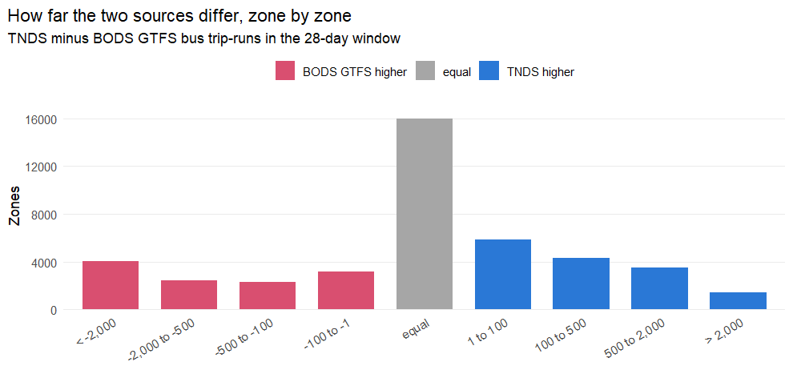
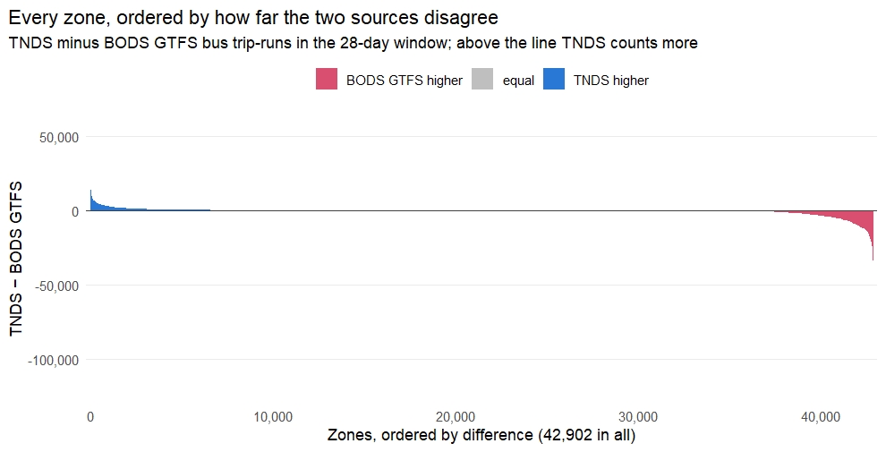
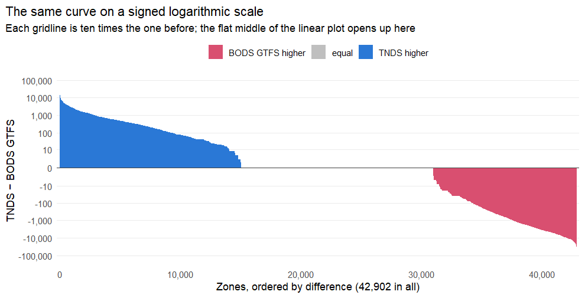

# Where TNDS and the DfT's BODS GTFS disagree most, zone by zone


The comparison report (`bus_source_comparison.md`) measures how far the three
bus timetable sources disagree nationally. This report asks a narrower and more
practical question: **for which individual LSOAs (Data Zones in Scotland) does
the choice between TNDS and the DfT's BODS GTFS change the answer most, and
which bus routes are responsible?**

Both sources are the **2026** snapshot, counted over the same 28-day
window (**2026-07-27 to 2026-08-23**) and the same widened
zone polygons as every other figure in this analysis:

- TNDS (TransXChange), converted with `UK2GTFS::transxchange2gtfs()`:
  tnds_20260726_merged.zip
- BODS GTFS, the DfT's own rendering, used as supplied:
  20260726

The measure is **total bus trip-runs in the window**: every vehicle journey
that calls at least once inside the zone, weighted by the number of times it
runs over the 28 days. A journey counts once per zone however many of the
zone's stops it calls at, which is exactly what `gtfs_trips_per_zone()` does, so
these numbers reconcile with the comparison report's zone totals. Unlike
`tph_daytime_avg` — the measure the pipeline publishes — it includes the night
band and does not weight weekdays, so it is a plain total.

## The national picture


|Measure                                         |       Value|
|:-----------------------------------------------|-----------:|
|Zones with counted bus service in either source |      42,902|
|Total bus trip-runs, TNDS                       | 453,210,665|
|Total bus trip-runs, BODS GTFS                  | 474,121,998|
|Zones where TNDS counts more                    |      15,038|
|Zones where BODS GTFS counts more               |      11,915|
|Zones where the two agree exactly               |      15,949|
|Zones with service in TNDS only                 |         139|
|Zones with service in BODS GTFS only            |          61|

Nationally TNDS counts 453,210,665 bus trip-runs against BODS GTFS's 474,121,998, so BODS GTFS is the higher of the two by 20,911,333 (-4.4% of the BODS GTFS total). The direction is not uniform: BODS GTFS is the higher source in 11,915 zones and TNDS in 15,038, so the national total is a partial cancellation of disagreements pointing opposite ways.

At zone level the two agree exactly in only 15,949 of 42,902 zones (37.2%), and in **200 zones** one source shows a bus service where the other shows none at all — 139 in TNDS only, 61 in BODS GTFS only. Those are the zones where the choice of source is not a matter of degree.



### Is the disagreement spread across the country or concentrated?

Every zone, ordered by its difference and plotted in that order: the far left is
where TNDS counts most more, the far right where the DfT's GTFS does. The
histogram above shows how many zones fall in each band; this shows the shape of
the whole distribution at once, and in particular whether the national totals
are driven by a long broad disagreement or by a short extreme tail.



On a linear axis the middle of that curve is flat whether the zones there agree
exactly or differ by a hundred departures, because the ends are thousands of
times larger. The same curve on a signed logarithmic axis separates the two —
each gridline is ten times the last, in both directions from zero:



Summed over every zone, the two sources differ by **43,665,913 trip-runs** in absolute terms, against **20,911,333** between the national totals — the difference between those two figures is disagreement that cancels between zones pointing opposite ways. Of the absolute total, the worst **1%** of zones carry **20.4%** and the worst **10%** carry **74.5%**.

By size of difference: **8,227 zones** differ by 1,000 trip-runs or more (19.2% of all zones), **9,769** by between 100 and 1,000, **8,957** by between 1 and 100, and **15,949** agree exactly. A zone differing by 100 trip-runs over 28 days is under four departures a day; one differing by 1,000 is thirty-six.

The curve is not symmetric. It crosses zero at rank **15,039 of 42,902**, 35.1% of the way along, and the two ends are of very different size: the highest zone is **+55,203** and the lowest **-120,564**, so the drop on the right is about 2 times the rise on the left. BODS GTFS counts more service than TNDS in more zones and by a wider margin.

The left-hand side is not one country's story either way. Of the **15,038 zones** where TNDS counts more, the split by country is 12,951 England, 1,554 Scotland, 533 Wales; but among the worst **1%** of that side it is 140 England, 9 Scotland, 2 Wales. England leads on both counts here, though that is a property of this snapshot rather than of the sources: on the February 2026 feeds the extremes were mostly Scottish. The top-ten tables below rank by size, so they show only the second of those two answers.

So the answer to "a few extreme zones or many moderate ones" is both, and the two facts have to be held together: the tail is heavy enough that a tenth of zones account for 74.5% of all disagreement, yet **19.2% of zones** differ by more than thirty-six departures a day, which is not a rounding error in any of them. The choice of source changes the answer over most of the country, and changes it drastically in a small part of it.

## The zones that disagree most

Ranked on the absolute difference in trip-runs, both directions. The last three
columns split each zone's difference into services **only** one source carries
and services **both** carry at different frequencies — the same decomposition
the comparison report applies nationally, but computed within the zone. They are
signed contributions and add up to `Difference`, so "Only BODS" is negative:
service the DfT feed has and TNDS does not pulls the difference down.

Expect repeated localities. City-centre LSOAs are small and the zone polygons
are widened by 500 m, so half a dozen adjacent zones can all contain the same
bus station and all rank together on the same handful of services. That is a
faithful answer to "which zones disagree most" rather than a fault in the
ranking, but it means the tables describe fewer distinct places than rows. The
route-level section below therefore takes one zone per locality.

### Zones where TNDS counts substantially more service


|Zone      |Locality                |Country |    TNDS| BODS GTFS| Difference| Only TNDS| Only BODS| Frequency|
|:---------|:-----------------------|:-------|-------:|---------:|----------:|---------:|---------:|---------:|
|E01034256 |Bus Station             |England | 121,683|    66,480|     55,203|     3,436|         0|    51,767|
|E01033166 |Bus Station             |England |  91,067|    50,924|     40,143|     3,144|         0|    36,999|
|E01034257 |Osmaston Road           |England |  79,123|    39,240|     39,883|     3,576|      -368|    36,675|
|E01013523 |Fox Street              |England |  50,332|    26,260|     24,072|     1,640|         0|    22,432|
|E01032896 |New Street              |England |  44,309|    20,776|     23,533|     3,696|         0|    19,837|
|E01032898 |New Street              |England |  44,305|    20,772|     23,533|     3,696|         0|    19,837|
|E01013524 |Bridge Street           |England |  38,632|    16,592|     22,040|     3,436|         0|    18,604|
|E01013453 |Bedford Street          |England |  34,784|    13,764|     21,020|     3,436|         0|    17,584|
|E01013542 |Albany Road West        |England |  33,676|    13,300|     20,376|     3,576|         0|    16,800|
|E01032930 |Chester Bus Interchange |England |  53,372|    35,084|     18,288|         0|       -40|    18,328|
|E01035373 |Chester Bus Interchange |England |  53,372|    35,084|     18,288|         0|       -40|    18,328|
|E01035374 |Chester Bus Interchange |England |  53,372|    35,084|     18,288|         0|       -40|    18,328|
|E01035376 |Chester Bus Interchange |England |  53,372|    35,084|     18,288|         0|       -40|    18,328|
|E01035506 |Victoria Centre         |England | 171,448|   153,250|     18,198|    13,896|       -40|     4,342|
|E01032522 |Cathedral               |England |  87,288|    69,107|     18,181|    13,896|       -24|     4,309|

### Zones where BODS GTFS counts substantially more service


|Zone      |Locality           |Country |    TNDS| BODS GTFS| Difference| Only TNDS| Only BODS| Frequency|
|:---------|:------------------|:-------|-------:|---------:|----------:|---------:|---------:|---------:|
|E01033620 |Lloyd House        |England | 206,128|   326,692|   -120,564|         0|         0|  -120,564|
|E01033617 |Lloyd House        |England | 145,280|   230,008|    -84,728|         0|         0|   -84,728|
|E01033561 |Moor St Selfridges |England | 133,736|   211,316|    -77,580|         0|         0|   -77,580|
|E01034091 |Bus Station        |England |  13,855|    77,951|    -64,096|       501|      -288|   -64,309|
|E01034092 |Bus Station        |England |  13,855|    77,951|    -64,096|       501|      -288|   -64,309|
|E01034089 |Bus Station        |England |  13,826|    77,896|    -64,070|       501|      -288|   -64,283|
|E01021575 |Bus Station        |England |  11,503|    66,943|    -55,440|       501|      -288|   -55,653|
|E01033567 |New Street Station |England | 101,264|   156,552|    -55,288|         0|         0|   -55,288|
|E01033615 |Moor St Selfridges |England | 101,264|   156,552|    -55,288|         0|         0|   -55,288|
|E01033140 |Parkway            |England |  12,037|    60,400|    -48,363|       498|      -180|   -48,681|
|E01021579 |Parkway            |England |  11,967|    59,866|    -47,899|       498|      -180|   -48,217|
|E01033420 |Friar Street       |England |  19,522|    65,864|    -46,342|       824|         0|   -47,166|
|E01033415 |Friar Street       |England |  25,438|    71,384|    -45,946|     1,544|         0|   -47,490|
|E01033423 |Friar Street       |England |  14,772|    58,604|    -43,832|        76|         0|   -43,908|
|E01034930 |Lloyd House        |England |  74,580|   117,352|    -42,772|         0|         0|   -42,772|

Across the 60 zones investigated in detail, the differences come to 196,442 trip-runs on services only TNDS carries, 3,896 on services only BODS GTFS carries, and a net -1,020,930 from services both carry at different frequencies. Missing services, not frequency differences, dominate.

## Is either source counting the same bus twice?

A zone's total can be inflated without any extra service existing, if the feed
publishes one journey more than once. This tests for it directly: within each
zone, a journey is identified by the (stop, departure time) pairs it makes at
that zone's stops, and two trips with the same route number, the same signature
and the same operating **date** are the same bus counted twice.

The date matters. GTFS models a school-term journey and its holiday twin as two
trips with identical times and complementary calendars, which is correct
modelling; a test that ignored dates would call every one of those a duplicate.


Table: Whole-feed duplicate journeys, by source

|Source              | Bus trips| Distinct journeys|  Trip-days| Duplicate runs| Share|
|:-------------------|---------:|-----------------:|----------:|--------------:|-----:|
|TNDS (TransXChange) | 1,156,823|           841,521|  9,832,693|        259,807|  2.6%|
|BODS (GTFS)         | 1,178,399|           861,417| 10,301,615|        380,264|  3.7%|

Nationally, **3.7%** of counted runs in BODS (GTFS) are the same journey twice on one day, against 2.6% in the other source. Across the whole feed a journey is its entire itinerary, which is a stricter test than the zone-level one below: inside a zone only the part of the trip that touches the zone's stops can be compared.

Across the 60 zones investigated, duplicate runs account for a median of **2.2%** of TNDS's counted trip-days and **0.8%** of the DfT GTFS's. Totals: 354,760 of 3,356,627 TNDS trip-days and 555,228 of 4,185,011 BODS GTFS trip-days.


Table: Zones with the largest share of duplicated runs in BODS GTFS

|Zone      |Locality                  | TNDS trip-days|TNDS duplicate | BODS trip-days|BODS duplicate |
|:---------|:-------------------------|--------------:|:--------------|--------------:|:--------------|
|E01020554 |Kings Statue              |          5,427|0.0%           |         39,814|47.2%          |
|E01020553 |Greenhill Gardens         |          5,256|0.0%           |         38,203|46.5%          |
|E01020555 |Kings Statue              |          5,256|0.0%           |         38,203|46.5%          |
|E01021579 |Parkway                   |         11,967|0.0%           |         59,866|36.8%          |
|E01033140 |Parkway                   |         12,037|0.0%           |         60,400|36.7%          |
|E01021575 |Bus Station               |         11,503|0.1%           |         66,943|36.5%          |
|E01021582 |Parkway                   |         10,490|0.7%           |         49,802|35.8%          |
|E01034089 |Bus Station               |         13,826|0.1%           |         77,896|34.1%          |
|E01034091 |Bus Station               |         13,855|0.1%           |         77,951|33.8%          |
|E01034092 |Bus Station               |         13,855|0.1%           |         77,951|33.6%          |
|E01009988 |West Bromwich Bus Station |         64,586|7.3%           |         96,490|19.9%          |
|E01010530 |Wolverhampton Bus Station |         61,974|6.3%           |         97,346|18.5%          |

A duplicate here is a statement about the feed, not about the road: two identical journeys on one day is one bus described twice. Where a source's excess over the other is close to its duplicate share, that is the explanation for the zone's gap; where it is not, the gap is real service one source lacks.

## What is actually going on in those zones

The route-level breakdown for the largest disagreement in each direction.
"Service" is a group of routes matched across the two sources on route number
and stop pattern, so a service split across several `route_id`s in one source
is compared as one thing.


### E01034256 — Bus Station (England)

TNDS 121,683 trip-runs, BODS GTFS 66,480, difference **55,203**. 80 stops in the zone; 11 services only in TNDS, 0 only in BODS GTFS, 56 in both.


|Service |Description                             |   TNDS| BODS GTFS| Difference|Cause                     |
|:-------|:---------------------------------------|------:|---------:|----------:|:-------------------------|
|X38     |High Street - Corporation Street        | 12,276|     4,092|      8,184|both, different frequency |
|if      |Derby - Cotmanhay                       |  7,488|     3,744|      3,744|both, different frequency |
|H1      |Derby - Alfreton                        |  6,912|     3,456|      3,456|both, different frequency |
|vil     |Derby - Burton upon Trent               |  3,296|         0|      3,296|only in TNDS              |
|SWI     |Hawthornden Avenue - Corporation Street |  4,608|     1,536|      3,072|both, different frequency |
|mic     |Derby - Mickleover                      |  5,424|     2,712|      2,712|both, different frequency |
|all     |Derby - Allestree                       |  4,184|     2,092|      2,092|both, different frequency |
|V3      |High Street - Bus Station               |  2,832|       944|      1,888|both, different frequency |


### E01034257 — Osmaston Road (England)

TNDS 79,123 trip-runs, BODS GTFS 39,240, difference **39,883**. 43 stops in the zone; 7 services only in TNDS, 2 only in BODS GTFS, 48 in both.


|Service |Description                             |   TNDS| BODS GTFS| Difference|Cause                     |
|:-------|:---------------------------------------|------:|---------:|----------:|:-------------------------|
|X38     |High Street - Corporation Street        | 10,128|     3,376|      6,752|both, different frequency |
|H1      |Derby - Alfreton                        |  6,912|     3,456|      3,456|both, different frequency |
|vil     |Derby - Burton upon Trent               |  3,296|         0|      3,296|only in TNDS              |
|SWI     |Hawthornden Avenue - Corporation Street |  4,608|     1,536|      3,072|both, different frequency |
|mic     |Derby - Mickleover                      |  5,424|     2,712|      2,712|both, different frequency |
|all     |Derby - Allestree                       |  4,184|     2,092|      2,092|both, different frequency |
|V3      |High Street - Bus Station               |  2,832|       944|      1,888|both, different frequency |
|7       |St Peter's Street - Community School    |  3,288|     1,644|      1,644|both, different frequency |


### E01013523 — Fox Street (England)

TNDS 50,332 trip-runs, BODS GTFS 26,260, difference **24,072**. 24 stops in the zone; 10 services only in TNDS, 0 only in BODS GTFS, 33 in both.


|Service |Description                             |  TNDS| BODS GTFS| Difference|Cause                     |
|:-------|:---------------------------------------|-----:|---------:|----------:|:-------------------------|
|H1      |Derby - Alfreton                        | 6,912|     3,456|      3,456|both, different frequency |
|mic     |Derby - Mickleover                      | 5,424|     2,712|      2,712|both, different frequency |
|X38     |High Street - Corporation Street        | 4,020|     1,340|      2,680|both, different frequency |
|all     |Derby - Allestree                       | 4,184|     2,092|      2,092|both, different frequency |
|vil     |Derby - Burton upon Trent               | 1,640|         0|      1,640|only in TNDS              |
|SWI     |Hawthornden Avenue - Corporation Street | 2,304|       768|      1,536|both, different frequency |
|8       |Albert Street - Albert Street           | 2,912|     1,456|      1,456|both, different frequency |
|6.1     |Wirksworth - Matlock                    | 1,872|       936|        936|both, different frequency |


### E01032896 — New Street (England)

TNDS 44,309 trip-runs, BODS GTFS 20,776, difference **23,533**. 41 stops in the zone; 7 services only in TNDS, 0 only in BODS GTFS, 28 in both.


|Service |Description                      |   TNDS| BODS GTFS| Difference|Cause                     |
|:-------|:--------------------------------|------:|---------:|----------:|:-------------------------|
|X38     |High Street - Corporation Street | 12,276|     4,092|      8,184|both, different frequency |
|vil     |Derby - Burton upon Trent        |  3,296|         0|      3,296|only in TNDS              |
|8       |Burton - Swadlincote             |  3,828|     1,276|      2,552|both, different frequency |
|21      |New Street - Pingle School       |  2,964|       988|      1,976|both, different frequency |
|V3      |High Street - Bus Station        |  2,736|       912|      1,824|both, different frequency |
|401     |Bus Station - New Street         |  2,816|     1,152|      1,664|both, different frequency |
|9       |New Street - Terminal Building   |  3,008|     1,504|      1,504|both, different frequency |
|21E     |New Street - Main Street         |    984|       328|        656|both, different frequency |


### E01013524 — Bridge Street (England)

TNDS 38,632 trip-runs, BODS GTFS 16,592, difference **22,040**. 33 stops in the zone; 11 services only in TNDS, 0 only in BODS GTFS, 20 in both.


|Service |Description                             |  TNDS| BODS GTFS| Difference|Cause                     |
|:-------|:---------------------------------------|-----:|---------:|----------:|:-------------------------|
|vil     |Derby - Burton upon Trent               | 3,296|         0|      3,296|only in TNDS              |
|SWI     |Hawthornden Avenue - Corporation Street | 4,608|     1,536|      3,072|both, different frequency |
|mic     |Derby - Mickleover                      | 5,424|     2,712|      2,712|both, different frequency |
|X38     |High Street - Corporation Street        | 4,020|     1,340|      2,680|both, different frequency |
|all     |Derby - Allestree                       | 4,184|     2,092|      2,092|both, different frequency |
|V3      |High Street - Bus Station               | 2,832|       944|      1,888|both, different frequency |
|8       |Albert Street - Albert Street           | 3,104|     1,552|      1,552|both, different frequency |
|6.1     |Wirksworth - Matlock                    | 1,872|       936|        936|both, different frequency |


### E01033620 — Lloyd House (England)

TNDS 206,128 trip-runs, BODS GTFS 326,692, difference **-120,564**. 90 stops in the zone; 2 services only in TNDS, 0 only in BODS GTFS, 67 in both.


|Service |Description |   TNDS| BODS GTFS| Difference|Cause                     |
|:-------|:-----------|------:|---------:|----------:|:-------------------------|
|50      |            | 11,488|    18,648|     -7,160|both, different frequency |
|74      |            |  8,224|    14,928|     -6,704|both, different frequency |
|6       |            |  5,256|    11,012|     -5,756|both, different frequency |
|16      |            |  6,488|    11,768|     -5,280|both, different frequency |
|14      |            |  5,440|    10,640|     -5,200|both, different frequency |
|97      |            |  4,776|     9,132|     -4,356|both, different frequency |
|9       |            |  4,336|     8,672|     -4,336|both, different frequency |
|94      |            |  4,224|     7,944|     -3,720|both, different frequency |


### E01033561 — Moor St Selfridges (England)

TNDS 133,736 trip-runs, BODS GTFS 211,316, difference **-77,580**. 58 stops in the zone; 1 services only in TNDS, 0 only in BODS GTFS, 44 in both.


|Service |Description |   TNDS| BODS GTFS| Difference|Cause                     |
|:-------|:-----------|------:|---------:|----------:|:-------------------------|
|50      |            | 11,488|    18,648|     -7,160|both, different frequency |
|6       |            |  5,256|    11,012|     -5,756|both, different frequency |
|16      |            |  6,488|    11,768|     -5,280|both, different frequency |
|14      |            |  5,440|    10,640|     -5,200|both, different frequency |
|97      |            |  4,776|     9,132|     -4,356|both, different frequency |
|94      |            |  4,224|     7,944|     -3,720|both, different frequency |
|95      |            |  4,160|     7,848|     -3,688|both, different frequency |
|4       |            |  4,628|     8,148|     -3,520|both, different frequency |


### E01034091 — Bus Station (England)

TNDS 13,855 trip-runs, BODS GTFS 77,951, difference **-64,096**. 35 stops in the zone; 7 services only in TNDS, 3 only in BODS GTFS, 46 in both.


|Service |Description | TNDS| BODS GTFS| Difference|Cause                     |
|:-------|:-----------|----:|---------:|----------:|:-------------------------|
|C1      |            |  824|     8,872|     -8,048|both, different frequency |
|X30     |            |  498|     6,764|     -6,266|both, different frequency |
|C2      |            |  617|     6,695|     -6,078|both, different frequency |
|C5      |            |  517|     5,755|     -5,238|both, different frequency |
|C10     |            |  364|     4,740|     -4,376|both, different frequency |
|C9      |            |  286|     4,290|     -4,004|both, different frequency |
|C3      |            |  348|     3,948|     -3,600|both, different frequency |
|C8      |            |  276|     3,592|     -3,316|both, different frequency |


### E01033567 — New Street Station (England)

TNDS 101,264 trip-runs, BODS GTFS 156,552, difference **-55,288**. 36 stops in the zone; 1 services only in TNDS, 0 only in BODS GTFS, 30 in both.


|Service |Description |   TNDS| BODS GTFS| Difference|Cause                     |
|:-------|:-----------|------:|---------:|----------:|:-------------------------|
|50      |            | 11,488|    18,648|     -7,160|both, different frequency |
|6       |            |  5,256|    11,012|     -5,756|both, different frequency |
|16      |            |  6,488|    11,768|     -5,280|both, different frequency |
|97      |            |  4,776|     9,132|     -4,356|both, different frequency |
|4       |            |  4,628|     8,148|     -3,520|both, different frequency |
|80      |            |  3,888|     7,104|     -3,216|both, different frequency |
|35      |            |  3,688|     6,088|     -2,400|both, different frequency |
|17      |            |  2,780|     5,108|     -2,328|both, different frequency |


### E01033140 — Parkway (England)

TNDS 12,037 trip-runs, BODS GTFS 60,400, difference **-48,363**. 32 stops in the zone; 6 services only in TNDS, 2 only in BODS GTFS, 39 in both.


|Service |Description | TNDS| BODS GTFS| Difference|Cause                     |
|:-------|:-----------|----:|---------:|----------:|:-------------------------|
|C1      |            |  676|     7,768|     -7,092|both, different frequency |
|C5      |            |  517|     5,755|     -5,238|both, different frequency |
|C2      |            |  570|     4,246|     -3,676|both, different frequency |
|C7      |            |  192|     3,324|     -3,132|both, different frequency |
|X30     |            |  438|     3,474|     -3,036|both, different frequency |
|C8      |            |  248|     3,172|     -2,924|both, different frequency |
|702     |            |  265|     2,895|     -2,630|both, different frequency |
|700     |            |  403|     2,961|     -2,558|both, different frequency |

## Interpretation

- The largest single-zone disagreement is E01033620 (Lloyd House), where the two sources differ by 120,564 trip-runs over the four weeks — 36.9% of the larger of the two figures.
- Within the zones investigated, 9.6% of the difference (by trip-runs) is services one source carries and the other does not at all, against 90.4% from differing frequencies on shared services.
- Disagreement by country: England 72.9% of zones; Scotland 22.8% of zones; Wales 38.9% of zones 

### Why these particular zones

The zone-level pattern is the national pattern concentrated:

- **Country coverage.** BODS is a statutory requirement for English local bus
  services only. Scottish and Welsh services reach it only where an operator
  crosses the border or publishes voluntarily, so Welsh and Scottish zones
  supply a disproportionate share of the "only in TNDS" cases, up to and
  including zones with no BODS GTFS service at all.
- **Interchanges amplify.** A zone containing a bus station or a major
  interchange has many services calling at many stops, so a single service
  missing from one source moves that zone's total by thousands of runs. The
  largest absolute disagreements are therefore concentrated on town-centre
  zones, and are not evidence that those places are badly described — the
  *relative* column is the fairer reading for them.
- **Snapshot age.** A TNDS snapshot carries the registration operative on the
  day it was taken; the BODS change archive holds future-dated files. Where a
  registration expires inside the counting window, TNDS counts a part-window
  service and BODS GTFS a whole-window one, which appears here as a frequency
  difference on a shared service rather than a missing service. See the
  snapshot-expiry section of the comparison report for the size of this effect.
- **Route naming.** Where the two sources disagree about a service's public
  number — TNDS carrying an operator's marketing name against the DfT's short
  code — the matching links them on stop pattern alone, and only for
  single-source groups. Any pair it still fails to link is counted as exclusive
  to each source, which inflates both "only in" columns at once.
- **Duplicate publication.** Measured above, and it works in both directions:
  a source that describes one bus twice reports twice the service. This is one
  of the few causes on this list that an outside check can settle, and where a
  published timetable has been brought to bear it has settled it — First
  Bristol's 21 is counted 5,816 times in the DfT's GTFS, of which 3,296 are
  distinct journeys, which is exactly what both TNDS and the operator's own
  timetable say (see `pdf_validation.md`).

### Caveats

- The unit is trip-runs touching a zone, not passenger-facing frequency. A
  zone crossed by a busy corridor scores highly whether or not the service is
  useful to people living there.
- Zones are the widened LSOA/Data Zone polygons used throughout this analysis
  (small LSOAs unioned with a 500 m buffer of their population-weighted
  centroid, then buffered 100 m). They overlap, so a stop can count in more
  than one zone and the zone totals do not sum to a national trip count.
- The service groupings come from the same route matching the comparison report
  uses, with the same limitations: a wrong pairing shows up here as a spurious
  frequency difference, and a failed pairing as a service missing from both
  directions at once.
- Zones carry only a code, so the "Locality" column is the commonest locality
  prefix among the NaPTAN names of the stops inside the zone. It names the
  place, not the LSOA.
```
