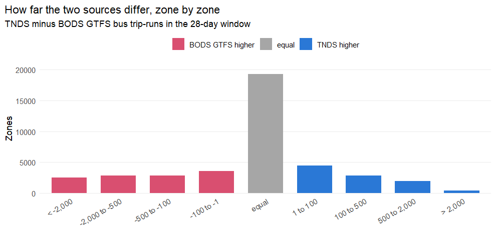
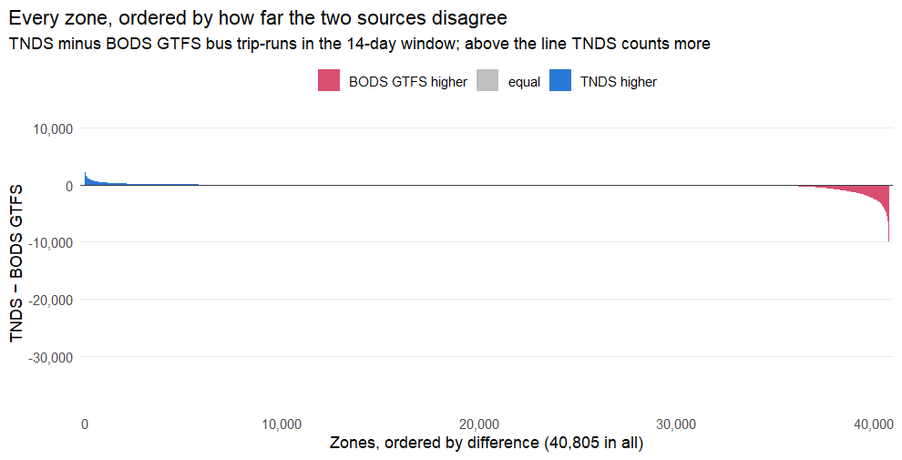
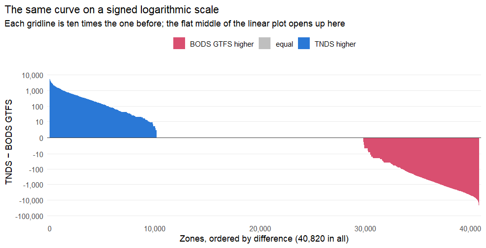

# Where TNDS and the DfT's BODS GTFS disagree most, zone by zone

The comparison report (`bus_source_comparison.md`) measures how far the three
bus timetable sources disagree nationally. This report asks a narrower and more
practical question: **for which individual LSOAs (Data Zones in Scotland) does
the choice between TNDS and the DfT's BODS GTFS change the answer most, which
routes are responsible, and — where the evidence allows — which of the two
sources is wrong?**

The bulk of it is about buses, which is what both sources exist to carry. Two
sections are newer: "Which source is wrong?" adjudicates the largest
disagreements instead of only cataloguing their causes, and "Every mode, not
just bus" covers tram, metro, rail, coach, ferry and the one aerial lift, which
every previous edition filtered out.

Both sources are the **2026** snapshot, both passed through
`UK2GTFS::gtfs_deduplicate()` so that most of the duplicate publication in
each is removed before counting — "Is either source still counting the same
bus twice?" below measures what survives, which is not nothing —
and counted over the same 28-day window (**2026-07-27 to
2026-08-23**) on the **plain LSOA21 / DZ22 boundaries**. The
published trips-per-zone outputs use zones widened for stop access; this
report does not, because widened zones overlap and a disagreement at a stop
in several of them would be counted several times over:

- TNDS (TransXChange), converted with `UK2GTFS::transxchange2gtfs()`:
  tnds_20260726_merged.zip
- BODS GTFS, the DfT's own rendering, used as supplied:
  20260726

The measure is **total bus trip-runs in the window**: every vehicle journey
that calls at least once inside the zone, weighted by the number of times it
runs over the 28 days. A journey counts once per zone however many of the
zone's stops it calls at, which is exactly what `gtfs_trips_per_zone()` does, so
these numbers reconcile with the comparison report's zone totals. Unlike
`tph_daytime_avg` — the measure the pipeline publishes — it includes the night
band and does not weight weekdays, so it is a plain total.

## The national picture

|Measure                                         |       Value|
|:-----------------------------------------------|-----------:|
|Zones with counted bus service in either source |      40,817|
|Total bus trip-runs, TNDS                       | 190,990,151|
|Total bus trip-runs, BODS GTFS                  | 203,021,824|
|Zones where TNDS counts more                    |       9,756|
|Zones where BODS GTFS counts more               |      11,805|
|Zones where the two agree exactly               |      19,256|
|Zones with service in TNDS only                 |         293|
|Zones with service in BODS GTFS only            |         261|

Nationally TNDS counts 190,990,151 bus trip-runs against BODS GTFS's 203,021,824, so BODS GTFS is the higher of the two by 12,031,673 (-5.9% of the BODS GTFS total). The direction is not uniform: BODS GTFS is the higher source in 11,805 zones and TNDS in 9,756, so the national total is a partial cancellation of disagreements pointing opposite ways.

At zone level the two agree exactly in only 19,256 of 40,817 zones (47.2%), and in **554 zones** one source shows a bus service where the other shows none at all — 293 in TNDS only, 261 in BODS GTFS only. Those are the zones where the choice of source is not a matter of degree.

### Is the disagreement spread across the country or concentrated?

Every zone, ordered by its difference and plotted in that order: the far left is
where TNDS counts most more, the far right where the DfT's GTFS does. The
histogram above shows how many zones fall in each band; this shows the shape of
the whole distribution at once, and in particular whether the national totals
are driven by a long broad disagreement or by a short extreme tail.

On a linear axis the middle of that curve is flat whether the zones there agree
exactly or differ by a hundred departures, because the ends are thousands of
times larger. The same curve on a signed logarithmic axis separates the two —
each gridline is ten times the last, in both directions from zero:

Summed over every zone, the two sources differ by **20,612,583 trip-runs** in absolute terms, against **12,031,673** between the national totals — the difference between those two figures is disagreement that cancels between zones pointing opposite ways. Of the absolute total, the worst **1%** of zones carry **22.8%** and the worst **10%** carry **76.1%**.

By size of difference: **5,215 zones** differ by 1,000 trip-runs or more (12.8% of all zones), **8,343** by between 100 and 1,000, **8,003** by between 1 and 100, and **19,256** agree exactly. A zone differing by 100 trip-runs over 28 days is under four departures a day; one differing by 1,000 is thirty-six.

The curve is not symmetric. It crosses zero at rank **9,757 of 40,817**, 23.9% of the way along, and the two ends are of very different size: the highest zone is **+18,886** and the lowest **-74,064**, so the drop on the right is about 4 times the rise on the left. BODS GTFS counts more service than TNDS in more zones and by a wider margin.

The left-hand side is not one country's story either way. Of the **9,756 zones** where TNDS counts more, the split by country is 9,102 England, 357 Wales, 297 Scotland; but among the worst **1%** of that side it is 83 England, 11 Wales, 4 Scotland. England leads on both counts here, though that is a property of this snapshot rather than of the sources: on the February 2026 feeds the extremes were mostly Scottish. The top-ten tables below rank by size, so they show only the second of those two answers.

So the answer to "a few extreme zones or many moderate ones" is both, and the two facts have to be held together: the tail is heavy enough that a tenth of zones account for 76.1% of all disagreement, yet **12.8% of zones** differ by more than thirty-six departures a day, which is not a rounding error in any of them. The choice of source changes the answer over most of the country, and changes it drastically in a small part of it.

## The zones that disagree most

Ranked on the absolute difference in trip-runs, both directions. The last three
columns split each zone's difference into services **only** one source carries
and services **both** carry at different frequencies — the same decomposition
the comparison report applies nationally, but computed within the zone. They are
signed contributions and add up to `Difference`, so "Only BODS" is negative:
service the DfT feed has and TNDS does not pulls the difference down.

Expect repeated localities. City-centre LSOAs are small, and a busy corridor
runs through several of them in a row, so half a dozen adjacent zones can rank
together on the same handful of services. (This is not the widened-zone
overlap described in editions before August 2026 — these are the plain
boundaries, which tile the country and put each stop in exactly one zone. The
repetition is geography, not double counting.) That is a faithful answer to
"which zones disagree most" rather than a fault in the ranking, but it means
the tables describe fewer distinct places than rows. The route-level section
below therefore takes one zone per locality.

### Zones where TNDS counts substantially more service

|Zone      |Locality                       |Country  |    TNDS| BODS GTFS| Difference| Only TNDS| Only BODS| Frequency|
|:---------|:------------------------------|:--------|-------:|---------:|----------:|---------:|---------:|---------:|
|E01004513 |Mapleton Road (SW18)           |England  |  25,028|     6,142|     18,886|    18,876|         0|        10|
|E01032896 |New Street                     |England  |  33,997|    20,756|     13,241|     2,048|         0|    11,193|
|S01014636 |Salisbury Place                |Scotland |  28,240|    15,236|     13,004|         0|         0|    13,004|
|E01035376 |Chester Bus Interchange        |England  |  44,728|    33,580|     11,148|         0|       -40|    11,188|
|E01004397 |Walthamstow Bus Station        |England  | 111,252|   101,004|     10,248|        60|         0|    10,188|
|E01035378 |Grosvenor Street               |England  |  19,468|    11,252|      8,216|         0|         0|     8,216|
|E01033223 |Bus Station                    |England  |  69,044|    61,043|      8,001|     2,644|       -96|     5,453|
|E01021782 |Loughton Station               |England  |  19,972|    12,052|      7,920|        40|         0|     7,880|
|E01003750 |Chingford Lane (IG8)           |England  |  23,772|    16,182|      7,590|       280|         0|     7,310|
|S01016759 |Co-op Supermarket              |Scotland |  10,272|     2,710|      7,562|     6,423|         0|     1,139|
|E01003670 |St Aubyns School               |England  |  19,308|    11,768|      7,540|       240|         0|     7,300|
|E01024940 |Bus Station                    |England  |  19,908|    12,368|      7,540|     1,444|        -8|     6,104|
|E01004377 |Chelmsford Rd /Woodford New Rd |England  |  18,016|    10,484|      7,532|       240|         0|     7,292|
|E01002218 |Alexandra Avenue (HA2)         |England  |  25,380|    17,939|      7,441|         0|         0|     7,441|
|E01021766 |Audleigh Place                 |England  |  13,304|     6,712|      6,592|         0|         0|     6,592|

### Zones where BODS GTFS counts substantially more service

|Zone      |Locality                  |Country |    TNDS| BODS GTFS| Difference| Only TNDS| Only BODS| Frequency|
|:---------|:-------------------------|:-------|-------:|---------:|----------:|---------:|---------:|---------:|
|E01033620 |Church Centre             |England | 134,556|   208,620|    -74,064|         0|         0|   -74,064|
|E01034091 |Bus Station               |England |  10,649|    66,571|    -55,922|       501|    -4,310|   -52,113|
|E01033617 |Albert Street             |England | 100,336|   151,028|    -50,692|         0|         0|   -50,692|
|E01034092 |Cathedral                 |England |  11,497|    60,111|    -48,614|       498|      -944|   -48,168|
|E01033415 |Friar Street              |England |  24,918|    71,384|    -46,466|     1,544|         0|   -48,010|
|E01033140 |Parkway                   |England |   9,328|    52,895|    -43,567|       309|      -912|   -42,964|
|E01033561 |Moor St Selfridges        |England |  81,536|   122,344|    -40,808|         0|         0|   -40,808|
|E01033615 |Markets                   |England |  65,888|   100,304|    -34,416|         0|         0|   -34,416|
|E01034313 |Wolverhampton Bus Station |England |  67,926|   100,521|    -32,595|         0|         0|   -32,595|
|E01010102 |West Bromwich Bus Station |England |  60,306|    88,662|    -28,356|     2,168|         0|   -30,524|
|E01002968 |Cromwell Road Bus Station |England |  94,740|   122,222|    -27,482|        40|         0|   -27,522|
|E01031585 |Bus Station               |England |   7,228|    33,548|    -26,320|         0|   -26,532|       212|
|E01033420 |Kings Road                |England |   9,814|    35,836|    -26,022|        20|         0|   -26,042|
|E01017032 |City Shops South          |England |  32,139|    56,709|    -24,570|     1,296|         0|   -25,866|
|E01010125 |Chelmsley Interchange     |England |  33,288|    57,456|    -24,168|         0|       -32|   -24,136|

Across the 60 zones investigated in detail, the differences come to 70,435 trip-runs on services only TNDS carries, 102,792 on services only BODS GTFS carries, and a net -640,533 from services both carry at different frequencies. The largest of the three is **services both carry at different frequencies**, at 78.7% of the three absolute contributions.

## Is either source still counting the same bus twice?

A zone's total can be inflated without any extra service existing, if the feed
publishes one journey more than once. Both feeds have already been through
`UK2GTFS::gtfs_deduplicate()`, so what follows measures what that deliberately
left behind, not the sources as published.

A journey is identified by its **whole itinerary** — every (stop, departure
time) pair of the trip — and two trips count as one bus twice only if they are
the same journey end to end, run on the same **date**, and carry the same route
number. Removal by `gtfs_deduplicate()` is stricter again: it also requires the
route and trip attributes to agree and every date of the copy removed to be
covered by the copy kept. What is reported below therefore falls in the gap
between the two: copies that overlap in the window only partly, or that one
source publishes under a different route number or operator.

The date matters. GTFS models a school-term journey and its holiday twin as two
trips with identical times and complementary calendars, which is correct
modelling; a test that ignored dates would call every one of those a duplicate.

> **A correction to earlier editions.** Until October 2026 this section
> identified a journey by the (stop, departure time) pairs it made at stops
> *inside the zone* only, reasoning that a zone can see no more of a trip than
> that. The reasoning is wrong and the error is large. Checked against the feed
> on route 74 in Birmingham city centre, the loose test reported 2,500
> duplicate trip-days that are not duplicates: the pairs it flagged are two
> buses three minutes apart — 14:06 and 14:09 from the same first stop, 29
> identical stops, different `service_id`s — whose times coincide at the few
> stops inside one small LSOA once rounded to the minute. On a high-frequency
> corridor that is ordinary service. The loose test called **16% of that
> zone's BODS GTFS count** a duplicate, against under 1% nationally, and a
> verdict resting on it would have blamed the wrong source for the largest
> single disagreement in the analysis. The figures below use whole-itinerary
> identity throughout and are much smaller as a result.

Table: Whole-feed duplicate journeys remaining, by source

|Source              | Bus trips| Distinct journeys|  Trip-days| Duplicate runs| Share|
|:-------------------|---------:|-----------------:|----------:|--------------:|-----:|
|TNDS (TransXChange) | 1,101,628|           825,987|  9,382,018|          2,896|  0.0%|
|BODS (GTFS)         | 1,128,176|           861,410| 10,000,181|         78,830|  0.8%|

Nationally, **0.8%** of the counted runs still left in BODS (GTFS) are the same journey twice on one day, against 0.0% in the other source. The zone-level figures below apply the same whole-itinerary test, restricted to trips touching the zone, so the two are now directly comparable and a zone figure far above the national one is a real concentration rather than an artefact of a looser rule.

Across the 60 zones investigated, the duplicate runs still present account for a median of **0.0%** of TNDS's counted trip-days and **0.0%** of the DfT GTFS's. Totals: 244 of 1,901,514 TNDS trip-days and 122,728 of 2,573,888 BODS GTFS trip-days.

Table: Zones with the largest share of duplicated runs remaining in BODS GTFS

|Zone      |Locality                  | TNDS trip-days|TNDS duplicate | BODS trip-days|BODS duplicate |
|:---------|:-------------------------|--------------:|:--------------|--------------:|:--------------|
|E01033140 |Parkway                   |          9,328|0.0%           |         52,895|34.2%          |
|E01021587 |Skerry Rise               |          2,496|0.0%           |         23,483|33.7%          |
|E01021542 |Hospital                  |          3,325|0.0%           |         21,746|32.6%          |
|E01034091 |Bus Station               |         10,649|0.0%           |         66,571|31.8%          |
|E01021592 |Cockney Corner            |          2,868|0.0%           |         25,882|31.7%          |
|E01034092 |Cathedral                 |         11,497|0.0%           |         60,111|30.6%          |
|E01020554 |Kings Statue              |          5,427|0.0%           |         28,832|26.3%          |
|E01017034 |The Hard Interchange      |         27,337|0.0%           |         49,932|12.1%          |
|E01017032 |City Shops South          |         32,139|0.0%           |         56,709|12.0%          |
|E01010106 |New Street                |         39,586|0.1%           |         60,578|6.2%           |
|E01010102 |West Bromwich Bus Station |         60,306|0.0%           |         88,662|5.2%           |
|E01034313 |Wolverhampton Bus Station |         67,926|0.0%           |        100,521|3.3%           |

A duplicate here is a statement about the feed, not about the road: two identical journeys on one day is one bus described twice. So where a source's remaining excess over the other is close to its remaining duplicate share, the zone's gap is still an artefact of the feed; where it is not, the gap is real service one source lacks. The next section uses this as one of its three tests.

These were previously described here as the copies `gtfs_deduplicate()` could not remove without risking real service. In **one of them, checked trip by trip** (E01034091, verified below), that is wrong: the pairs share a `route_id`, a `service_id` and a byte-identical itinerary, which is precisely the case deduplication is built to remove. Whether the other zones in this table have the same cause is not established — they sit at a similar share and in neighbouring areas, which is suggestive and no more. Why deduplication keeps any of them is an open question about `UK2GTFS` rather than about the bus sources.

## Which source is wrong?

The sections above say how far the two sources disagree and which services the
disagreement sits on. They do not say which source to believe, and for the
zones at the extremes that is the question that matters: a zone whose bus
service differs by tens of thousands of runs over four weeks is being described
correctly by at most one of the two feeds.

Three measurements decide it, and they cannot be mistaken for one another.

**1. Journeys against operating days.** A zone's run total is the number of
vehicle journeys touching the zone multiplied by the number of days each one
runs. Those two factors fail for different reasons, and dividing the gap
between them says which failure happened:

- same journeys, fewer days each → the difference is in the **calendars**. A
  registration that expires inside the window gives a source a part-window
  service where the other has a whole-window one.
- same days each, fewer journeys → the difference is in the **timetable**.
  Service one source does not carry.

**2. Duplicate runs remaining**, measured in the section above. Where the
*higher* source's residual duplication accounts for much of its own excess, the
excess is one bus described twice, and the higher source is the wrong one. Only
the higher source can be explained this way: duplication in the lower source
would make its shortfall larger, not smaller.

**3. The daily profile** — how many of the window's 28 days each source counts
a normal day's service on. This separates a source that is uniformly thin from
one that stops partway through the window, and only the second is an expiry. It
is required as corroboration before any zone is called truncated, so that a
source which genuinely runs less often is not mislabelled.

Before the zone verdicts, one national fact frames most of them.

Table: How much of each feed stops before the window closes (window 2026-07-27 to 2026-08-23 )

|Source              | Last date in feed| Bus trips| Expiring inside the window| Runs if none expired|
|:-------------------|-----------------:|---------:|--------------------------:|--------------------:|
|TNDS (TransXChange) |        2026-09-09| 1,321,834|                      18.1%|            9,675,968|
|BODS (GTFS)         |        2027-08-02| 1,288,523|                       6.2%|           10,316,166|

The two feeds are not symmetric in time. The TNDS snapshot's calendar runs out on **2026-09-09**, and **18.1% of its bus journeys stop running before the window closes** — the single largest cluster of them on 2026-07-25 (68,345 trips); 2026-08-15 (27,972 trips). The DfT's GTFS holds forward-dated files to **2027-08-02** and only 6.2% of its journeys expire inside the window.

A TNDS snapshot carries the registrations operative on the day it was taken, and this one was taken on the eve of the window with no history behind it. So wherever a zone below is found to hold *the same journeys as BODS GTFS on fewer days*, it is one instance of this: the TNDS figure describes part of the window and the BODS figure the whole of it. That is a measurement artefact rather than a difference in service.

How far it reaches into the zone findings below is worth stating up front, because the verdict table only names it where it is the *whole* explanation. **In 11 of the 60 zones investigated, TNDS carries a normal day's service on fewer of the 28 days than BODS GTFS does**, and in 9 of those the shortfall is at least half. Most of those zones are labelled "unresolved" rather than "calendars cut short", because something else is wrong in them as well — but truncation is part of what is wrong in far more zones than carry its name.

That chain was checked end to end on one operator rather than left as
inference. **Reading Buses, in the 26 July 2026 snapshots** (verified against
`calendar.txt` in both feeds, October 2026):

- TNDS holds 6,245 Reading Buses journeys, of which **6,134 carry a service
  ending 2 August 2026** — seven days into a twenty-eight-day window. Every one
  of the 6,245 ends before the window closes.
- BODS GTFS holds 6,658, of which **6,112 run to 31 August 2026**, past the end
  of the window. Only 224 expire inside it.
- Seven days of twenty-eight is **0.25**, and that is exactly the ratio the
  Reading zone shows: of its 48 shared services, **39 read TNDS at 0.250 of
  the BODS GTFS figure**, to three decimal places.

So for Reading the question "which source is wrong" has a definite answer:
TNDS is counting one week of a four-week window because its registrations
expire on 2 August, and the DfT's GTFS is describing the window correctly. The
same signature — a ratio at a clean fraction, with the journey counts matching
— appears on other operators, and the verdict table below is how to find them.

Table: What the evidence says about the 60 most disagreeing zones

|Verdict                         | Zones| Disagreement (runs)| Share of it|
|:-------------------------------|-----:|-------------------:|-----------:|
|unresolved                      |    26|             503,420|       44.4%|
|journeys missing from TNDS      |    13|             406,250|       35.8%|
|journeys missing from BODS GTFS |    17|             141,136|       12.4%|
|TNDS calendars cut short        |     2|              72,488|        6.4%|
|absent from BODS GTFS           |     2|              11,328|        1.0%|

Of the 60 zones investigated, the evidence faults **TNDS in 15** and **BODS GTFS in 17**; the remaining 28 are either an absence that may be correct or genuinely unresolved. Weighted by the size of the disagreement rather than by zone count, **42.2% of it is laid at TNDS's door and 12.4% at BODS GTFS's**, with the other 45.4% unattributed. So among the zones where a single mechanism can be identified at all, TNDS is the source at fault about 3.4 times as often by volume — but that is a statement about the extremes of the distribution, not about the two feeds nationally, where BODS GTFS counts the higher total.

The 26 unresolved zones are not a failure of the method so much as its honest limit: in each, the journey count and the days-per-journey *both* differ, so more than one thing is wrong at once and no single mechanism accounts for the gap. They hold 44.4% of the disagreement in these zones.

In **7 of them the two faults are identifiable even though neither accounts for the whole gap**: TNDS carries a normal day's service on fewer of the 28 days *and* at least 5% of BODS GTFS's counted trip-days in the zone are the same journey twice. The largest is E01034091 (Bus Station), where TNDS manages 6 full days against 24 and 31.8% of the BODS GTFS count is duplicated. Both sources are misdescribing that zone, in opposite directions, which is why no single verdict fits.

That duplication figure was checked against the feed rather than taken on
trust, because the previous edition of this report had a duplicate measure
that produced false positives of exactly this size. **E01034091, the Chelmsford
cluster, BODS GTFS, 26 July 2026** (verified October 2026): 21,185 of the
zone's 66,571 counted trip-days are duplicates, which reproduces the 31.8%
above. The pairs are genuine — the largest involves two trips on **the same
`route_id` (the X30, agency `OP393`), with the same `service_id`, 29 stops
each, both leaving stop `1500CHBS2` at 03:55 and arriving at `15800726` at
04:54, byte-identical end to end**. That is one bus published twice, not two
buses minutes apart. The duplication spans a dozen route numbers in the zone
(X30, C1, C6, C12, 170, 31, 47, 332, 13A, 73A, 73B, X10), so it is a
publishing pattern rather than one rogue registration.

Why `gtfs_deduplicate()` keeps these is not established here. It removed 5.3%
of the BODS feed's trips on this read, and copies this exact — same route, same
calendar, same times — are the case it is designed to remove, so the survival
of 21,185 of them in one zone is worth a look in its own right. That is a
question about `UK2GTFS`, not about which bus source to prefer, and it is
recorded here rather than pursued.

### The verdicts, zone by zone

`Journeys` and `Days each` are the two factors of the run total; `Dup.` is the
share of that source's counted trip-days that are still the same bus twice;
`Full days` is how many of the 28 days carry a normal day's service.

|Zone      |Locality               | Difference|Journeys T:B    |Days each T:B |Dup. T:B     |Full days T:B |Verdict                    |
|:---------|:----------------------|----------:|:---------------|:-------------|:------------|:-------------|:--------------------------|
|E01033620 |Church Centre          |    -74,064|12,851 : 19,828 |10.5 : 10.5   |0.0% : 0.9%  |28 : 24       |journeys missing from TNDS |
|E01034091 |Bus Station            |    -55,922|3,802 : 9,544   |2.8 : 7.0     |0.0% : 31.8% |6 : 24        |unresolved                 |
|E01033617 |Albert Street          |    -50,692|9,433 : 13,746  |10.6 : 11.0   |0.0% : 2.1%  |28 : 24       |journeys missing from TNDS |
|E01034092 |Cathedral              |    -48,614|3,580 : 8,270   |3.2 : 7.3     |0.0% : 30.6% |6 : 23        |unresolved                 |
|E01033415 |Friar Street           |    -46,466|6,900 : 6,834   |3.6 : 10.4    |0.0% : 0.0%  |6 : 24        |TNDS calendars cut short   |
|E01033140 |Parkway                |    -43,567|3,239 : 7,465   |2.9 : 7.1     |0.0% : 34.2% |6 : 23        |unresolved                 |
|E01033561 |Moor St Selfridges     |    -40,808|7,867 : 11,859  |10.4 : 10.3   |0.0% : 0.4%  |28 : 24       |journeys missing from TNDS |
|E01033615 |Markets                |    -34,416|6,314 : 9,626   |10.4 : 10.4   |0.0% : 1.1%  |28 : 24       |journeys missing from TNDS |
|E01034313 |Wolverhampton Bus Stat |    -32,595|6,494 : 9,034   |10.5 : 11.1   |0.0% : 3.3%  |24 : 24       |unresolved                 |
|E01010102 |West Bromwich Bus Stat |    -28,356|5,973 : 7,871   |10.1 : 11.3   |0.0% : 5.2%  |24 : 24       |unresolved                 |
|E01002968 |Cromwell Road Bus Stat |    -27,482|12,193 : 14,692 |7.8 : 8.3     |0.0% : 0.0%  |28 : 28       |unresolved                 |
|E01031585 |Bus Station            |    -26,320|777 : 4,387     |9.3 : 7.6     |0.0% : 0.0%  |24 : 24       |journeys missing from TNDS |
|E01033420 |Kings Road             |    -26,022|3,364 : 3,362   |2.9 : 10.7    |0.0% : 0.0%  |6 : 24        |TNDS calendars cut short   |
|E01017032 |City Shops South       |    -24,570|6,977 : 11,246  |4.6 : 5.0     |0.0% : 12.0% |26 : 27       |journeys missing from TNDS |
|E01010125 |Chelmsley Interchange  |    -24,168|3,129 : 5,716   |10.6 : 10.1   |0.0% : 2.9%  |28 : 24       |journeys missing from TNDS |
|E01031575 |North Terminal Bus Sta |    -24,160|750 : 3,833     |11.5 : 8.6    |0.0% : 0.0%  |28 : 28       |journeys missing from TNDS |
|E01020554 |Kings Statue           |    -23,405|2,682 : 4,865   |2.0 : 5.9     |0.0% : 26.3% |6 : 21        |unresolved                 |
|E01021592 |Cockney Corner         |    -23,014|1,367 : 3,619   |2.1 : 7.2     |0.0% : 31.7% |6 : 23        |unresolved                 |

### The cases worth reading in full

#### E01033415 — Friar Street

TNDS 24,918 trip-runs against BODS GTFS's 71,384, a difference of **-46,466**. TNDS holds **6,900 journeys** touching the zone, each running on an average of **3.6** of the 28 days; BODS GTFS holds **6,834 journeys** at **10.4** days each. Residual duplication is 0.0% of TNDS's trip-days and 0.0% of BODS GTFS's. A normal day's service appears on 6 of 28 days in TNDS and 24 in BODS GTFS.

The journey counts agree to within 1.0% (6,900 against 6,834), so neither source is missing the timetable. What differs is how long each journey runs for: 3.6 days against 10.4, a ratio of 0.35, and a normal day's service appears on 6 of the 28 days in TNDS against 24 in BODS GTFS. That is a registration expiring inside the window, not a service that does not exist. 

|Service |Description |  TNDS| BODS GTFS| Difference|Cause                     |
|:-------|:-----------|-----:|---------:|----------:|:-------------------------|
|17      |            | 1,629|     6,516|     -4,887|both, different frequency |
|5       |            | 1,102|     4,408|     -3,306|both, different frequency |
|6       |            | 1,052|     4,208|     -3,156|both, different frequency |
|26      |            |   950|     3,800|     -2,850|both, different frequency |
|21      |            |   761|     3,044|     -2,283|both, different frequency |
|3       |            |   759|     3,036|     -2,277|both, different frequency |

#### E01033620 — Church Centre

TNDS 134,556 trip-runs against BODS GTFS's 208,620, a difference of **-74,064**. TNDS holds **12,851 journeys** touching the zone, each running on an average of **10.5** of the 28 days; BODS GTFS holds **19,828 journeys** at **10.5** days each. Residual duplication is 0.0% of TNDS's trip-days and 0.9% of BODS GTFS's. A normal day's service appears on 28 of 28 days in TNDS and 24 in BODS GTFS.

Each journey runs for about as long in both sources (10.5 days against 10.5, a ratio of 1.00), so the calendars are not the problem: TNDS holds 35.2% fewer journeys — 12,851 against 19,828. Of that shortfall, 0.0% sits on services BODS GTFS carries and TNDS does not carry at all, and the rest is **fewer journeys on services both sources carry** — the same route numbers, run less often in TNDS. The second is the harder kind to dismiss, because no missing registration explains it. 

|Service |Description |  TNDS| BODS GTFS| Difference|Cause                     |
|:-------|:-----------|-----:|---------:|----------:|:-------------------------|
|6       |            | 5,256|    10,952|     -5,696|both, different frequency |
|74      |            | 8,224|    13,592|     -5,368|both, different frequency |
|14      |            | 5,440|    10,096|     -4,656|both, different frequency |
|97      |            | 4,776|     8,992|     -4,216|both, different frequency |
|9       |            | 4,336|     8,276|     -3,940|both, different frequency |
|95      |            | 4,160|     7,848|     -3,688|both, different frequency |

#### E01004513 — Mapleton Road (SW18)

TNDS 25,028 trip-runs against BODS GTFS's 6,142, a difference of **18,886**. TNDS holds **3,353 journeys** touching the zone, each running on an average of **7.5** of the 28 days; BODS GTFS holds **850 journeys** at **7.2** days each. Residual duplication is 0.0% of TNDS's trip-days and 0.0% of BODS GTFS's. A normal day's service appears on 28 of 28 days in TNDS and 28 in BODS GTFS.

Each journey runs for about as long in both sources (7.2 against 7.5 days), but BODS GTFS holds 74.6% fewer journeys — 850 against 3,353. Of that, 99.9% sits on services TNDS carries and BODS GTFS does not carry at all. 

|Service |Description                                    |  TNDS| BODS GTFS| Difference|Cause        |
|:-------|:----------------------------------------------|-----:|---------:|----------:|:------------|
|87      |Wandsworth Plain - Aldwych / Drury Lane        | 3,624|         0|      3,624|only in TNDS |
|39      |Putney Bridge Station - Clapham Junction Stati | 3,280|         0|      3,280|only in TNDS |
|170     |Danebury Avenue /Minstead Gdns - Victoria Stat | 3,152|         0|      3,152|only in TNDS |
|37      |Putney Heath / Green Man - Peckham Bus Station | 3,036|         0|      3,036|only in TNDS |
|156     |Wimbledon Bus Station - Vauxhall Bus Station   | 2,828|         0|      2,828|only in TNDS |
|337     |Northcote Road (SW11) - Richmond Bus Station   | 2,396|         0|      2,396|only in TNDS |

One of those cases was checked against the feeds directly, because "missing
service" is the verdict most easily faked by a failure of the route matching.
**Metrobus around Crawley and Gatwick, 26 July 2026 snapshots** (verified
against `routes.txt` and `trips.txt`, October 2026): BODS GTFS carries
Metrobus routes 1, 2, 10 and 100 — the Crawley town network — and TNDS carries
**none of those four route numbers under Metrobus at all**, so no matching
rule could have paired them. The numbers TNDS does share with BODS there (3,
4, 5, 20 and 400) hold between 12 and 26 journeys each, against a full
timetable on the BODS side. The absence is in the feed, not in the comparison.

### The ratios give one mechanism away by themselves

Zone verdicts aggregate over everything in the zone. Looking instead at each
shared service's ratio between the two sources finds a mechanism the zone view
blurs: a service one source publishes twice reads *exactly* double, and exact
small-integer ratios do not arise from timetables.

Table: Shared services sitting on an exact integer ratio

|Ratio TNDS:BODS | Service-zone pairs| Runs at stake|
|:---------------|------------------:|-------------:|
|0.25 (BODS ×4)  |                 70|        89,126|
|0.50 (BODS ×2)  |                 21|        24,012|
|1.00 (agree)    |                514|           536|
|2.00 (TNDS ×2)  |                 87|       153,973|
|4.00 (TNDS ×4)  |                  0|             0|

Of 1,174 shared services in the zones investigated, **87 sit within 3% of exactly 2.00** — TNDS reading precisely double the DfT's figure — and those alone account for **153,973 trip-runs** of TNDS's excess. A further 70 sit on 0.25, where BODS GTFS reads exactly four times TNDS.

Table: Services TNDS reads exactly twice (one zone each)

|Service |Description                              |  TNDS| BODS GTFS|Ratio |
|:-------|:----------------------------------------|-----:|---------:|:-----|
|125     |Royal Preston Hospital - Bolton          | 8,816|     4,408|2.000 |
|X38     |High Street - Corporation Street         | 8,184|     4,092|2.000 |
|275     |Walthamstow Bus Station - Barkingside Te | 7,840|     3,960|1.980 |
|140     |Millington Road - Long Elmes Harrow Weal | 6,916|     3,428|2.018 |
|20      |Debden - Walthamstow                     | 6,804|     3,392|2.006 |
|76      |Tottenham Hale Bus Station - Lower Marsh | 6,536|     3,280|1.993 |
|462     |Limes Farm / Copperfield - Hainault Stre | 6,408|     3,204|2.000 |
|1       |Wrexham Bus Station 7 - Chester Railway  | 6,016|     3,008|2.000 |

This group is the one cause on the list that an outside check has already settled. The mechanism was traced on the Preston–Bolton 125: TNDS holds it under two `route_id`s with the same number of trips each, and no pair of those trips is a same-day duplicate under any signature — whole itinerary, stop and departure time, or stop alone — because the two registrations describe the same service at times that differ. No signature test can match them, and `gtfs_deduplicate()` is right to keep both. Its published timetable decides it: **TNDS reads 2.28 of the document and the DfT's GTFS 1.14**, so TNDS is the source at fault and BODS GTFS is close to correct. That this group survives the mode fixes of September 2026 untouched is expected — it is a duplicate-registration defect, not a classification one.

### What this does and does not settle

The verdicts are about **which feed misdescribes the service**, which is not
quite the same question as which feed to use. Three limits are worth stating.

- A verdict of "absent from BODS GTFS" is often not a fault at all. BODS is a
  statutory requirement for English local bus services; a Welsh or Scottish
  service, or a tram, has no duty to appear in it. The adjudication therefore
  blames neither source for an absence, and the counts above keep those zones
  separate rather than scoring them against BODS.
- "TNDS calendars cut short" says the TNDS snapshot undercounts *that window*.
  It does not say the BODS figure is the better estimate of normal service,
  because a feed holding future-dated files can equally describe a timetable
  that had not started. What it does establish is that the shortfall is an
  artefact of when the snapshot was taken.
- None of the three tests is an external check. They compare the two feeds with
  each other and with their own internal consistency. Where a published
  timetable has been brought to bear the answer has been settled outright, and
  that work lives in `pdf_validation.md` and `route_279_pdf_validation.md`;
  only a handful of services have been checked that way.

One more reading note, because it collapses several apparently separate verdicts into one cause. **The BODS-side shortfall is concentrated in London.** Of the 30 zones here where TNDS counts more, the services TNDS carries alone are worth 61,231 trip-runs, and the largest are TfL routes — in the worked case above the 87, 39, 170, 37, 156 and 337, every one present in TNDS and absent from the DfT's GTFS. The comparison report records the same gap on the BODS TransXChange side. So a verdict of "journeys missing from BODS GTFS" in a London zone is this one cause recurring, not 30 independent findings, and the 17 zones carrying that verdict should be counted as fewer than 17 distinct problems.

## What is actually going on in those zones

The route-level breakdown for the largest disagreement in each direction.
"Service" is a group of routes matched across the two sources on route number
and stop pattern, so a service split across several `route_id`s in one source
is compared as one thing. Zones already broken down as worked cases under
"Which source is wrong?" are skipped here rather than tabulated twice.

### E01032896 — New Street (England)

TNDS 33,997 trip-runs, BODS GTFS 20,756, difference **13,241**. 27 stops in the zone; 7 services only in TNDS, 0 only in BODS GTFS, 28 in both.

|Service |Description                      |  TNDS| BODS GTFS| Difference|Cause                     |
|:-------|:--------------------------------|-----:|---------:|----------:|:-------------------------|
|X38     |High Street - Corporation Street | 8,184|     4,092|      4,092|both, different frequency |
|vil     |Derby - Burton upon Trent        | 1,648|         0|      1,648|only in TNDS              |
|9       |New Street - Terminal Building   | 3,008|     1,504|      1,504|both, different frequency |
|8       |Burton - Swadlincote             | 2,552|     1,276|      1,276|both, different frequency |
|21      |New Street - Pingle School       | 1,976|       988|        988|both, different frequency |
|V3      |High Street - Bus Station        | 1,824|       912|        912|both, different frequency |
|401     |Bus Station - New Street         | 1,984|     1,152|        832|both, different frequency |
|2       |New Street - Sussex Road         | 1,140|       560|        580|both, different frequency |

### S01014636 — Salisbury Place (Scotland)

TNDS 28,240 trip-runs, BODS GTFS 15,236, difference **13,004**. 5 stops in the zone; 0 services only in TNDS, 0 only in BODS GTFS, 14 in both.

|Service |Description                                    |  TNDS| BODS GTFS| Difference|Cause                     |
|:-------|:----------------------------------------------|-----:|---------:|----------:|:-------------------------|
|3       |Mayfield - Wester Hailes Clovenstone           | 4,212|     2,100|      2,112|both, different frequency |
|31      |Rosewell or Bonnyrigg - East Craigs            | 4,096|     2,048|      2,048|both, different frequency |
|37      |Silverknowes - Easter Bush or Penicuik Deanbur | 3,504|     1,792|      1,712|both, different frequency |
|7       |Newhaven - Edinburgh Royal Infirmary           | 2,940|     1,464|      1,476|both, different frequency |
|29      |Silverknowes - Gorebridge Birkenside           | 2,728|     1,344|      1,384|both, different frequency |
|49      |Fort Kinnaird - Edinburgh Royal Infirmary      | 2,660|     1,284|      1,376|both, different frequency |
|8       |Muirhouse - Edinburgh Royal Infirmary          | 2,488|     1,220|      1,268|both, different frequency |
|47      |Cammo - Penicuik Ladywood                      | 2,280|     1,144|      1,136|both, different frequency |

### E01035376 — Chester Bus Interchange (England)

TNDS 44,728 trip-runs, BODS GTFS 33,580, difference **11,148**. 26 stops in the zone; 1 services only in TNDS, 1 only in BODS GTFS, 46 in both.

|Service |Description                                    |  TNDS| BODS GTFS| Difference|Cause                     |
|:-------|:----------------------------------------------|-----:|---------:|----------:|:-------------------------|
|10      |Bus Interchange - Quay Shopping Centre         | 5,304|     2,652|      2,652|both, different frequency |
|1       |Wrexham Bus Station 7 - Chester Railway Statio | 3,008|     1,504|      1,504|both, different frequency |
|11      |Chester Bus Interchange - Holywell Bus Station | 2,800|     1,400|      1,400|both, different frequency |
|4       |Chester Railway Station - Bus Station 5        | 2,304|     1,152|      1,152|both, different frequency |
|PR1     |Chester Bus Interchange - Wrexham Road, Park & | 1,832|       916|        916|both, different frequency |
|41      |Bus Interchange - Whitchurch Bus Station       | 1,216|       608|        608|both, different frequency |
|X4      |Chester Railway Station - Bus Station 5        | 1,200|       600|        600|both, different frequency |
|T8      |Corwen Interchange - Chester Railway Station S | 1,056|       468|        588|both, different frequency |

### E01004397 — Walthamstow Bus Station (England)

TNDS 111,252 trip-runs, BODS GTFS 101,004, difference **10,248**. 13 stops in the zone; 1 services only in TNDS, 0 only in BODS GTFS, 21 in both.

|Service |Description                                    |  TNDS| BODS GTFS| Difference|Cause                     |
|:-------|:----------------------------------------------|-----:|---------:|----------:|:-------------------------|
|275     |Walthamstow Bus Station - Barkingside Tesco    | 7,840|     3,960|      3,880|both, different frequency |
|20      |Debden - Walthamstow                           | 6,804|     3,392|      3,412|both, different frequency |
|215     |Lee Valley Campsite - Walthamstow Bus Station  | 5,640|     2,820|      2,820|both, different frequency |
|675     |St James Street Station - Broadmead Road (IG8) |    60|         0|         60|only in TNDS              |
|N38     |Walthamstow Bus Station - Victoria Bus Station |   940|       909|         31|both, different frequency |
|N26     |Victoria Station - Chingford Station           |   644|       621|         23|both, different frequency |
|N73     |Great Titchfield Street / Oxford Circus Statio |   776|       754|         22|both, different frequency |
|55      |                                               | 6,740|     6,740|          0|both, different frequency |

### E01035378 — Grosvenor Street (England)

TNDS 19,468 trip-runs, BODS GTFS 11,252, difference **8,216**. 11 stops in the zone; 0 services only in TNDS, 0 only in BODS GTFS, 13 in both.

|Service |Description                                    |  TNDS| BODS GTFS| Difference|Cause                     |
|:-------|:----------------------------------------------|-----:|---------:|----------:|:-------------------------|
|1       |Wrexham Bus Station 7 - Chester Railway Statio | 6,016|     3,008|      3,008|both, different frequency |
|11      |Chester Bus Interchange - Holywell Bus Station | 2,800|     1,400|      1,400|both, different frequency |
|4       |Chester Railway Station - Bus Station 5        | 2,304|     1,152|      1,152|both, different frequency |
|PR1     |Chester Bus Interchange - Wrexham Road, Park & | 1,832|       916|        916|both, different frequency |
|X4      |Chester Railway Station - Bus Station 5        | 1,200|       600|        600|both, different frequency |
|T8      |Corwen Interchange - Chester Railway Station S | 1,056|       468|        588|both, different frequency |
|11A     |Chester Bus Interchange - McDonalds            | 1,104|       552|        552|both, different frequency |
|4S      |                                               |   492|       492|          0|both, different frequency |

### E01034091 — Bus Station (England)

TNDS 10,649 trip-runs, BODS GTFS 66,571, difference **-55,922**. 13 stops in the zone; 7 services only in TNDS, 5 only in BODS GTFS, 39 in both.

|Service |Description | TNDS| BODS GTFS| Difference|Cause                     |
|:-------|:-----------|----:|---------:|----------:|:-------------------------|
|C1      |            |  817|     8,575|     -7,758|both, different frequency |
|C2      |            |  617|     6,675|     -6,058|both, different frequency |
|C10     |            |  364|     4,740|     -4,376|both, different frequency |
|C5      |            |  517|     4,843|     -4,326|both, different frequency |
|C3      |            |  348|     3,948|     -3,600|both, different frequency |
|X30     |            |    0|     3,290|     -3,290|only in BODS GTFS         |
|X30     |            |  231|     3,474|     -3,243|both, different frequency |
|C8      |            |  276|     3,444|     -3,168|both, different frequency |

### E01033617 — Albert Street (England)

TNDS 100,336 trip-runs, BODS GTFS 151,028, difference **-50,692**. 26 stops in the zone; 1 services only in TNDS, 0 only in BODS GTFS, 43 in both.

|Service |Description |  TNDS| BODS GTFS| Difference|Cause                     |
|:-------|:-----------|-----:|---------:|----------:|:-------------------------|
|16      |            | 6,488|    11,768|     -5,280|both, different frequency |
|14      |            | 5,440|    10,096|     -4,656|both, different frequency |
|95      |            | 4,160|     7,848|     -3,688|both, different frequency |
|94      |            | 4,224|     7,892|     -3,668|both, different frequency |
|74      |            | 4,112|     7,300|     -3,188|both, different frequency |
|9       |            | 2,168|     4,224|     -2,056|both, different frequency |
|X51     |            | 4,104|     6,064|     -1,960|both, different frequency |
|87      |            | 2,124|     4,040|     -1,916|both, different frequency |

### E01034092 — Cathedral (England)

TNDS 11,497 trip-runs, BODS GTFS 60,111, difference **-48,614**. 13 stops in the zone; 4 services only in TNDS, 4 only in BODS GTFS, 40 in both.

|Service |Description | TNDS| BODS GTFS| Difference|Cause                     |
|:-------|:-----------|----:|---------:|----------:|:-------------------------|
|C1      |            |  676|     7,556|     -6,880|both, different frequency |
|C5      |            |  517|     5,755|     -5,238|both, different frequency |
|C2      |            |  570|     5,146|     -4,576|both, different frequency |
|C9      |            |  286|     4,290|     -4,004|both, different frequency |
|C7      |            |  171|     3,324|     -3,153|both, different frequency |
|C8      |            |  248|     3,372|     -3,124|both, different frequency |
|C10     |            |  364|     3,444|     -3,080|both, different frequency |
|C3      |            |  342|     3,246|     -2,904|both, different frequency |

### E01033140 — Parkway (England)

TNDS 9,328 trip-runs, BODS GTFS 52,895, difference **-43,567**. 14 stops in the zone; 6 services only in TNDS, 3 only in BODS GTFS, 38 in both.

|Service |Description | TNDS| BODS GTFS| Difference|Cause                     |
|:-------|:-----------|----:|---------:|----------:|:-------------------------|
|C5      |            |  517|     5,755|     -5,238|both, different frequency |
|C2      |            |  570|     4,246|     -3,676|both, different frequency |
|C1      |            |  340|     3,840|     -3,500|both, different frequency |
|X30     |            |  206|     3,474|     -3,268|both, different frequency |
|C7      |            |  171|     3,324|     -3,153|both, different frequency |
|C8      |            |  248|     3,172|     -2,924|both, different frequency |
|702     |            |  265|     2,895|     -2,630|both, different frequency |
|700     |            |  403|     2,961|     -2,558|both, different frequency |

### E01033561 — Moor St Selfridges (England)

TNDS 81,536 trip-runs, BODS GTFS 122,344, difference **-40,808**. 27 stops in the zone; 0 services only in TNDS, 0 only in BODS GTFS, 36 in both.

|Service |Description |   TNDS| BODS GTFS| Difference|Cause                     |
|:-------|:-----------|------:|---------:|----------:|:-------------------------|
|50      |            | 11,488|    18,460|     -6,972|both, different frequency |
|14      |            |  5,440|    10,096|     -4,656|both, different frequency |
|95      |            |  4,160|     7,848|     -3,688|both, different frequency |
|94      |            |  4,224|     7,892|     -3,668|both, different frequency |
|6       |            |  2,628|     5,496|     -2,868|both, different frequency |
|17      |            |  2,780|     5,008|     -2,228|both, different frequency |
|35      |            |  3,688|     5,808|     -2,120|both, different frequency |
|97      |            |  2,360|     4,340|     -1,980|both, different frequency |

## Every mode, not just bus

Everything above counts buses, as every comparison in this repository has. That
is the right default — both sources exist to carry local bus registrations, and
bus is the great majority of what either holds — but it is not the whole of
either feed, and the non-bus modes disagree in ways bus does not. This section
covers them.

The numbers come from the same per-zone counts the comparison already produced,
which have always held every mode; only the reporting was bus-only.

Table: Counted runs and zones served, by mode and source

|Mode        | Zones, TNDS| Zones, BODS| Only TNDS| Only BODS|  Runs, TNDS|  Runs, BODS|  T/B|
|:-----------|-----------:|-----------:|---------:|---------:|-----------:|-----------:|----:|
|Bus         |      40,481|      40,449|       293|       261| 190,990,151| 203,021,824| 0.94|
|Coach       |          94|         875|        26|       807|      51,368|     923,841| 0.06|
|Tram        |         276|         259|        54|        37|   1,520,693|   1,571,683| 0.97|
|Metro       |         389|         335|        59|         5|   6,201,362|   5,499,306| 1.13|
|Rail        |          21|          42|        21|        42|       5,178|     500,481| 0.01|
|Ferry       |          88|          84|         7|         3|      88,286|      88,397| 1.00|
|Aerial lift |           2|           2|         0|         0|      14,224|      14,176| 1.00|

Bus is 96.0% of TNDS's counted runs and 95.9% of BODS GTFS's, so the non-bus modes are a small part of either feed. They are not a small part of the *disagreement*: 3 of the 6 non-bus modes differ by more than a tenth, and 2 of them (coach and rail) by more than a factor of ten.

The modes that agree are **tram** (ratio 0.97), **ferry** (ratio 1.00), **aerial lift** (ratio 1.00) — within a tenth on run totals, which for ferry and the one aerial lift means the two feeds are rendering the same source data compatibly.

### The commonest non-bus disagreement is not missing service

In **48 zones** a mode goes to zero in one source while a *different* mode goes to zero in the other, in the same zone, by almost exactly the same number of runs. That is not absent service. It is the same vehicles counted under a different mode, and it means neither source has lost anything — they disagree about what to call it.

Table: Modes both sources carry and label differently

|Classified as                    | Zones| Runs, TNDS| Runs, BODS| Worst mismatch|
|:--------------------------------|-----:|----------:|----------:|--------------:|
|Metro in TNDS, Rail in BODS GTFS |    29|    337,577|    338,361|           0.7%|
|Metro in TNDS, Tram in BODS GTFS |    13|    123,032|    123,032|           0.0%|
|Rail in TNDS, Tram in BODS GTFS  |     6|        762|        762|           0.0%|

The run totals matching to within 0.7% is what makes this a classification difference rather than a coincidence: missing service does not reappear in the same zone at the same volume under another name.

Table: The services behind each relabelling

|Relabelling                      |Named in TNDS as        |Named in BODS GTFS as |
|:--------------------------------|:-----------------------|:---------------------|
|Metro in TNDS, Rail in BODS GTFS |Bank - Lewisham Station |DLR                   |
|Metro in TNDS, Tram in BODS GTFS |Glasgow - Outer Circle  |SUB                   |

The two pairs are named above; Rail in TNDS, Tram in BODS GTFS is in the aggregate table but below the threshold at which this report reads route-level detail (its zones are too small to enter the per-mode top ten). From the feeds' own agency lists it is the heritage and minor railways — Bo'ness and Kinneil, Keith and Dufftown, Leadhills and Wanlockhead, Strathspey — which `UK2GTFS` codes as rail under its standard mode rules and the DfT's GTFS codes as tram.

### Coach, and why this one is deliberate

Coach is the largest proportional disagreement of any mode: BODS GTFS counts **923,841** runs against TNDS's **51,368**, a ratio of 0.06, and serves **875 zones** where TNDS serves 94. 807 zones have coach in BODS GTFS and none in TNDS.

This one is known and expected, and the pipeline already acts on it. TNDS carried the National Coach Services Database until it was withdrawn, after which the TNDS snapshots hold almost no coach at all; the registrations moved to BODS. That is why `year_sources()` takes coach from a separate BODS coach feed from 2024 onwards rather than from TNDS, and why the published coach series is not simply the TNDS figure. The residue left in TNDS is the handful of coach services that are also registered as local bus services.

### The Nottingham tram, and what the mode fixes changed

Tram now **agrees to within 3.2%** between the two sources (1,520,693 runs in TNDS against 1,571,683 in BODS GTFS). That is new, and it is the clearest visible effect of the non-bus mode work in `UK2GTFS`.

Earlier editions of this report opened their interpretation with the Nottingham tram: TNDS filed Nottingham Express Transit as `route_type = 3`, a bus, so all of its runs landed in the *bus* comparison and were credited to TNDS alone. It was the largest single "only in TNDS" entry in the whole analysis, more than twenty times the next largest, and it dragged a cluster of Nottingham zones — including one whose locality is "Highbury Vale Tram Stop" — into the table of worst bus disagreements.

`UK2GTFS::apply_standard_modes()` now classifies it as a tram, and the consequence is visible in two places: the tram totals above, and the absence of Nottingham from the bus tables earlier in this report. The defect is fixed, and the bus comparison is cleaner for it.

The correction does not make the two sources agree about Nottingham, though — it moves the disagreement to where it belongs. The tram is in TNDS and **not in BODS GTFS at all**, under any mode: BODS carries no Nottingham tram agency, and no route of any mode named for the line's termini (Hucknall, Toton, Phoenix Park, Clifton). A tramway is not a local bus service and has no duty to register, so this is BODS behaving as designed. What changed is that the difference is now a non-bus difference, visible in the tram row, instead of a phantom bus disagreement in a table of bus interchanges.

### Metro: TNDS holds more journeys for much the same service

Metro is the one non-bus mode where TNDS counts materially *more* than BODS GTFS: **6,201,362** runs against **5,499,306**, a ratio of 1.13, over 389 zones against 335. Part of that is the Docklands Light Railway, which the table above shows TNDS filing as metro and BODS GTFS as rail — but only part, and the remainder is not a classification difference.

Counting journeys rather than runs makes the mechanism plain. Inside the window TNDS holds **47,856 metro journeys** against BODS GTFS's **33,397** — a factor of 1.43 — while the run totals differ by only 12.8%. Journeys that much more numerous for service that similar means TNDS's extra journeys each operate on fewer days: they are **copies of the same line with partial calendars**, not extra service.

The same-day duplicate test finds almost nothing in either source — 0.0% of TNDS's metro trip-days and 0.0% of BODS GTFS's — and that *is* the expected result rather than a contradiction. The Underground copies are not byte-identical: one calls at a stop the other skips and intermediate times shift by a minute, so no exact-itinerary test can match them, which is precisely why `metro_duplicate_copies.md` had to propose a looser rule keyed on first and last stop instead. The journeys-against-days arithmetic above sees the duplication that the signature test cannot.

This is the defect `metro_duplicate_copies.md` documents in detail: TfL publishes each Underground line into TNDS as several TransXChange files with distinct `ServiceCode`s and overlapping validity, and `gtfs_deduplicate()` cannot group them because the converter deletes `route_short_name` for names longer than six characters — which is every Underground line except `Circle`. The DfT's own rendering of the same TfL data does not carry the copies, which is useful corroboration: it is an independent indication that the TNDS metro figure is too high rather than the BODS one too low.

Table: Whole-feed journeys and residual same-day duplication, non-bus modes

|Mode        | Journeys, TNDS| Journeys, BODS| Duplicate, TNDS| Duplicate, BODS|
|:-----------|--------------:|--------------:|---------------:|---------------:|
|Coach       |            558|          8,879|            0.0%|            0.7%|
|Tram        |         17,048|         17,208|            0.0%|            0.0%|
|Metro       |         47,856|         33,397|            0.0%|            0.0%|
|Rail        |            424|          4,535|            0.0%|            0.0%|
|Ferry       |         16,673|         16,958|            0.0%|            1.5%|
|Aerial lift |          1,016|          1,016|            0.0%|            0.0%|

### Where the non-bus modes disagree on the map

Table: The largest non-bus disagreements, any mode

|Zone      |Locality                   |Mode  |Country  |   TNDS| BODS GTFS| Difference|
|:---------|:--------------------------|:-----|:--------|------:|---------:|----------:|
|E01004255 |Salter Street              |Rail  |England  |      0|    25,326|    -25,326|
|E01004302 |Shadwell DLR               |Rail  |England  |      0|    25,326|    -25,326|
|E01032769 |Cable Street               |Rail  |England  |      0|    25,326|    -25,326|
|E01004255 |Salter Street              |Metro |England  | 25,228|         0|     25,228|
|E01032769 |Cable Street               |Metro |England  | 25,228|         0|     25,228|
|E01004219 |Poplar / All Saints Church |Rail  |England  |      0|    23,633|    -23,633|
|E01004219 |Poplar / All Saints Church |Metro |England  | 23,534|         0|     23,534|
|E01033661 |Manchester Piccadilly Rail |Tram  |England  |  4,056|    27,361|    -23,305|
|E01032771 |Canary Wharf Underground S |Metro |England  | 46,479|    23,352|     23,127|
|E01004277 |West India Avenue          |Metro |England  | 22,779|         0|     22,779|
|E01004277 |West India Avenue          |Rail  |England  |      0|    22,779|    -22,779|
|E01003929 |Borough Station            |Metro |England  | 22,356|         0|     22,356|
|E01032771 |Canary Wharf Underground S |Rail  |England  |      0|    22,263|    -22,263|
|E01034209 |Canning Town               |Metro |England  | 43,236|    22,284|     20,952|
|E01034209 |Canning Town               |Rail  |England  |      0|    20,241|    -20,241|
|S01017420 |Buchanan Bus Station       |Coach |Scotland |      0|    19,370|    -19,370|

Read this table with the relabelling table above in hand: a zone appearing twice, once with a large positive metro difference and once with a large negative rail one, is one railway classified two ways, not two failures.

## Interpretation

- The largest single-zone disagreement is E01033620 (Church Centre), where the two sources differ by 74,064 trip-runs over the four weeks — 35.5% of the larger of the two figures.
- Within the zones investigated, 14.8% of the difference (by trip-runs) is services one source carries and the other does not at all, against 85.2% from differing frequencies on shared services.
- 2 of the 60 zones investigated have **no counted bus service at all** in one of the two sources. For those zones the choice of source is not a matter of degree: one says the zone has a bus service and the other says it has none.
- Disagreement by country: England 62.5% of zones; Wales 36.8% of zones; Scotland 9.5% of zones 

### Why these particular zones

The zone-level pattern is the national pattern concentrated. The causes below
are the catalogue; "Which source is wrong?" above is the attempt to decide
which of them applies to each zone, and how much of the total each accounts
for. Several were traced to a named service rather than inferred, and those
say so.

- **Mode classification.** This was the largest single cause in editions of
  this report before October 2026, when TNDS filed the Nottingham tram as a
  bus and all of its runs entered the bus comparison on the TNDS side.
  `UK2GTFS::apply_standard_modes()` has since corrected it and the Nottingham
  cluster has left the bus tables entirely. Mode classification still accounts
  for the largest *non-bus* disagreement — see "Every mode, not just bus"
  below, where the Docklands Light Railway, the Glasgow Subway and the
  heritage railways are each carried by both sources under different modes —
  but it no longer distorts the bus figures this section is about.
- **Duplicate publication in TNDS that no signature test can see.** A run of
  services read *exactly* twice in TNDS what they read in the DfT's GTFS —
  a TNDS:BODS ratio of 2.00 to three decimal places on the Debden–Walthamstow
  20, the 275, the Preston–Bolton 125, the Harrow 140 and the Derby X38 among
  others. Counted in "The ratios give one mechanism away by themselves" above,
  which also shows this group survived the September 2026 mode fixes
  untouched, as a duplicate-registration defect should.
  The mechanism was measured on the Preston–Bolton 125: TNDS holds it under two
  `route_id`s of 371 trips each, and **not one pair of them is a same-day
  duplicate under any signature** — whole itinerary, stop and departure time,
  or stop alone. The two registrations describe the same service at times that
  differ, so no signature test can match them and `gtfs_deduplicate()` is right
  to keep both. Its published timetable settles which source is wrong: TNDS
  reads 2.28 of the document, the DfT's GTFS 1.14. Whether every route in this
  group shares that mechanism is inferred from the exact factor of two, not
  separately measured.
- **Country coverage.** BODS is a statutory requirement for English local bus
  services only. Scottish and Welsh services reach it only where an operator
  crosses the border or publishes voluntarily, so Welsh and Scottish zones
  supply a disproportionate share of the "only in TNDS" cases, up to and
  including zones with no BODS GTFS service at all.
- **Interchanges amplify.** A zone containing a bus station or a major
  interchange has many services calling at many stops, so a single service
  missing from one source moves that zone's total by thousands of runs. The
  largest absolute disagreements are therefore concentrated on town-centre
  zones, and are not evidence that those places are badly described — the
  *relative* column is the fairer reading for them.
- **Snapshot age.** A TNDS snapshot carries the registration operative on the
  day it was taken; the BODS change archive holds future-dated files. Where a
  registration expires inside the counting window, TNDS counts a part-window
  service and BODS GTFS a whole-window one, which appears here as a frequency
  difference on a shared service rather than a missing service. The Reading
  Buses case above pins this one to the day — registrations ending 2 August in
  a window that runs to 23 August, giving the exact 0.25 ratio that zone shows
  — and the verdict table says how many of the zones investigated it accounts
  for. The comparison report measures the same effect nationally.
- **Route naming.** Where the two sources disagree about a service's public
  number — TNDS carrying an operator's marketing name against the DfT's short
  code — the matching links them on stop pattern alone, and only for
  single-source groups. Any pair it still fails to link is counted as exclusive
  to each source, which inflates both "only in" columns at once.
- **Duplicate publication that survives removal.** Measured above, and it works
  in both directions: a source that describes one bus twice reports twice the
  service. Most of it is now removed before counting, but `gtfs_deduplicate()`
  keeps any copy whose dates are not fully covered by the copy kept, or whose
  route number or operator differs — so what is left still moves a zone's
  total. This is one of the few causes on this list that an outside check can
  settle, and where a published timetable has been brought to bear it has
  settled it (see `pdf_validation.md`).

### Caveats

- The unit is trip-runs touching a zone, not passenger-facing frequency. A
  zone crossed by a busy corridor scores highly whether or not the service is
  useful to people living there.
- Zones are the **plain** LSOA21 / DZ22 boundaries, not the widened polygons
  the published trips-per-zone outputs use. They tile the country, so each stop
  falls in exactly one zone and each disagreement is counted once. Levels here
  are therefore about 2.3 times lower than in editions of this report published
  before August 2026, which used the widened zones — a stop falls in 2.6 of
  those on average. Only 186 of 318,931 stops fall outside all plain zones.
  Totals still do not sum to a national trip count, because a journey crossing
  several zones contributes to each.
- The service groupings come from the same route matching the comparison report
  uses, with the same limitations: a wrong pairing shows up here as a spurious
  frequency difference, and a failed pairing as a service missing from both
  directions at once.
- Zones carry only a code, so the "Locality" column is the commonest locality
  prefix among the NaPTAN names of the stops inside the zone. It names the
  place, not the LSOA.
- The verdicts apply only to the zones investigated in detail — the extremes of
  the distribution in both directions — and are not a sample of the country.
  They say which source misdescribes *those* zones. Nothing here licenses a
  national preference for one source over the other, and the national totals
  earlier in this report point in a different direction from several of the
  individual verdicts.
- A verdict is a statement about the two feeds, reached by comparing them with
  each other and with their own internal consistency. Only `pdf_validation.md`
  and the route-level validation reports settle a case against evidence from
  outside the feeds, and they cover a handful of services.
- The thresholds in `gap_verdict()` are judgement, not derived: one factor
  must have moved at least 2.5 times as far as the other on a log scale before
  the gap is attributed to it, the moved factor must be below 0.7 or above
  1.43, and duplication must explain half the gap before it is blamed. They
  are deliberately wide and the fall-through is "unresolved" rather than a
  guess, so moving them changes how many zones are labelled rather than which
  direction the labelled ones point. The verdict is recomputed from the stored
  measurements each time this report is knitted, so the thresholds can be
  revised without re-reading the feeds.
- Non-bus figures inherit one limitation the bus figures do not: the
  cross-source route matching is built for bus and is not run for other modes,
  so the non-bus service tables compare route *names* within a zone rather
  than matched services. Where the two sources name a tram line differently,
  its runs appear on both sides as one-source-only.
