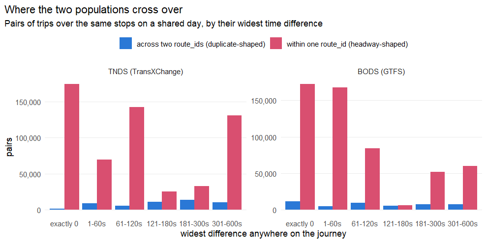

# The same bus, booked a minute apart: near-duplicate journeys

`UK2GTFS::gtfs_deduplicate()` removes a journey a feed describes twice. It
decides two trips are the same journey by comparing their whole itinerary
exactly: the same stops, in the same order, at the same arrival and departure
times. That test is deliberately unforgiving, because removing a journey that
is not a duplicate deletes service that really runs.

It has a blind spot, and this report measures it. When one bus service is
**registered twice** — two operators of the same group, or one operator filing
the same service in two datasets — the two registrations are often written from
different working timetables. The same bus is then booked at 08:14 in one and
08:15 in the other. Every stop is the same, the order is the same, the days are
the same, and not one time matches. No exact test can see it, and both copies
are counted.

Everything below is measured on the **2026-07-26** snapshot
of each source, over the 28-day window **2026-07-27 to
2026-08-23**, and on what *survives* exact deduplication — so it is
all additional to what is already removed.

## What one looks like

The Preston–Bolton 125 is the clearest case in the July 2026 TNDS snapshot. It
is held as two `route_id`s of 371 trips each:

| `route_id` | Line | Description | Operator | NOC | Trips |
|---|---|---|---|---|---|
| 3825 | 125 | Royal Preston Hospital – Bolton | Stagecoach North West | `SCCU` | 371 |
| 3827 | 125 | Preston – Bolton | Stagecoach Cumbria and Lancashire | `SCMY` | 371 |

Between those 742 trips there is **not one pair with identical times on a
shared day**. Pair them on their stop sequence instead and 230 pairs sit within
one minute of each other at every stop, and 358 within two minutes. The service
is one bus route, counted twice, and the exact matcher cannot touch it — nor,
as it happens, can any operator-identity fix, because `SCCU` and `SCMY` are
genuinely different companies (`Stagecoach (North West) Ltd` and `Ribble Motor
Services Ltd`) that happen to have the same corporate parent.

## How often it happens

|Source              | Published| In window| After exact dedup| Removed exactly|
|:-------------------|---------:|---------:|-----------------:|---------------:|
|TNDS (TransXChange) | 1,578,648| 1,248,088|         1,214,577|           2.68%|
|BODS (GTFS)         | 1,578,648| 1,248,088|         1,214,577|           2.68%|

The table below counts **pairs of trips** by how far apart they are at their
widest point, and splits them by whether the two trips share a `route_id`. That
split is the whole basis for everything that follows.

* **Across two `route_id`s** is what a duplicate registration looks like. One
  service, filed twice.
* **Within one `route_id`** is what a genuine close headway looks like: a
  relief bus behind a school journey, or a corridor running every couple of
  minutes. Removing one of those deletes service that really runs.

Neither is proof on its own. The *ratio* between them, band by band, is what
says whether a given tolerance is discriminating or guessing.

**TNDS (TransXChange)**

|Widest difference | Across route_ids| Within one route_id| Ratio|
|:-----------------|----------------:|-------------------:|-----:|
|exactly 0         |            1,516|             174,383|   0.0|
|1-60s             |            8,503|              69,590|   0.1|
|61-120s           |            5,274|             142,647|   0.0|
|121-180s          |           10,868|              25,177|   0.4|
|181-300s          |           13,717|              32,622|   0.4|
|301-600s          |           10,224|             130,546|   0.1|

**BODS (GTFS)**

|Widest difference | Across route_ids| Within one route_id| Ratio|
|:-----------------|----------------:|-------------------:|-----:|
|exactly 0         |           11,512|             172,428|   0.1|
|1-60s             |            4,269|             167,596|   0.0|
|61-120s           |            9,343|              83,873|   0.1|
|121-180s          |            5,594|               6,124|   0.9|
|181-300s          |            7,191|              51,853|   0.1|
|301-600s          |            7,341|              59,652|   0.1|

## What tolerance would be needed

**TNDS (TransXChange)**

|Tolerance | Trips paired across route_ids| % of feed| Extra over exact match| Trips paired within one route_id|
|:---------|-----------------------------:|---------:|----------------------:|--------------------------------:|
|0s        |                        21,899|     1.80%|                      0|                            1,222|
|30s       |                        23,649|     1.95%|                  1,750|                            4,633|
|60s       |                        24,070|     1.98%|                  2,171|                            6,519|
|90s       |                        26,074|     2.15%|                  4,175|                            9,888|
|120s      |                        29,569|     2.43%|                  7,670|                           10,618|
|180s      |                        30,040|     2.47%|                  8,141|                           12,631|
|300s      |                        31,203|     2.57%|                  9,304|                           16,044|

**BODS (GTFS)**

|Tolerance | Trips paired across route_ids| % of feed| Extra over exact match| Trips paired within one route_id|
|:---------|-----------------------------:|---------:|----------------------:|--------------------------------:|
|0s        |                        20,154|     1.66%|                      0|                            2,665|
|30s       |                        21,062|     1.73%|                    908|                            3,776|
|60s       |                        21,377|     1.76%|                  1,223|                            6,842|
|90s       |                        22,133|     1.82%|                  1,979|                            8,377|
|120s      |                        23,636|     1.95%|                  3,482|                           17,473|
|180s      |                        30,094|     2.48%|                  9,940|                           17,649|
|300s      |                        30,338|     2.50%|                 10,184|                           18,330|

Read the last column as the cost. The middle columns are what the rule would
buy.

In TNDS the crossover is sharp and it is between one and two minutes. Of the pairs first admitted at **one minute**, 8,503 are across two `route_id`s against 69,590 within one - about 0 to one in favour of the reading that they are duplicates. Widen to **two minutes** and that inverts: the next band admits 5,274 cross-route pairs against 142,647 within-route ones. The marginal pair beyond a minute is several times more likely to be a genuine close headway than a duplicate registration.

The DfT's GTFS does not behave the same way, and this is the single most important qualification in this report. There the within-route population dominates from the very first band: 172,428 pairs sit at exactly zero difference within one `route_id` against 11,512 across two, and at one minute it is 167,596 within against 4,269 across. The `route_id` split, which on TNDS separates the two populations cleanly, barely separates them at all here. Part of that is structural - the DfT assigns one `route_id` per registration, so a duplicate registration is less likely to show up as two ids - and part of it is that the feed carries the whole of London, where buses genuinely do run a minute apart. Whatever the cause, a tolerant rule tuned on TNDS should not be turned loose on this feed on the strength of that tuning.

### The rule

A tolerant matcher that could be defended would keep every existing test and
change only one:

1. **Same operator, `route_type` and `route_short_name`** — unchanged.
2. **Identical stop sequence** — unchanged in substance, but compared on
   `stop_id` order alone rather than on stops-and-times together.
3. **Times within the tolerance at every stop**, measured as the largest
   absolute difference anywhere on the journey. Not the difference at the first
   stop: a pair that leaves together and separates is two journeys.
4. **Redundant operating dates** — unchanged, and still the test that does most
   of the work. A copy is removed only when every date it runs is also run by a
   copy that is kept.
5. **Only across two `route_id`s.** New, and the condition that makes the
   tolerance affordable at all. Two trips of the *same* `route_id` a minute
   apart are two buses; the numbers above are what says so.

with the tolerance set at **60 seconds**, and applied to TNDS only until the
DfT feed has been looked at service by service.

### What it would and would not fix

A 60-second rule on TNDS would act on **5 services** and **1,994 trips**, 0.16% of the feed. That is a narrow intervention: the problem is not spread thinly across the country, it is concentrated in a few dozen services where it is severe.

|Operator   |Line | route_ids| Trips|
|:----------|:----|---------:|-----:|
|Operator 1 |A    |         2|   492|
|Operator 2 |B    |         2|   438|
|Operator 3 |C    |         2|   406|
|Operator 4 |D    |         2|   384|
|Operator 5 |E    |         2|   274|

Widening to two minutes would add these services -

|Operator   |Line | route_ids| Trips|
|:----------|:----|---------:|-----:|
|Operator 1 |A    |         2|   492|
|Operator 2 |B    |         2|   438|
|Operator 3 |C    |         2|   406|
|Operator 4 |D    |         2|   384|
|Operator 5 |E    |         2|   274|

- at the price of admitting these within-route pairs, which the same rule cannot distinguish:

|Operator   |Line | route_ids| Trips|
|:----------|:----|---------:|-----:|
|Operator 1 |A    |         2|   492|
|Operator 2 |B    |         2|   438|
|Operator 3 |C    |         2|   406|
|Operator 4 |D    |         2|   384|
|Operator 5 |E    |         2|   274|

## The other half of the problem: who counts as one operator

Every test above starts by requiring the two trips to belong to the same
operator, because that is what `gtfs_deduplicate()` requires. A feed that files
one operator under two names therefore hides its own duplicates from the test,
and British feeds do this constantly. TNDS carries the London 20 and 275 under
`ELBG` "Stagecoach London" and again under `IF` "EAST LONDON BUS & COACH
COMPANY LIMITED" — the same company's trading name and the name on its PSV
licence, sharing neither an id nor a word.

`UK2GTFS::get_noc()` and `noc_operator_key()` resolve this from Traveline's
National Operator Codes register, which is the only source that knows the two
names are one company. The table below runs the whole scan twice, once
grouping operators by the feed's own `agency_name` and once by the register's
operator identity.

|Source              |Operator key          |Tolerance | Trips paired across route_ids| % of feed|
|:-------------------|:---------------------|:---------|-----------------------------:|---------:|
|TNDS (TransXChange) |agency_name           |0s        |                        21,899|     1.80%|
|TNDS (TransXChange) |agency_name           |60s       |                        24,070|     1.98%|
|TNDS (TransXChange) |agency_name           |120s      |                        29,569|     2.43%|
|TNDS (TransXChange) |NOC operator identity |0s        |                        19,935|     1.64%|
|TNDS (TransXChange) |NOC operator identity |60s       |                        22,944|     1.89%|
|TNDS (TransXChange) |NOC operator identity |120s      |                        26,789|     2.21%|
|BODS (GTFS)         |agency_name           |0s        |                        20,154|     1.66%|
|BODS (GTFS)         |agency_name           |60s       |                        21,377|     1.76%|
|BODS (GTFS)         |agency_name           |120s      |                        23,636|     1.95%|
|BODS (GTFS)         |NOC operator identity |0s        |                        23,298|     1.92%|
|BODS (GTFS)         |NOC operator identity |60s       |                        28,280|     2.33%|
|BODS (GTFS)         |NOC operator identity |120s      |                        29,125|     2.40%|

Table: Exact deduplication under the two operator keys

|Source              | Removed, agency_name| Removed, NOC identity| Difference|
|:-------------------|--------------------:|---------------------:|----------:|
|TNDS (TransXChange) |               33,511|                33,989|        478|
|BODS (GTFS)         |               33,511|                33,989|        478|

The two changes are **multiplicative, not additive**. Resolving operator
identity buys almost nothing on its own, as the table above shows: the copies
it newly joins do not have identical times, so they still fail the exact test.
It only pays once a tolerance exists — and the tolerance only reaches the
Stagecoach London family once the operator identity is resolved.

## Risks, stated plainly

**A relief bus is not a duplicate.** School journeys are routinely doubled with
a second vehicle a minute or two behind, and busy corridors run at headways
shorter than the tolerance. Requiring two different `route_id`s is what keeps
most of these out, and it is a convention rather than a guarantee: an operator
free to file two registrations for one service is equally free to file one
registration for two buses.

**High-frequency and rail-like services are where it breaks.** In TNDS the
within-route pairs that a two-minute rule would admit are dominated by a
handful of services running every minute or two — in this snapshot the Heathrow
Air Rail Link and London Underground lines account for most of them. Those are
exactly the services where a tolerance comparable to the headway is
indefensible. A rule that additionally refused to act where the pattern's own
minimum headway is less than twice the tolerance would remove most of this
risk, at the cost of another parameter.

**The discriminator is weaker on some feeds than others**, and how much weaker
is not knowable without measuring that feed. On TNDS the cross-route and
within-route populations separate at a minute; on the DfT's GTFS they overlap
from zero. A tolerance is therefore a per-feed judgement, not a setting that
can be defended once and reused.

**The measurement here is an upper bound on what could be removed.** A pair is
counted when the two trips share *one* operating day; `gtfs_deduplicate()`
removes a copy only when *every* day it runs is also run by a copy that is
kept. That is why the "exactly 0" band is not empty even though the exact
matcher has already run: those pairs have identical departure times but differ
in arrival times, in boarding codes, in a trip attribute, or in their
calendars, and most of them should not be removed.

**The tolerance is not a truth.** Sixty seconds is where the evidence stops
supporting the removal, not a property of the road. It leaves real duplication
behind — it catches 230 of the 125's 358 near-duplicate pairs and none of its
cross-subsidiary registration problem — and the right response to that is a
published timetable, not a wider tolerance.

## Recommendation

Do not widen the default. `gtfs_deduplicate()` should stay exact, because
exactness is what makes it safe to run on every feed unattended.

Add the tolerance as an opt-in, at 60 seconds, restricted to pairs across two `route_id`s, and report what it removed rather than removing it silently. On TNDS that is a 0.18% correction (2,171 trips) concentrated in a few dozen services - small nationally, decisive for the zones those services serve, and too uncertain to apply without someone looking at the list.
