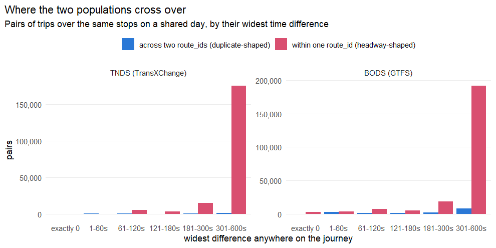

# The same bus, booked a minute apart: near-duplicate journeys

`UK2GTFS::gtfs_deduplicate()` removes a journey a feed describes twice. It
decides two trips are the same journey by comparing their whole itinerary
exactly: the same stops, in the same order, at the same arrival and departure
times. That test is deliberately unforgiving, because removing a journey that
is not a duplicate deletes service that really runs.

It has a blind spot, and this report measures it. When one bus service is
**registered twice** — two operators of the same group, or one operator filing
the same service in two datasets — the two registrations are often written from
different working timetables. The same bus is then booked at 08:14 in one and
08:15 in the other. Every stop is the same, the order is the same, the days are
the same, and not one time matches. No exact test can see it, and both copies
are counted.

Everything below is measured on the **2026-07-26** snapshot
of each source, over the 14-day window **2026-07-27 to
2026-08-09**, and on what *survives* exact deduplication — so it is
all additional to what is already removed.

## What one looks like

The Preston–Bolton 125 is the clearest case in the July 2026 TNDS snapshot. It
is held as two `route_id`s of 371 trips each:

| `route_id` | Line | Description | Operator | NOC | Trips |
|---|---|---|---|---|---|
| 3825 | 125 | Royal Preston Hospital – Bolton | Stagecoach North West | `SCCU` | 371 |
| 3827 | 125 | Preston – Bolton | Stagecoach Cumbria and Lancashire | `SCMY` | 371 |

Between those 742 trips there is **not one pair with identical times on a
shared day**. Pair them on their stop sequence instead and 230 pairs sit within
one minute of each other at every stop, and 358 within two minutes — so a
two-minute rule reaches the whole of it and a one-minute rule reaches two
thirds. The service is one bus route, counted twice, and the exact matcher
cannot touch it.

**And the rule this report ends up recommending would not fix it.** That is
worth stating at the top rather than burying, because the 125 is the case that
raised the question. Every test here begins by requiring the two trips to
belong to the same operator, as `gtfs_deduplicate()` does, and these two do
not: `SCCU` and `SCMY` are genuinely different companies — `Stagecoach (North
West) Ltd` and `Ribble Motor Services Ltd` — that happen to share a corporate
parent, and Traveline's register says exactly that. Only matching at group
level would join them, and "Stagecoach" as a group is 94 operator codes
including Bluebird and London. So the 125 is not merely missed by the exact
matcher; it is outside the scan below, and the numbers in this report do not
include it.

Dropping the operator condition altogether — matching on stop sequence and
times alone — is the obvious way to reach it, and is the experiment this
report does not run. Two operators filing the identical stop sequence within
two minutes of each other on the same day is nearly always one service
registered twice, but "nearly always" is not a measurement, and competing
services over a shared corridor are the counter-example that would have to be
counted first.

## How often it happens

|Source              | Published| In window| After exact dedup| Removed exactly|
|:-------------------|---------:|---------:|-----------------:|---------------:|
|TNDS (TransXChange) | 1,474,389| 1,197,347|         1,171,549|           2.15%|
|BODS (GTFS)         | 1,469,864| 1,266,012|         1,196,336|           5.50%|

The table below counts **pairs of trips** by how far apart they are at their
widest point, and splits them by whether the two trips share a `route_id`. That
split is the whole basis for everything that follows.

* **Across two `route_id`s** is what a duplicate registration looks like. One
  service, filed twice.
* **Within one `route_id`** is what a genuine close headway looks like: a
  relief bus behind a school journey, or a corridor running every couple of
  minutes. Removing one of those deletes service that really runs.

Neither is proof on its own. The *ratio* between them, band by band, is what
says whether a given tolerance is discriminating or guessing.

**TNDS (TransXChange)**

|Widest difference | Across route_ids| Within one route_id| Ratio|
|:-----------------|----------------:|-------------------:|-----:|
|exactly 0         |                9|                   3|   3.0|
|1-60s             |              442|                 122|   3.6|
|61-120s           |              319|               5,120|   0.1|
|121-180s          |              167|               3,076|   0.1|
|181-300s          |              399|              15,098|   0.0|
|301-600s          |            1,069|             175,362|   0.0|

**BODS (GTFS)**

|Widest difference | Across route_ids| Within one route_id| Ratio|
|:-----------------|----------------:|-------------------:|-----:|
|exactly 0         |               37|               2,710|   0.0|
|1-60s             |            2,945|               3,851|   0.8|
|61-120s           |            1,501|               7,658|   0.2|
|121-180s          |              993|               5,142|   0.2|
|181-300s          |            2,137|              18,611|   0.1|
|301-600s          |            8,123|             191,685|   0.0|

## What tolerance would be needed

**TNDS (TransXChange)**

|Tolerance | Trips paired across route_ids| % of feed| Extra over exact match| Trips paired within one route_id|
|:---------|-----------------------------:|---------:|----------------------:|--------------------------------:|
|0s        |                            14|     0.00%|                      0|                                6|
|30s       |                            32|     0.00%|                     18|                                6|
|60s       |                           879|     0.08%|                    865|                              242|
|90s       |                         1,125|     0.10%|                  1,111|                              242|
|120s      |                         1,488|     0.13%|                  1,474|                            5,571|
|180s      |                         1,764|     0.15%|                  1,750|                            9,435|
|300s      |                         2,126|     0.18%|                  2,112|                           18,336|

**BODS (GTFS)**

|Tolerance | Trips paired across route_ids| % of feed| Extra over exact match| Trips paired within one route_id|
|:---------|-----------------------------:|---------:|----------------------:|--------------------------------:|
|0s        |                            70|     0.01%|                      0|                            5,307|
|30s       |                         3,803|     0.32%|                  3,733|                            5,739|
|60s       |                         5,779|     0.48%|                  5,709|                           12,135|
|90s       |                         6,199|     0.52%|                  6,129|                           12,388|
|120s      |                         8,619|     0.72%|                  8,549|                           21,903|
|180s      |                        10,496|     0.88%|                 10,426|                           29,190|
|300s      |                        14,184|     1.19%|                 14,114|                           43,822|

Read the last column as the cost. The middle columns are what the rule would
buy.

### Read that table by mode, or it will mislead you

Taken as printed above, the TNDS table looks as though the two populations
cross over between one and two minutes, and that reading is wrong. It is the
rail-like modes talking over the buses. Nearly every pair in the "exactly 0"
band is a London Underground journey, and the explosion of within-route pairs
at two minutes is the trams and the Underground, where trains genuinely do run
a minute apart. The buses are a quiet minority inside the same numbers.

**TNDS (TransXChange), buses only (`route_type` 3)**

|Widest difference | Across route_ids| Within one route_id| Ratio|
|:-----------------|----------------:|-------------------:|-----:|
|exactly 0         |                0|                   3|   0.0|
|1-60s             |              375|                 122|   3.1|
|61-120s           |              276|                  98|   2.8|
|121-180s          |              145|                 125|   1.2|
|181-300s          |              378|               2,698|   0.1|
|301-600s          |              835|             124,571|   0.0|

**BODS (GTFS), buses only (`route_type` 3)**

|Widest difference | Across route_ids| Within one route_id| Ratio|
|:-----------------|----------------:|-------------------:|-----:|
|exactly 0         |               28|               2,678|   0.0|
|1-60s             |            2,765|               3,821|   0.7|
|61-120s           |            1,214|               2,626|   0.5|
|121-180s          |              941|               2,180|   0.4|
|181-300s          |            1,927|               7,474|   0.3|
|301-600s          |            6,520|             145,508|   0.0|

On TNDS buses the discrimination is strong and it **stays** strong well past two minutes: 3.1 to one in the first minute, 2.8 to one in the second, 1.2 to one in the third. It does not collapse until the 181-300 second band, where it falls to 0.1 to one. The crossover for buses is therefore somewhere between three and five minutes, not between one and two.

The DfT's GTFS does not behave this way, and that is the single most important qualification in this report. Restricted to buses in exactly the same way, its ratios never reach one: 0.72 in the first minute, 0.46 in the second, 0.43 in the third. The `route_id` split, which separates the two populations cleanly on TNDS, does not separate them here at any tolerance. Part of that is structural - the DfT assigns one `route_id` per registration, so a duplicate registration is less likely to appear as two ids - and part of it is that the feed carries the whole of London, where buses really do run a minute apart. Whatever the cause, a tolerance tuned on TNDS must not be turned loose on this feed on the strength of that tuning.

### The rule

A tolerant matcher that could be defended would keep every existing test and
change only one:

1. **Same operator, `route_type` and `route_short_name`** — unchanged.
2. **Identical stop sequence** — unchanged in substance, but compared on
   `stop_id` order alone rather than on stops-and-times together.
3. **Times within the tolerance at every stop**, measured as the largest
   absolute difference anywhere on the journey. Not the difference at the first
   stop: a pair that leaves together and separates is two journeys.
4. **Redundant operating dates** — unchanged, and still the test that does most
   of the work. A copy is removed only when every date it runs is also run by a
   copy that is kept.
5. **Only across two `route_id`s.** New, and the condition that makes the
   tolerance affordable at all. Two trips of the *same* `route_id` a minute
   apart are two buses; the numbers above are what says so.
6. **Buses only.** Also new, and not a detail. Every mode that runs at
   headways comparable to the tolerance — the Underground, the trams, the DLR
   — has to be out, because on those a tolerance cannot tell a duplicate
   registration from the next train. Restricting to `route_type == 3` is the
   blunt version; testing the pattern's own minimum headway against the
   tolerance would be the principled one.

   Excluding those modes here is right, but for years it also meant nobody
   looked at them at all, and three conversion defects lived in that gap — see
   [`non_bus_modes.md`](non_bus_modes.md), which now covers them on every
   build. Duplicate copies of fixed-track services are real and are handled by
   `gtfs_deduplicate(fixed_track = )`, which matches on a journey's termini
   rather than on a time tolerance; see
   [`metro_duplicate_copies.md`](metro_duplicate_copies.md).

with the tolerance set at **120 seconds**, and applied to TNDS only until the
DfT feed has been looked at service by service.

### What it would and would not fix

A 120-second rule on TNDS buses would act on **13 services** and **1,255 trips**, 0.11% of the feed. That is a narrow intervention: the problem is not spread thinly across the country, it is concentrated in a few dozen services where it is severe. The 3 non-bus services the same rule would have caught are listed after it, and are exactly what condition 6 exists to exclude.

|Operator                              |Line |Mode | route_ids| Trips|
|:-------------------------------------|:----|:----|---------:|-----:|
|ARRIVA LONDON NORTH LIMITED           |158  |bus  |         2|   347|
|Arriva Cymru                          |1    |bus  |         2|   280|
|Arriva Cymru                          |10   |bus  |         2|   244|
|Arriva Cymru                          |14   |bus  |         2|   104|
|LONDON GENERAL TRANSPORT SERVICES LTD |265  |bus  |         2|    70|
|ARRIVA North East                     |X12  |bus  |         2|    66|
|Arriva Cymru                          |11A  |bus  |         2|    52|
|Central Connect Transport Ltd         |A1   |bus  |         2|    32|
|Arriva Cymru                          |101  |bus  |         2|    32|
|Arriva Cymru                          |15A  |bus  |         2|    18|
|Arriva Midlands                       |X84  |bus  |         2|     4|
|TM Travel                             |26   |bus  |         2|     4|
|Central Connect Transport Ltd         |25C  |bus  |         2|     2|

And the non-bus services the mode condition removes:

|Operator                |Line         |Mode  | route_ids| Trips|
|:-----------------------|:------------|:-----|---------:|-----:|
|London Underground      |Metropolitan |metro |         4|   186|
|London Underground      |Piccadilly   |metro |         2|    23|
|Docklands Light Railway |DLR          |metro |         2|    10|

Widening from two minutes to five would add these bus services -

|Operator                              |Line |Mode | route_ids| Trips|
|:-------------------------------------|:----|:----|---------:|-----:|
|ARRIVA LONDON NORTH LIMITED           |158  |bus  |         2|   578|
|Arriva Cymru                          |11A  |bus  |         2|    44|
|ARRIVA North East                     |X12  |bus  |         2|    38|
|LONDON GENERAL TRANSPORT SERVICES LTD |265  |bus  |         2|    20|
|Central Connect Transport Ltd         |33   |bus  |         2|     6|
|Arriva Cymru                          |14   |bus  |         2|     2|
|Arriva Midlands                       |X84  |bus  |         2|     2|

- at the price of admitting these within-route bus pairs, which the same rule cannot distinguish, and which outnumber them:

|Operator                       |Line |Mode | route_ids| Trips|
|:------------------------------|:----|:----|---------:|-----:|
|London Transit                 |18   |bus  |         1|   760|
|METROLINE TRAVEL LIMITED       |W7   |bus  |         1|   526|
|BLUE TRIANGLE BUSES LIMITED    |EL1  |bus  |         1|   384|
|Replacement Service            |PL-6 |bus  |         1|   306|
|ARRIVA LONDON NORTH LIMITED    |38   |bus  |         1|   221|
|National Express West Midlands |50   |bus  |         1|   209|
|ARRIVA LONDON NORTH LIMITED    |29   |bus  |         1|   129|
|Arriva                         |310  |bus  |         1|   128|
|Arriva                         |SB1  |bus  |         1|   104|
|ARRIVA LONDON SOUTH LIMITED    |137  |bus  |         1|    68|

## The other half of the problem: who counts as one operator

Every test above starts by requiring the two trips to belong to the same
operator, because that is what `gtfs_deduplicate()` requires. A feed that files
one operator under two names therefore hides its own duplicates from the test,
and British feeds do this constantly. TNDS carries the London 20 and 275 under
`ELBG` "Stagecoach London" and again under `IF` "EAST LONDON BUS & COACH
COMPANY LIMITED" — the same company's trading name and the name on its PSV
licence, sharing neither an id nor a word.

`UK2GTFS::get_noc()` and `noc_operator_key()` resolve this from Traveline's
National Operator Codes register, which is the only source that knows the two
names are one company. The table below runs the whole scan twice, once
grouping operators by the feed's own `agency_name` and once by the register's
operator identity.

|Source              |Operator key          |Tolerance | Trips paired across route_ids| % of feed|
|:-------------------|:---------------------|:---------|-----------------------------:|---------:|
|TNDS (TransXChange) |agency_name           |0s        |                            14|     0.00%|
|TNDS (TransXChange) |agency_name           |120s      |                         1,488|     0.13%|
|TNDS (TransXChange) |agency_name           |300s      |                         2,126|     0.18%|
|TNDS (TransXChange) |NOC operator identity |0s        |                            14|     0.00%|
|TNDS (TransXChange) |NOC operator identity |120s      |                         1,484|     0.13%|
|TNDS (TransXChange) |NOC operator identity |300s      |                         2,120|     0.18%|
|BODS (GTFS)         |agency_name           |0s        |                            70|     0.01%|
|BODS (GTFS)         |agency_name           |120s      |                         8,619|     0.72%|
|BODS (GTFS)         |agency_name           |300s      |                        14,184|     1.19%|
|BODS (GTFS)         |NOC operator identity |0s        |                            70|     0.01%|
|BODS (GTFS)         |NOC operator identity |120s      |                         8,461|     0.71%|
|BODS (GTFS)         |NOC operator identity |300s      |                        13,866|     1.16%|

Table: Exact deduplication under the two operator keys

|Source              | Removed, agency_name| Removed, NOC identity| Difference|
|:-------------------|--------------------:|---------------------:|----------:|
|TNDS (TransXChange) |               25,798|                25,798|          0|
|BODS (GTFS)         |               69,676|                69,666|        -10|

The two changes are **multiplicative, not additive**. Resolving operator
identity buys almost nothing on its own, as the table above shows: the copies
it newly joins do not have identical times, so they still fail the exact test.
It only pays once a tolerance exists — and then it pays modestly, reaching a
handful more Stagecoach London services (372, 215, 498, 397) that the feed's
own names keep apart.

It can also go the other way, and should. On the DfT's GTFS the register
*declines* a merge that the plain name match makes, because six separate
companies in that feed all trade as "Bee Network" and a shared brand is not a
shared operator. That is the difference showing in the table above as a small
negative.

**It does not reach the 20 and the 275**, which is worth saying because they
are the routes that raised the question. Their two registrations differ in
*where the bus goes* as well as in when: over the counting window the 20
survives as `route_id` 2396 (328 trips, 101 stops) against 8686 (459 trips, 101
stops) with 99 stops in common and two different on each side, and the 275 as
2367 (384 trips, 91 stops) against 8704 (384 trips, 98 stops). Pair them on an
identical stop sequence and there is not one candidate pair on any shared day.
Reaching those would need a matcher that accepted one itinerary as a
sub-sequence of the other, which is a much larger change and a much riskier
one: a short working and a full-length journey over the same corridor are two
buses, not one described twice.

## Risks, stated plainly

**A relief bus is not a duplicate.** School journeys are routinely doubled with
a second vehicle a minute or two behind, and busy corridors run at headways
shorter than the tolerance. Requiring two different `route_id`s is what keeps
most of these out, and it is a convention rather than a guarantee: an operator
free to file two registrations for one service is equally free to file one
registration for two buses.

**High-frequency and rail-like services are where it breaks, and they will
hide in a national statistic.** The within-route pairs a wide rule would admit
are dominated by a handful of services running every minute or two — in this
snapshot the Heathrow Air-Rail Link, the Underground lines and Metrolink
account for most of them. Read across all modes at once those services do not
merely add noise, they *reverse the conclusion*: they put the apparent
crossover at one to two minutes when the buses' own crossover is at three to
five. Restricting to `route_type == 3` fixes it here. The principled version
is to refuse to act where the pattern's own minimum headway is less than twice
the tolerance, which would also catch a bus route running every ninety
seconds.

**The discriminator is weaker on some feeds than others**, and how much weaker
is not knowable without measuring that feed. On TNDS buses the cross-route and
within-route populations separate by more than ten to one and stay separated
past two minutes; on the DfT's GTFS, restricted the same way, they never
separate at all. A tolerance is a per-feed judgement, not a setting that can
be defended once and reused.

**The measurement here is an upper bound on what could be removed.** A pair is
counted when the two trips share *one* operating day; `gtfs_deduplicate()`
removes a copy only when *every* day it runs is also run by a copy that is
kept. That is why the "exactly 0" band is not empty even though the exact
matcher has already run: those pairs have identical departure times but differ
in arrival times, in boarding codes, in a trip attribute, or in their
calendars, and most of them should not be removed.

**The tolerance is not a truth.** Two minutes is where the evidence for buses
in this feed stops being one-sided, not a property of the road.

**And it leaves the two cases that raised the question unfixed.** The
Preston–Bolton 125 is blocked by the operator condition, since its two
registrations belong to two different Stagecoach companies. The London 20 and
275 are blocked by the stop-sequence condition, since their copies run over
slightly different stop lists. Both would need a *looser* rule than the one
recommended here — dropping the operator test in the first case, accepting a
sub-sequence in the second — and neither loosening has been measured. The
right response to what is left is a published timetable, not a wider
tolerance chosen to make a particular route come out right.

## Recommendation

Do not widen the default. `gtfs_deduplicate()` should stay exact, because
exactness is what makes it safe to run on every feed unattended.

Add the tolerance as an opt-in, at **120 seconds**, restricted to buses and to pairs across two `route_id`s, and have it report what it removed rather than remove it silently. On TNDS that is 1,255 trips over 651 bus pairs, 0.11% of the feed, concentrated in a few dozen services - small nationally, decisive for the zones those services serve, and too uncertain to apply without someone reading the list first.

Do not enable it on the DfT's GTFS on this evidence. Whatever duplication of this kind that feed contains is not separable from its genuine high-frequency service by any tolerance tested here, and a rule that cannot tell them apart would delete real buses.
