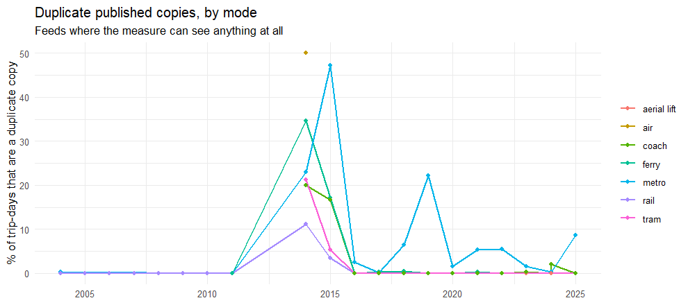
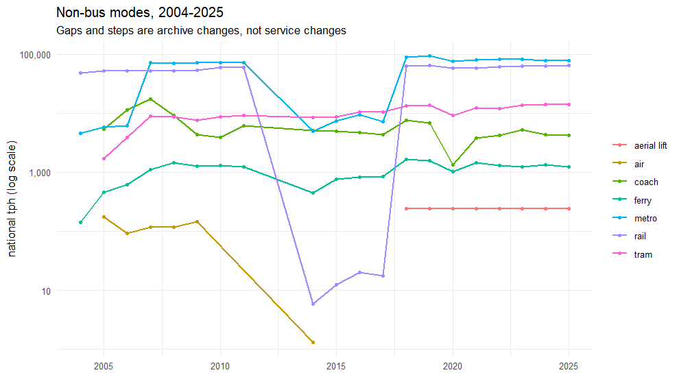

# Everything that is not a bus

Bus is 97% of the journeys in this pipeline and the whole of the question the
pipeline was built to answer, so every other validation stage here is
hard-filtered to `route_type == 3` — `R/comparison.R:212`, `R/lsoa_gap.R:43`,
`R/route_match.R:169` — and `reports/near_duplicate_journeys.md` scopes its
deduplication rule to "buses only" on purpose.

The cost of that became clear in September 2026, when three defects were found
in quick succession. Two of them were invisible to a bus-only check by
construction, and had been in the published outputs for months:

1. **Duplicate published copies of Underground lines.** TfL files one line
   into TNDS as several TransXChange documents with overlapping validity.
   UK2GTFS blanked any `LineName` longer than six characters to pass a
   validation check, and `gtfs_deduplicate()` keys an unnamed route on its own
   `route_id` — so 93% of metro trips could not be grouped with their own
   duplicates. Leytonstone read 96.8 trips per hour in 2021 against 55 in
   neighbouring years.
2. **`gtfs_merge()` numbered `file_id` per table**, so a feed with no
   `calendar_dates` shifted every later feed's cancellations onto the
   preceding feed's services. This one hit *bus* hardest, and was still missed,
   because nothing compared a merged feed against the regions that went into
   it.
3. **The NAPTAN join ran after the mode rules**, silently disabling the
   thirteen rules that identify a system by its stops' names. The Docklands
   Light Railway came out as heavy rail in half the series.

This report is the standing check for that blind spot. It is deliberately not
"the same tests with a different filter": it asks the questions whose absence
let those three through.

Coach (`route_type` 200) is included even though it is a road mode. The
sources disagree about where coach belongs, and `load_pt_frequency()` in the
`build` repo folds it back into bus — so a defect in coach lands inside the
bus figures, where no bus check will look for it.

Table: Feeds audited

|side | feeds| years|
|:----|-----:|-----:|
|bus  |    22|    20|
|rail |     8|     8|

## 1. Does every system carry the same mode in every feed?

This is the test that found defect 3, and it is the one to run first after any
change to a converter. A system is identified the way
`UK2GTFS::standard_mode_overrides()` identifies it — at least 80% of a route's
distinct stops matching that system's NAPTAN name pattern — and the route's
*actual* `route_type` is reported beside it. Identification is by stop name
rather than operator code because operator codes are not stable between
archives: NPTDR reuses them across eras, and `CAB` means something different
before the cable car opened in 2012.

A system with more than one mode across the series means the published metro,
tram and rail totals are not comparable between years.

Table: Modes each system is given, across every feed

|system                      |modes | n_modes| feeds|
|:---------------------------|:-----|-------:|-----:|
|Birmingham Air-Rail Link    |tram  |       1|    10|
|Blackpool Tramway           |tram  |       1|    16|
|Croydon Tramlink            |tram  |       1|     5|
|Docklands Light Railway     |metro |       1|    13|
|Edinburgh Trams             |tram  |       1|    12|
|Gatwick Airport shuttle     |tram  |       1|    15|
|Glasgow Subway              |metro |       1|    19|
|Heritage and minor railways |rail  |       1|    18|
|London Underground          |metro |       1|    13|
|Manchester Metrolink        |tram  |       1|    18|
|Midland Metro               |tram  |       1|    19|
|Nottingham Express Transit  |tram  |       1|    15|
|Sheffield Supertram         |tram  |       1|     5|
|Tyne and Wear Metro         |metro |       1|    15|

**14 systems, every one of them consistent.** No system is filed under two different modes anywhere in the series.

Trips per system and year, for the systems the mode rules name. Read down a
column rather than across a row: a system's *mode* should never change, but its
trip count reflects what the archive for that year happens to contain.

Table: Trips per system per year, bus-side feeds

|sys                         | 2005| 2006|  2007|  2008|  2009|  2010|  2011|  2014|  2015|  2016|  2017|  2018|  2019|  2020|  2021|  2022|  2023|  2024|  2025|
|:---------------------------|----:|----:|-----:|-----:|-----:|-----:|-----:|-----:|-----:|-----:|-----:|-----:|-----:|-----:|-----:|-----:|-----:|-----:|-----:|
|Birmingham Air-Rail Link    |    0|    0|     0|     0|     0|     0|     0|     0|     0| 16234| 17480|  6239|  3747|  3747|  3747|  3747|  3747|  3786|  3786|
|Blackpool Tramway           |    0|    0|   925|   966|  1139|   906|   368|  1568|  1410|  2588|  2580|   476|   568|     0|   744|   402|   402|   479|   740|
|Croydon Tramlink            |    0|    0|  1518|  1789|  1709|  1734|  1747|     0|     0|     0|     0|     0|     0|     0|     0|     0|     0|     0|     0|
|Docklands Light Railway     |    0|    0|  3541|  3628|  3586|  3763|  4149|     0|     0|     0|     0| 10235| 15573|  3684|  6375| 12270| 10709|  5014| 14683|
|Edinburgh Trams             |    0|    0|     0|     0|     0|     0|     0|  2520|  2568|  2520|  2248|   562|   852|   152|   846|   830|   885|   885|   893|
|Gatwick Airport shuttle     |    0|    0|     0|   492|     0|  1476|   492| 19008| 17040| 19008| 17040|  2460|  4260|  1968|   492|   492|   492|   492|   492|
|Glasgow Subway              |  505|  505|   507|   498|   498|   498|   498|  1984|  3968|  3968|  3968|   992|   992|   992|  1740|  1740|  1740|   870|   870|
|Heritage and minor railways |    0|   32|    26|    39|   169|   328|   115|   590|   841|   985|   671|   588|   322|   141|    28|   134|   138|   240|   320|
|London Underground          |    0|    0| 25219| 24579| 24574| 24172| 29206|     0|     0|     0|     0| 81644| 84886| 65051| 45625| 67133| 79150| 55718| 62701|
|Manchester Metrolink        |    0| 1914|  1911|  1356|  1675|  1920|  2693| 12077| 15764| 20180| 17644|  5902|  6561|  2902|  5221|  4033|  5683| 15225| 28648|
|Midland Metro               |  705|  706|   706|   658|   658|   658|   658|  5216|  3428|  2862|  2996|  1037|   677|   522|   631|  2174|   622|   693|   718|
|Nottingham Express Transit  |    0|    0|     0|     0|  1373|  1381|  1903| 14416| 14190| 19376| 17520|  4323|  4789|  3426|  3890|  3891|  4242|  5344|  3822|
|Sheffield Supertram         |    0|    0|  2652|  2652|  2651|  2644|  2638|     0|     0|     0|     0|     0|     0|     0|     0|     0|     0|     0|     0|
|Tyne and Wear Metro         |    0|    0|     0|     0|  1108|  1108|  1351|  4480|  6829|  5617|  4618|  3154|  3286|  4495|  2353|  4451|  3536|  1400|   938|

## 2. Is any line published as more than one live copy?

The defect that started this work. For each line and each date inside the
28-day counting window: how many journeys all live copies claim between them,
against how many the single largest copy claims alone. The difference is
service that exists only because the same timetable was published twice.

Counting per date matters. A superseded copy with a short calendar is
legitimate on the dates its replacement does not cover, and taking the largest
copy rather than the first stops a genuine mid-window timetable change being
scored as duplication. A feed-level count gets 2019 wrong in the other
direction: that year's copies are cancelled by exception on weekdays but not
on Saturdays, so a weekday-only check sees nothing at all.

**Read `measurable` before `pct`.** The measure groups copies of a line by its
name, so it assumes one `route_id` is one published timetable. That holds for
TransXChange but not for ATCO-CIF: NPTDR gives every metro route a blank
`route_long_name` and splits one line across hundreds of `route_id`s carrying a
few trips each — 920 routes under 18 line codes in 2007, 136 of them District
line. Grouping those by name reported 79% of Underground service as duplicated
when none of it was. Unnamed routes are therefore keyed individually and can
never be grouped, exactly as `gtfs_deduplicate()` treats them, and
`measurable` reports how much of each mode's service sits on routes the measure
can see. **`pct = 0` with `measurable = 0` means "cannot tell", not "no
duplication".** The NPTDR years are almost entirely unmeasurable this way; what
protects them is `gtfs_deduplicate()`'s exact-itinerary matching, which does not
depend on names.

Table: Phantom trip-days by mode and year

| year|mode        | trip_days| phantom|  pct| lines| lines_affected| measurable|
|----:|:-----------|---------:|-------:|----:|-----:|--------------:|----------:|
| 2004|coach       |       160|       0|  0.0|     8|              0|        0.0|
| 2004|ferry       |     30724|       0|  0.0|    33|              0|        0.0|
| 2004|metro       |     62168|     144|  0.2|   161|              2|       10.7|
| 2004|rail        |   2017361|     593|  0.0| 43396|             55|      100.0|
| 2005|air         |     65980|       0|  0.0|  1033|              0|        0.0|
| 2005|coach       |    301344|       0|  0.0|   908|              0|        0.0|
| 2005|ferry       |     82144|       0|  0.0|   228|              0|        0.0|
| 2005|metro       |     45016|       0|  0.0|    77|              0|        0.0|
| 2005|rail        |   1451274|      24|  0.0| 44828|              2|      100.0|
| 2005|tram        |     20332|       0|  0.0|    36|              0|        0.0|
| 2006|air         |     19264|       0|  0.0|  1008|              0|        0.0|
| 2006|coach       |    425904|       0|  0.0|  1575|              0|        0.0|
| 2006|ferry       |    119243|       0|  0.0|   210|              0|        0.0|
| 2006|metro       |     43081|       0|  0.0|   127|              0|        0.0|
| 2006|rail        |   1458296|       0|  0.0| 46451|              0|      100.0|
| 2006|tram        |     75012|       0|  0.0|    82|              0|        0.0|
| 2007|air         |     20076|       0|  0.0|  1028|              0|        0.0|
| 2007|coach       |    459921|       0|  0.0|  1874|              0|        0.0|
| 2007|ferry       |    134876|       0|  0.0|   281|              0|        0.0|
| 2007|metro       |    300168|       0|  0.0|   918|              0|        0.0|
| 2007|rail        |   1346493|      30|  0.0| 46147|              2|      100.0|
| 2007|tram        |    141480|       0|  0.0|   227|              0|        0.0|
| 2008|air         |     21176|       0|  0.0|  1030|              0|        0.0|
| 2008|coach       |    355394|       0|  0.0|  1345|              0|        0.0|
| 2008|ferry       |    140256|       0|  0.0|   289|              0|        0.0|
| 2008|metro       |    292166|       0|  0.0|   982|              0|        0.0|
| 2008|rail        |   1387824|       4|  0.0| 48248|              1|       99.9|
| 2008|tram        |    137588|       0|  0.0|   213|              0|        0.0|
| 2009|air         |     41112|       0|  0.0|  1037|              0|        0.0|
| 2009|coach       |    237164|       0|  0.0|  1166|              0|        0.0|
| 2009|ferry       |    145167|       0|  0.0|   281|              0|        0.0|
| 2009|metro       |    318927|       0|  0.0|  1001|              0|        0.0|
| 2009|rail        |   1432496|      44|  0.0| 49929|              4|       99.9|
| 2009|tram        |    125733|       0|  0.0|   215|              0|        0.0|
| 2010|coach       |    238621|       0|  0.0|  1140|              0|        0.0|
| 2010|ferry       |    148115|       0|  0.0|   299|              0|        0.0|
| 2010|metro       |    296185|       0|  0.0|   984|              0|        0.0|
| 2010|rail        |   1488533|       0|  0.0| 52363|              0|       99.8|
| 2010|tram        |    141199|       0|  0.0|   232|              0|        0.0|
| 2011|coach       |    320224|       0|  0.0|  1332|              0|        0.0|
| 2011|ferry       |    128383|       0|  0.0|  2927|              0|       25.8|
| 2011|metro       |    310634|       0|  0.0|  1128|              0|        0.1|
| 2011|rail        |   1484386|      26|  0.0| 52745|              3|       99.9|
| 2011|tram        |    156264|       0|  0.0|   246|              0|        0.0|
| 2014|air         |        80|      40| 50.0|     1|              1|      100.0|
| 2014|coach       |     41753|    8344| 20.0|    89|             24|      100.0|
| 2014|ferry       |     53011|   18376| 34.7|    80|             63|      100.0|
| 2014|metro       |     21544|    4948| 23.0|     4|              1|      100.0|
| 2014|rail        |       847|      94| 11.1|     6|              2|      100.0|
| 2014|tram        |    122682|   26175| 21.3|    15|             10|      100.0|
| 2015|coach       |     45924|    7612| 16.6|    87|             21|      100.0|
| 2015|ferry       |     94297|   16242| 17.2|   102|             60|      100.0|
| 2015|metro       |     30916|   14584| 47.2|    10|              4|      100.0|
| 2015|rail        |      1732|      61|  3.5|    11|              2|      100.0|
| 2015|tram        |    123098|    6533|  5.3|    16|              4|      100.0|
| 2016|coach       |     49714|       0|  0.0|    88|              0|      100.0|
| 2016|ferry       |     98223|       0|  0.0|   101|              0|      100.0|
| 2016|metro       |     50613|    1274|  2.5|    26|              4|      100.0|
| 2016|rail        |      1929|       0|  0.0|     9|              0|      100.0|
| 2016|tram        |    135692|       0|  0.0|    21|              0|      100.0|
| 2017|coach       |     46369|       0|  0.0|   111|              0|      100.0|
| 2017|ferry       |     98210|     308|  0.3|   109|              1|      100.0|
| 2017|metro       |     30866|      19|  0.1|    14|              2|      100.0|
| 2017|rail        |      1673|       0|  0.0|     9|              0|      100.0|
| 2017|tram        |    132908|       0|  0.0|    17|              0|      100.0|
| 2018|aerial lift |      7832|       0|  0.0|     1|              0|      100.0|
| 2018|coach       |    108653|       0|  0.0|   288|              0|      100.0|
| 2018|ferry       |    120219|     657|  0.5|   127|              2|      100.0|
| 2018|metro       |    341706|   21880|  6.4|    16|              4|      100.0|
| 2018|rail        |      3105|       0|  0.0|    11|              0|      100.0|
| 2018|tram        |    152094|       0|  0.0|    19|              0|      100.0|
| 2019|aerial lift |      7880|       0|  0.0|     1|              0|      100.0|
| 2019|coach       |    109081|       0|  0.0|   274|              0|      100.0|
| 2019|ferry       |    107564|       0|  0.0|   111|              0|      100.0|
| 2019|metro       |    417369|   92693| 22.2|    20|             11|      100.0|
| 2019|rail        |      1108|       0|  0.0|     6|              0|      100.0|
| 2019|tram        |    156688|       0|  0.0|    18|              0|      100.0|
| 2020|aerial lift |      6728|       0|  0.0|     1|              0|      100.0|
| 2020|coach       |     16916|       0|  0.0|    78|              0|      100.0|
| 2020|ferry       |     80117|       0|  0.0|    76|              0|      100.0|
| 2020|metro       |    303432|    4596|  1.5|    15|              3|      100.0|
| 2020|rail        |       638|       0|  0.0|     2|              0|      100.0|
| 2020|tram        |    121752|       0|  0.0|    16|              0|      100.0|
| 2021|aerial lift |      8168|       0|  0.0|     1|              0|      100.0|
| 2021|coach       |     65347|       0|  0.0|   167|              0|      100.0|
| 2021|ferry       |     92391|     210|  0.2|    97|              1|      100.0|
| 2021|metro       |    318261|   16744|  5.3|    17|              8|      100.0|
| 2021|rail        |       296|       0|  0.0|     5|              0|      100.0|
| 2021|tram        |    155512|       0|  0.0|    18|              0|      100.0|
| 2022|aerial lift |      8168|       0|  0.0|     1|              0|      100.0|
| 2022|coach       |     75292|       0|  0.0|   163|              0|      100.0|
| 2022|ferry       |     90497|       0|  0.0|    93|              0|      100.0|
| 2022|metro       |    339283|   18435|  5.4|    18|              7|      100.0|
| 2022|rail        |       106|       0|  0.0|     2|              0|      100.0|
| 2022|tram        |    149178|       0|  0.0|    17|              0|      100.0|
| 2023|aerial lift |      8360|       0|  0.0|     1|              0|      100.0|
| 2023|coach       |     94330|     280|  0.3|   201|              3|      100.0|
| 2023|ferry       |     89154|       0|  0.0|    92|              0|      100.0|
| 2023|metro       |    324198|    5046|  1.6|    18|              4|      100.0|
| 2023|rail        |        34|       0|  0.0|     2|              0|      100.0|
| 2023|tram        |    167444|       0|  0.0|    19|              0|      100.0|
| 2024|aerial lift |      7880|       0|  0.0|     1|              0|      100.0|
| 2024|coach       |    214117|       0|  0.0|   230|              0|      100.0|
| 2024|coach       |     90641|    1820|  2.0|   205|              1|      100.0|
| 2024|ferry       |     98659|       0|  0.0|   105|              0|      100.0|
| 2024|metro       |    307467|     466|  0.2|    15|              2|      100.0|
| 2024|rail        |       952|       0|  0.0|     6|              0|      100.0|
| 2024|tram        |    175888|       0|  0.0|    35|              0|      100.0|
| 2025|aerial lift |      7112|       0|  0.0|     1|              0|      100.0|
| 2025|coach       |    143634|       0|  0.0|   224|              0|      100.0|
| 2025|coach       |     10020|       0|  0.0|    16|              0|      100.0|
| 2025|ferry       |     97398|       0|  0.0|   110|              0|      100.0|
| 2025|metro       |    327399|   28510|  8.7|    16|              7|      100.0|
| 2025|rail        |      1292|       0|  0.0|     8|              0|      100.0|
| 2025|tram        |    172564|       0|  0.0|    24|              0|      100.0|

The lines carrying the most duplication, whatever mode they are in:

Table: Most duplicated lines

| year|mode  |line                                              | trip_days| phantom|  pct|
|----:|:-----|:-------------------------------------------------|---------:|-------:|----:|
| 2019|metro |broadway ealing station upminster                 |     63454|   28392| 44.7|
| 2019|metro |5 cockfosters heathrow terminal                   |     46418|   23380| 50.4|
| 2019|metro |aldgate amersham                                  |     41380|   21294| 51.5|
| 2018|metro |barnet high morden                                |     61902|   18303| 29.6|
| 2015|metro |circle glasgow outer                              |     18928|   14412| 76.1|
| 2025|metro |bank lewisham station                             |     51443|    9237| 18.0|
| 2019|metro |epping ruislip west                               |     37299|    9090| 24.4|
| 2025|metro |5 cockfosters heathrow station terminal           |     29801|    7710| 25.9|
| 2025|metro |aldgate amersham station                          |     27142|    7150| 26.3|
| 2021|metro |broadway ealing station upminster                 |     41458|    6734| 16.2|
| 2022|metro |broadway ealing station station upminster         |     39760|    5070| 12.8|
| 2014|metro |circle glasgow outer                              |      9464|    4948| 52.3|
| 2022|metro |bank lewisham station                             |     54288|    4672|  8.6|
| 2015|tram  |airport edinburgh edinburgh pl york               |      6432|    4630| 72.0|
| 2014|tram  |ashton eccles lyne under                          |      8643|    4353| 50.4|
| 2014|tram  |airport edinburgh edinburgh pl york               |      6312|    3392| 53.7|
| 2023|metro |broadway ealing station station upminster         |     37943|    3254|  8.6|
| 2022|metro |castle elephant harrow station station wealdstone |     20847|    3139| 15.1|
| 2022|metro |5 cockfosters heathrow terminal                   |     26305|    3121| 11.9|
| 2019|metro |barnet high morden                                |     48947|    3113|  6.4|
| 2014|tram  |meadowhall middlewood                             |      5360|    3024| 56.4|
| 2021|metro |aldgate amersham                                  |     23226|    3014| 13.0|
| 2014|tram  |bridge halfway malin                              |      5292|    2984| 56.4|
| 2025|metro |broadway ealing station station upminster         |     31202|    2862|  9.2|
| 2014|tram  |didsbury east rochdale                            |      5596|    2820| 50.4|

## 3. Which routes are exempt from deduplication?

`route_short_name` is the field `gtfs_deduplicate()` groups candidate routes
on. An unnamed route is keyed on its own `route_id`, so it can never share a
group with its own duplicate — a blank name is an exemption from
deduplication.

**This table should be all zeros, and that is the test.** It is the direct
regression check on the fix that stopped UK2GTFS deleting long line names:
`transxchange_export.R` used to blank any `LineName` over six characters to
pass a validation check, which removed `Central`, `Piccadilly` and
`Bakerloo` while leaving `Circle` — the only named Underground route in the old
feeds. Measured on `tnds_20211012` either side of the fix:

| mode | trips on unnamed routes, before | after |
|---|---|---|
| metro | **93.5%** | 0% |
| ferry | 48.2% | 0% |
| tram | 28.8% | 0% |
| rail | 11.5% | 0% |
| bus | 0.6% | 0% |

A non-zero cell below means the truncation has returned, and with it the
exemption that let one Underground line be counted twice.

Table: % of trips on routes with no route_short_name

|mode        | 2004| 2005| 2006| 2007| 2008| 2009| 2010| 2011| 2014| 2015| 2016| 2017| 2018| 2019| 2020| 2021| 2022| 2023| 2024| 2025|
|:-----------|----:|----:|----:|----:|----:|----:|----:|----:|----:|----:|----:|----:|----:|----:|----:|----:|----:|----:|----:|----:|
|aerial lift |   NA|   NA|   NA|   NA|   NA|   NA|   NA|   NA|   NA|   NA|   NA|   NA|    0|    0|    0|    0|    0|    0|    0|    0|
|air         |   NA|    0|    0|    0|    0|    0|   NA|   NA|    0|   NA|   NA|   NA|   NA|   NA|   NA|   NA|   NA|   NA|   NA|   NA|
|bus         |    0|    0|    0|    0|    0|    0|    0|    0|    0|    0|    0|    0|    0|    0|    0|    0|    0|    0|    0|    0|
|coach       |    0|    0|    0|    0|    0|    0|    0|    0|    0|    0|    0|    0|    0|    0|    0|    0|    0|    0|    0|    0|
|ferry       |    0|    0|    0|    0|    0|    0|    0|    0|    0|    0|    0|    0|    0|    0|    0|    0|    0|    0|    0|    0|
|metro       |    0|    0|    0|    0|    0|    0|    0|    0|    0|    0|    0|    0|    0|    0|    0|    0|    0|    0|    0|    0|
|rail        |    0|    0|    0|    0|    0|    0|    0|    0|    0|    0|    0|    0|    0|    0|    0|    0|    0|    0|    0|    0|
|tram        |   NA|    0|    0|    0|    0|    0|    0|    0|    0|    0|    0|    0|    0|    0|    0|    0|    0|    0|    0|    0|

## 4. Is the same service counted from two feeds at once?

From 2018 each year sums a bus feed and a rail feed. `sum_feeds()` adds their
counts, so any service in both is counted twice. Matching stop ids cannot
detect it — TNDS uses ATCO codes and the rail CIF uses TIPLOCs — but the zone
join is spatial, so a double count lands in whichever zone holds the station.

Identification here is by `route_type` and **agency name**, not by stop-name
pattern. The patterns in `standard_mode_overrides()` are NAPTAN names
("Bank DLR Station"); the rail CIF names its stops from TIPLOCs and matches
none of them, so a stop-pattern check on a rail feed finds nothing and cannot
tell "no overlap" from "cannot see" — the first version of this section
silently reported the former. The CIF does name its operators plainly, so that
is what is used.

`drop_route_types = 1` on the rail feed is the fix already in
`year_sources()`; `dropped` records whether it was applied for that year.

Table: Tram and metro service inside each year's rail feed

| year|agency_name               |mode  | routes| trips|dropped |
|----:|:-------------------------|:-----|------:|-----:|:-------|
| 2018|London Underground        |metro |     41|  4009|TRUE    |
| 2018|Tyne & Wear Metro         |metro |     13|  1410|TRUE    |
| 2019|London Underground        |metro |     30|  2721|TRUE    |
| 2019|Tyne & Wear Metro         |metro |     24|  1011|TRUE    |
| 2020|London Underground        |metro |     49|  5798|TRUE    |
| 2020|Tyne & Wear Metro         |metro |     18|  1400|TRUE    |
| 2021|London Underground        |metro |     41|  1901|TRUE    |
| 2021|Tyne & Wear Metro         |metro |     15|   967|TRUE    |
| 2022|London Underground        |metro |     42|  4608|TRUE    |
| 2022|Tyne & Wear Metro         |metro |     10|   936|TRUE    |
| 2022|West Midlands Trains      |metro |      1|     1|TRUE    |
| 2023|London Underground        |metro |     32|  4297|TRUE    |
| 2023|Tyne & Wear Metro         |metro |     17|   975|TRUE    |
| 2024|London Underground        |metro |     36|  5723|TRUE    |
| 2024|Nexus (Tyne & Wear Metro) |metro |     13|   972|TRUE    |
| 2024|Great Northern            |metro |      1|     1|TRUE    |
| 2025|London Underground        |metro |     31|  6092|TRUE    |
| 2025|Nexus (Tyne & Wear Metro) |metro |     14|   966|TRUE    |

**0 of 18 rows are NOT excluded by `drop_route_types`** — every one of these is dropped before counting, so none is double counted.

## 5. When is each mode actually in the series?

Not a defect — a comparability trap, and the one most likely to mislead a
reader of the published outputs. A mode that vanishes for a block of years, or
moves by an order of magnitude between adjacent years, is showing which
archive that year came from and not a change in service.

Table: National afternoon-peak tph by mode and year (bus excluded)

|mode        |  2004|  2005|  2006|  2007|  2008|  2009|  2010|  2011| 2014| 2015|  2016|  2017|  2018|  2019|  2020|  2021|  2022|  2023|  2024|  2025|
|:-----------|-----:|-----:|-----:|-----:|-----:|-----:|-----:|-----:|----:|----:|-----:|-----:|-----:|-----:|-----:|-----:|-----:|-----:|-----:|-----:|
|tram        |     0|  1702|  3859|  8855|  8789|  7673|  8676|  9197| 8418| 8704| 10370| 10529| 13201| 13669|  9168| 12391| 11939| 13658| 14224| 14086|
|metro       |  4566|  5838|  6072| 72129| 70073| 72304| 71349| 71698| 4978| 7425|  9391|  7250| 89509| 92759| 75096| 80906| 82273| 81476| 77388| 76933|
|rail        | 48466| 51709| 52470| 52186| 52614| 53290| 58938| 59502|    6|   13|    20|    18| 63132| 64978| 58532| 58343| 61327| 62821| 62981| 63947|
|ferry       |   142|   456|   615|  1108|  1470|  1276|  1296|  1247|  444|  767|   824|   862|  1680|  1585|  1041|  1462|  1290|  1243|  1336|  1244|
|aerial lift |     0|     0|     0|     0|     0|     0|     0|     0|    0|    0|     0|     0|   240|   240|   240|   240|   240|   240|   240|   240|
|coach       |     0|  5402| 11405| 17377|  9175|  4377|  3907|  6079| 5132| 4966|  4756|  4304|  7617|  6788|  1334|  3815|  4249|  5248|  4366|  4254|
|air         |     0|   174|    94|   117|   118|   148|     0|     0|    1|    0|     0|     0|     0|     0|     0|     0|     0|     0|     0|     0|

The breaks a reader needs to know about, each measured from the table above:

- **2004** — the Underground is inside the *bus* totals. `nptdr.R` converts
  that year with `clean_route_type(guess_bus = TRUE)`.
- **2005–2006** — no Underground and no Docklands Light Railway at all.
- **2012–2013** — no data of any kind; the archive does not exist.
- **2014–2017** — the Bus Archive era. The metro series here is Tyne and Wear
  and the Glasgow Subway, *except* 2016, which also carries 66 Underground
  routes and 6,778 trips, and 2017, which carries a vestigial 4 routes and 8
  trips. The same Glasgow Subway service is described as 64 routes in 2014,
  128 in 2015 and 4 in 2016 and 2017, with 2014 holding half the journeys of
  the other three years. None of that is a service change.
- **2018 onwards** — TNDS plus the rail CIF, with the Underground and the DLR
  both present and both metro.

Because of the 2014–2017 block in particular, the metro series should not be
read as a single continuous measure across 2004–2025.

## 6. What this report does not cover

- **No external validation of non-bus frequency.** The bus series has been
  checked against operators' published timetables journey-for-journey
  (`route_279_pdf_validation.md`, `route_validation_69_A1_142.md`). Nothing
  equivalent exists for any fixed-track mode. The Leytonstone figure of
  ~55 trips per hour is consistent across eight snapshots and plausible for
  the Central line, but it has never been checked against a TfL timetable.
- **Ferry and air are reported but not examined.** Both are small enough that
  a defect in them would not move the published totals, and neither has a
  duplicate-copy mechanism of the kind found in metro.
- **Trolleybus (`route_type` 11) appears in no feed** in this series. It is
  kept in the mode list so that a source which starts using it is noticed
  rather than silently mapped elsewhere.
- **The phantom measure is an estimate of duplication, not a correction.** It
  says how much service is claimed more than once; it does not say which copy
  a deduplicator should keep. `gtfs_deduplicate(fixed_track = )` does that,
  and its own effect is reported in `metro_duplicate_copies.md`.

---

Generated 2026-09-26 08:19 from `data/non_bus_audit.Rds` by the `non_bus_report` target.
